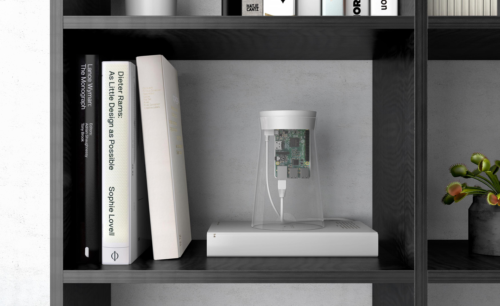

# Founding Node

The Founding Node was a limited edition device designed around the Raspberry Pi in collaboration with industrial design agency Blond in London. The Foudning Node was the result of five months of prototyping and development, culminating in a unique glass and silicone structure with an exposed circuit board meant to look great in any home or office setting.

The use of the Raspberry Pi demonstrated the power of the network softeware, adn the ease with which the platform could be grown through the use of the low and high powered devices all around us.

Hundreds of Founding Nodes were given away to early community supporters, with devices shipped to 96 countries worldwide. There are around 300 still in operation today.

 (1).jpg>)

 (1).jpg>)

 (1).jpg>)

