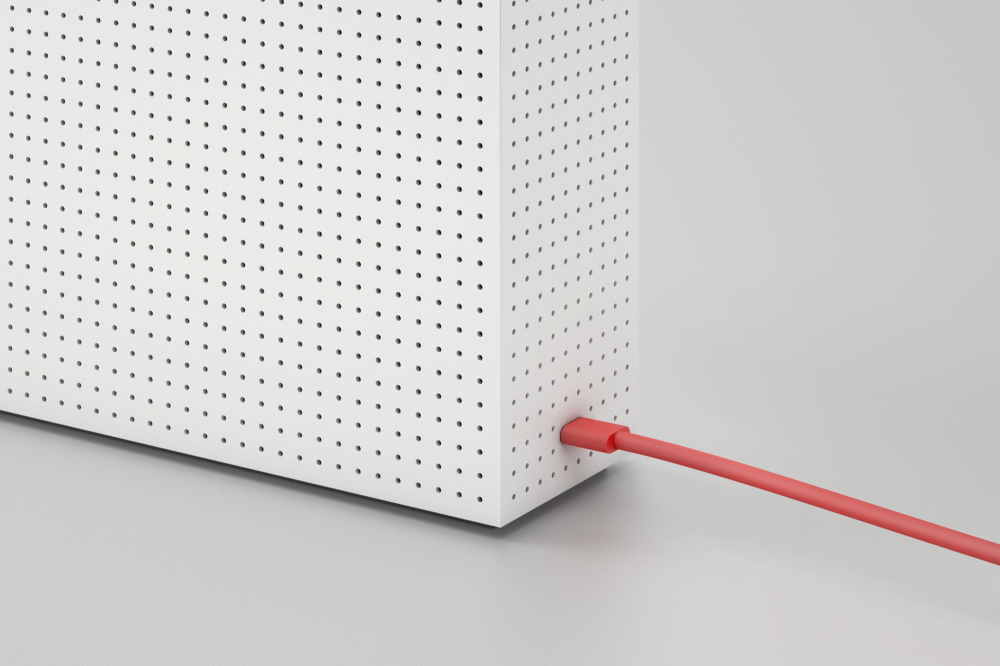
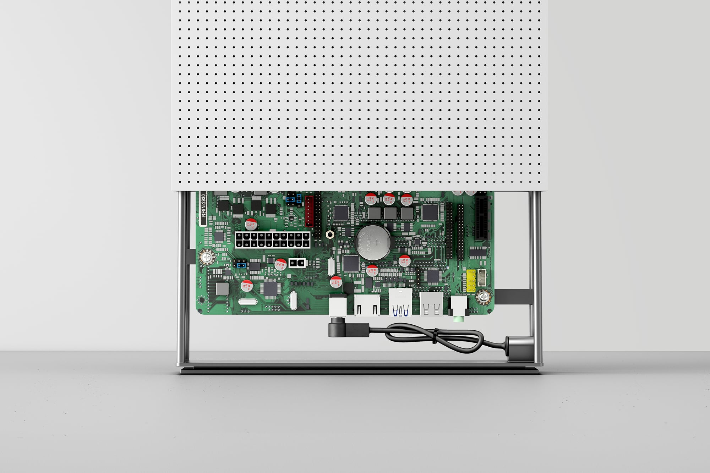
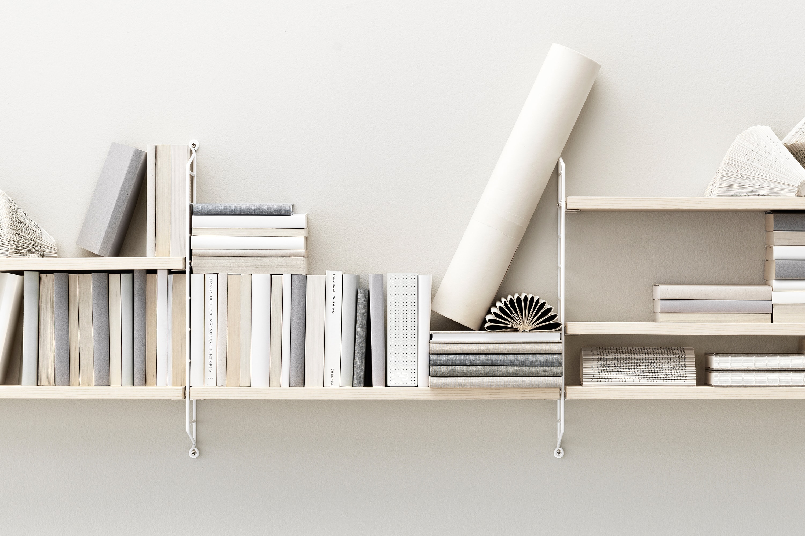

# Node one

Node One was the second dedicated device designed inconjunction with industrial design agency Blond in London. A significantly more powerful device than the Founding Node, Node One was designed to be upgradable.

The design approach to Node One rested on embracing the limitations and restrictions inherent in computing devices. The device needed to be working 24 hours a day, seven days a week, with unrestricted efficiency. The design is unapologetic, with a simplistic aesthetic. Designed to look good anywhere in the home or office, almost every surface was vented for maximum efficiency and to allow other items to be stored near-by, without prohibiting the ventilation.

Node One wasn't put in to full production. It was held back to pending the completion of several core components in the network, neccessary to get the most out of its power footprint.

.jpg>)

.jpg>)

