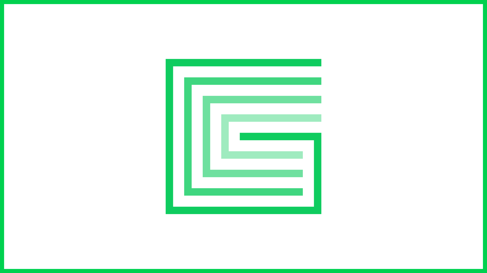

# Network Nodes

An Edge node is a computing device that is connected to the Edge Network in order to contribute its spare capacity.

## Node Types

There are three key node types in the network:

### Host

Hosts provide the processing and storage capacity in the network. Designed for mixed device types with varying capability, Hosts can be run behind a home router without the need for router configuration.

#### **Minimum specification**

* **Standard bandwidth:** 15 Mbit/s+
* **Low availability:** 20%+
* **CPU:** 1x quad-core 1.2 GHZ+
* **RAM:** 1GB RAM+
* **Disk:** 50GB HDD+


**Minimum device specification requirements are subject to change**




### Gateway

Gateways are the entry point to the network, acting as an aggregate point for Host node capacity. They manage job queues and deliver job requests to Hosts on the basis of a rolling Host score, preferencing the Host nodes most likely to quickly perform a certain task at any given moment in time.

They are high-connectivity devices.

#### **Minimum specification**

* **Medium bandwidth:** 250 Mbit/s+
* **High availability:** 99%
* **CPU:** 1x quad-core+ @ 2.5GHz+
* **RAM:** 64GB RAM+
* **Disk:** 1TB SSD+

### Stargate

Stargates are the masternodes in the Edge Network. They run the $XE blockchain and provide the domain name system that makes Gateway/Host resources addressable. They are responsible for the secure running of the network. They monitor resources and control device yields.

Stargates are intended for high-connectivity environments: think data centers and high bandwidth office environments, and are designed to be single, powerful machines rather than a cluster of smaller, less powerful machines.

#### **Minimum specification**

* **High bandwidth:** 1 Gbit/s+
* **High availability:** 99.9999%
* **CPU:** 2x quad-core+ @ 2.80GHz+
* **RAM:** 128GB RAM+
* **Disk:** 2TB SSD+

## Network Backbone

The core team at Edge manage a series of nodes in order to ensure and front run capacity requirements in the network. The backbone is housed with data centre partners all over the world and includes Stargates, Gateways and Hosts.

### Backbone Rentals

Nodes in the network backbone are made available for staking to members of the community. This gives access to nodes without the requirement for providing hardware and connectivity yourself.

Stake levels are the same as if you were running a node yourself, but the nodes yield is split between the staker and the dev fund, with 75% going to the stake provider and 25% going towards future network development.


**Yield distribution figures are subject to change**


