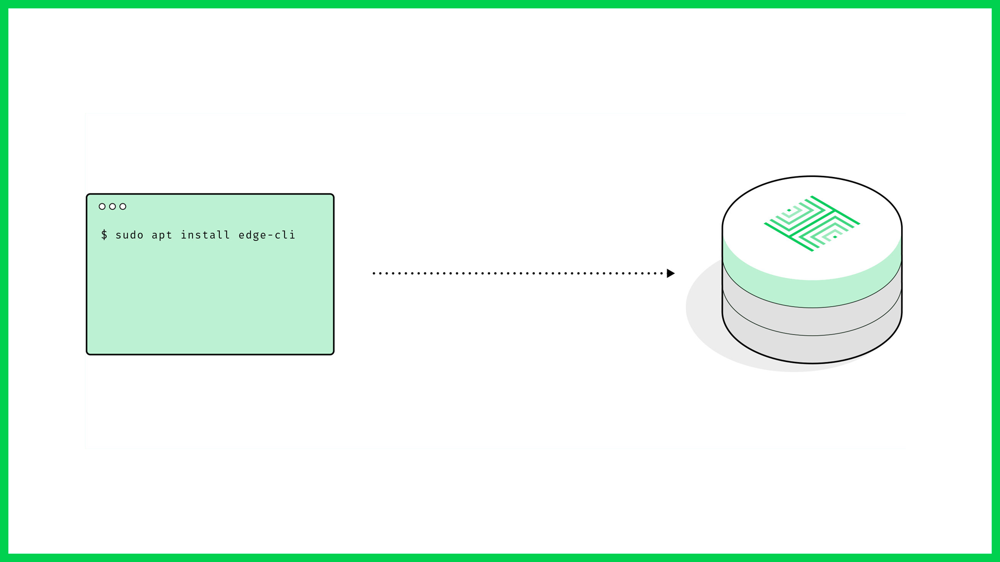

# Setting up a Host


**Host onboarding is temporailly suspended. It is expected to open again in June**


Onboarding is now open for Host nodes on the Edge network, with support for Linux based AMD64/ARM devices available.

You can access our Apt repository here: [archive.edge.network](https://archive.edge.network/)



## Minimum Specifications

Our base recommendation is a device with the equivalent capacity of a Raspberry Pi 4 Model B, with a 64GB SD.


**Devices with higher performance/capacity will return a higher yield**


## Installation Process

The process has been designed to be as straight forward as possible.

The process is as follows:

1. Install Docker \(vs. 18.06+\)
2. Install Edge Cli \(`edge-cli`\)
3. Connect your device to your console.edge.network account
4. Provide your refundable proof of stake \(the wallet address will be provided by a member of the team\)
5. Await enabling for production traffic in the network

### Installing Cli

#### Add the Edge Repository to Your Sources

```bash
$ echo "deb https://archive.edge.network/ /" | sudo tee /etc/apt/sources.list.d/edge.list
```

#### Import the Public Key for the Repository

```bash
$ wget -q -O - https://archive.edge.network/KEY.gpg | sudo apt-key add -
```

#### Update Apt

```bash
$ sudo apt update
```

#### Install Edge Cli

```bash
$ sudo apt install edge-cli
```

Once done you will need to add you device your account at console.edge.network, which is done at the command line through Cli, as shown in the following steps.

#### Attach Your Device to Your Account

```bash
$ edge-cli login -u "email@address.com"
```

#### Register your Device

```bash
$ edge-cli register
```

#### Start the Node

```bash
$ edge-cli start
```

Note that `edge-cli start` will return a message if your device hasn’t been funded.


**You only need to run`edge-cli start`once. Edge self-restarts, including on reboot**


