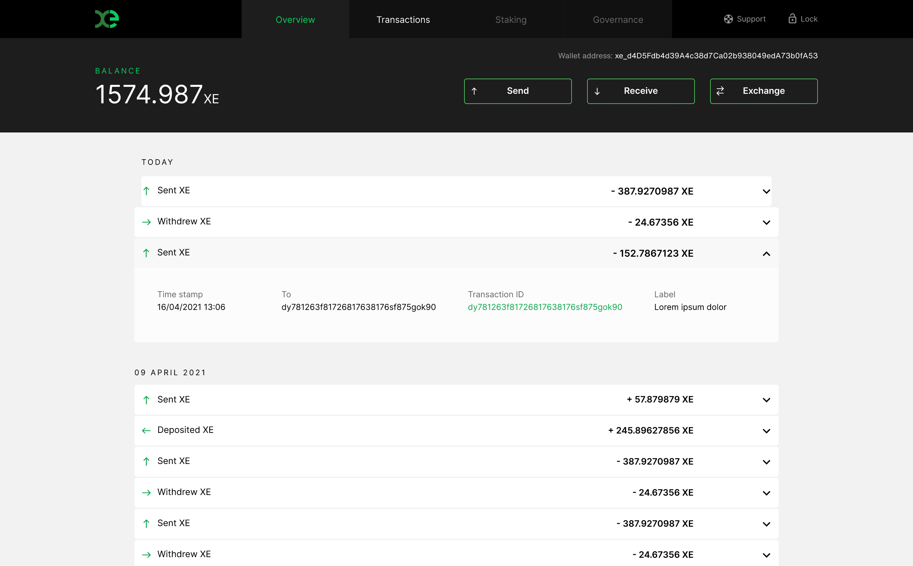

# Wallets

## $EDGE


**$EDGE is not currently listed or traded**


Any Ethereum or multicoin wallet that supports custom ERC-20 tokens can be used to send and receive your $EDGE tokens. Keep in mind that in order to move the token on the Ethereum network, you will need ETH in your wallet to pay for network transaction fees \(commonly known as "gas"\).

We recommend using [MetaMask](https://metamask.io/), but this is by no means your only option.

Things to look for when choosing a wallet are:

1. Native support for your tokens and/or the ability to add Custom Tokens
2. The ability to interact with contracts \(dApps\) on the Ethereum network
3. Hardware wallet support \(if desired\)

## $XE


**$XE has not been minted or distributed**


### Web Wallet


**The web wallet is currently in development. It will be released in the coming weeks**


$XE has its own network native client-side wallet. This is a JavaScript app that runs entirely in your local broswer. The web wallet provides the ability to generate and restore $XE wallets, view your transaction history, make transactions within the $XE network and bridge between $XE and $EDGE.

### Mobile Wallet


**The mobile wallet is currently in development. It will be released in the coming months**


The Edge Mobile Wallet can also be used for the management of your $XE. It's available for iOS and Android and can be used to bridge your tokens. The wallet includes support for $EDGE and $ETH, facilitating the bridging to and from $XE directly in app.

You can also buy and sell $XE directly in the app using the network's exchange function.

It is expected that future itterations of the mobile wallet will bundle in an Edge Network node, allowing staking directly within the wallet.

### Desktop Wallet


**The desktop wallet is currently in development. It will be released in the coming months**


The Edge Desktop Wallet can also be used for the management of your $XE. It's available for Windows and OSX and can be used to bridge your tokens.

You can also buy and sell $XE directly in the app using the network's exchange function.

It is expected that future itterations of the desktop wallet will bundle in an Edge Network node, allowing staking directly within the wallet.

