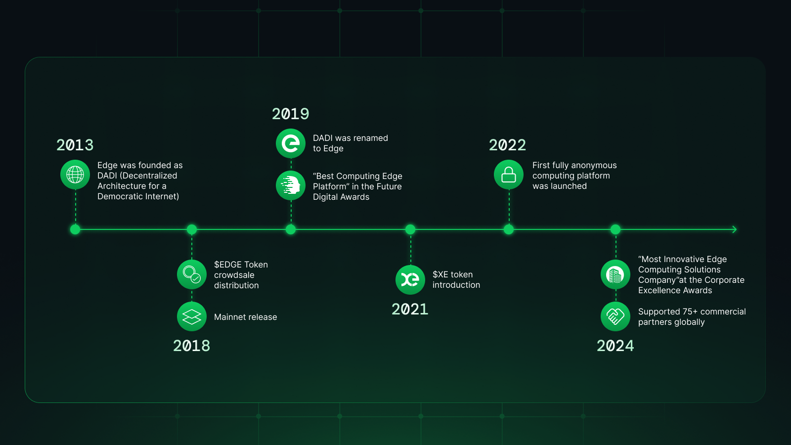

# 🕰️ A Brief History

<figure><figcaption></figcaption></figure>

Edge was founded in 2013 as a decentralised alternative to the cloud. Originally called DADI, which stood for "Decentralised Architecture for a Democratic Internet", the company was renamed Edge in July 2019, taking the name of the network at the heart of the project to better reflect the evolution of the technology and its mission.

A crowdsale was held in 2018 to raise funds for the delivery of the core network. Set against a five year roadmap, the crowdsale distributed $EDGE tokens to supporters and future customers.

Edge's testnet - running on the domain test.network - was launched in January 2018. The first release of the mainnet was in May 2018. The first products built on top of the Edge Protocol are [DNS](https://edge.network/en/dns), [Content Delivery](https://edge.network/cdn) and [Edge Servers](https://edge.network/en/compute), all of which are live and in production.

In 2019 Edge was recognised as the “Best Edge Computing Platform” in the Future Digital Awards.

In 2021 the blockchain in the network used for the tracking of network requests was extended to become a mechanism for value transfer. This introduced $XE, a coin used for value attribution within the network. the XE Blockchain is a layer 1 solution that bridges in to other networks. $XE is used for the payment of services; for network staking; for the distribution of node yields; and for community governance. It is currently bridged to the $EDGE ERC-20 token within the Etheruem network.

In 2022 the first fully anonymous computing platform was launched. Edge's account system using a private key for security, giving direct access to Edge Servers, Edge DNS and Edge CDN.

The project roadmaps for Edge capture the near to mid term development priorities, focused on the core network layer as well as individual services on top of the network (such as Object Storage, Edge Functions and Edge DB).


[project-roadmaps.md](project-roadmaps.md)


Edge Network Technologies Limited is a not-for-profit company limited by guarantee. Registered in the United Kingdom this company operates under instruction from the Edge DAO.

## Mission & Vision

### To Uphold the Founding Principles of the Web

The Internet was conceived as a global, democratic communication network - a mesh of computers where information and power were equally distributed. This principle is under attack from all sides. Companies like _Google_, _Amazon_ and _Microsoft_ are centralising control, while powerful lobbying groups are working to undermine net neutrality. We are facing a future where you are the customer – and the product – of a network controlled by only a handful of global corporations.

We want to reverse this relationship – to give the ownership of the network to everyone that is connected to it, and to make them the beneficiaries of the revenue that comes from its use.

### The Edge Network as the Standard for the Decentralised Web

A network of millions of nodes, directly addressable and usable by anyone. A governance system free from individual or multinational control, organised by a Decentralised Autonomous Organisation.
