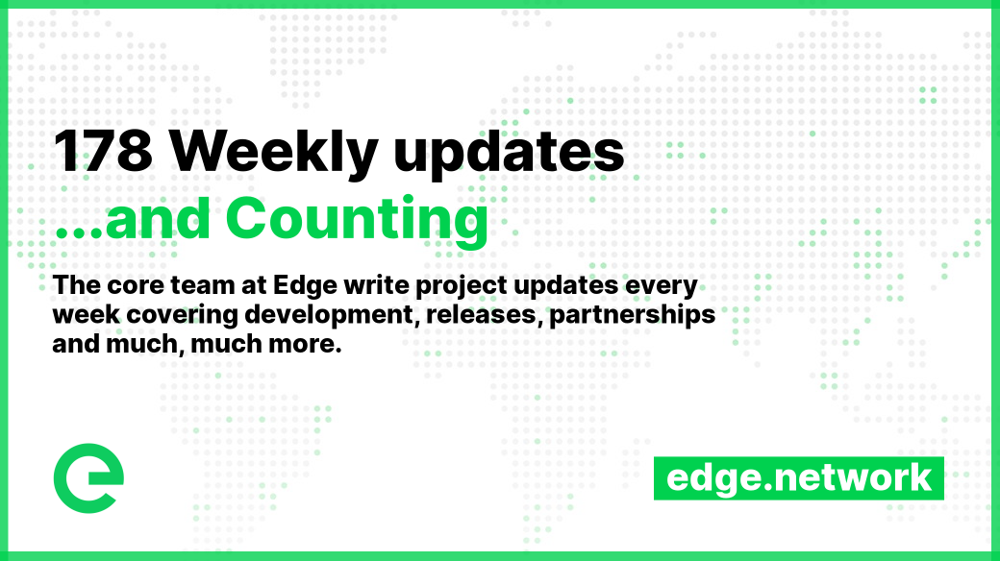
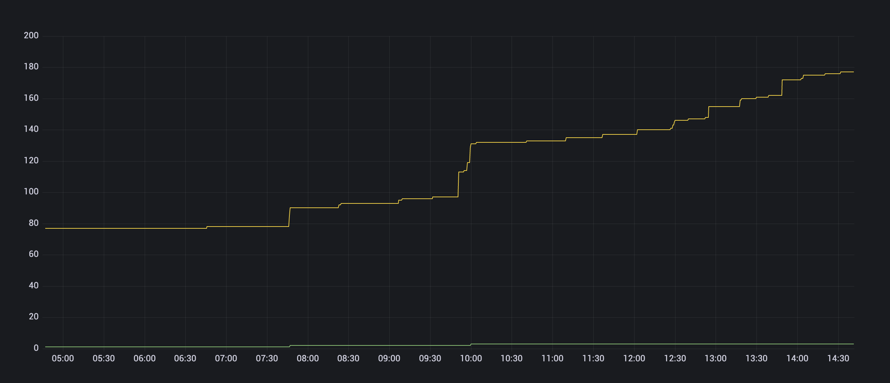

# 📰 Core Team Updates

As part of Edge's ongoing commitment to transparency and development in the open, the core team write weekly updates to the Edge community.

There have been 178 of these so far.


[weekly-updates.md](weekly-updates.md)


## Latest Update

<figure><figcaption></figcaption></figure>

Good evening everyone 

This week was shorter than usual, as the team spent Monday doing whatever people do when they’re not building the next generation of network technologies (which is probably thinking about building the next generation of network technologies). We’ve had a great week working on integrating Edge DNS into the account system, and look ready for making it available next week.

<figure><figcaption></figcaption></figure>

We’re just working through final UI tweaks and testing before rolling it out, after which we’ll be straight onto the integration of CDN, which includes some updates to Stargates and Gateways along with synchronisation of configurations and the network, and the reporting of usage and subsequent billing. It’s super exciting to see and we can’t wait to see people self-onboarding onto CDN again.

This week saw a single network deployment, with **Gateway v2.10.1-152** being deployed to mainnet, introducing improved metrics for request queues. This allows us to monitor timeouts within the network, of which there are two types: reply timeouts (yellow) are when a Host doesn’t respond within a specific period of time, after which the request will be sent to another Host; and request timeouts (green) are when no Host responds within a specific (longer) period of time, after which a service unavailable message is sent back to the client. See below:

<figure><figcaption></figcaption></figure>

Recently we’ve been reminding you that the stake migration window was closing at the end of August. It is now closed. Anyone who sent in a stake migration request before the window closed will be processed this month, but we ask that you reply swiftly to emails from the team so that we can process your request. Any requests yet to be processed by the end of September will not be processed. All unclaimed tokens will remain in the treasury. Please help us to help you get these stakes migrated as that will help us to focus on what matters most — building the Edge network.

This week, community member Pod continued with his great ideas, and the 🔖│links channel was born on [Discord](https://ed.ge/discord), a handy list of useful links to help you find information, web resources, wallets, and more. Big  for that Pod and to everyone else who has been contributing to the community.

As a reminder, your Edge Account includes a referral link. If you use this when sharing Edge with your friends, colleagues and social channels, you will receive _10% commission_ on their usage of the network for the **lifetime** of their usage.

And that's it for this week my friends!

Enjoy your weekends 

_Posted by: Adam K Dean_
