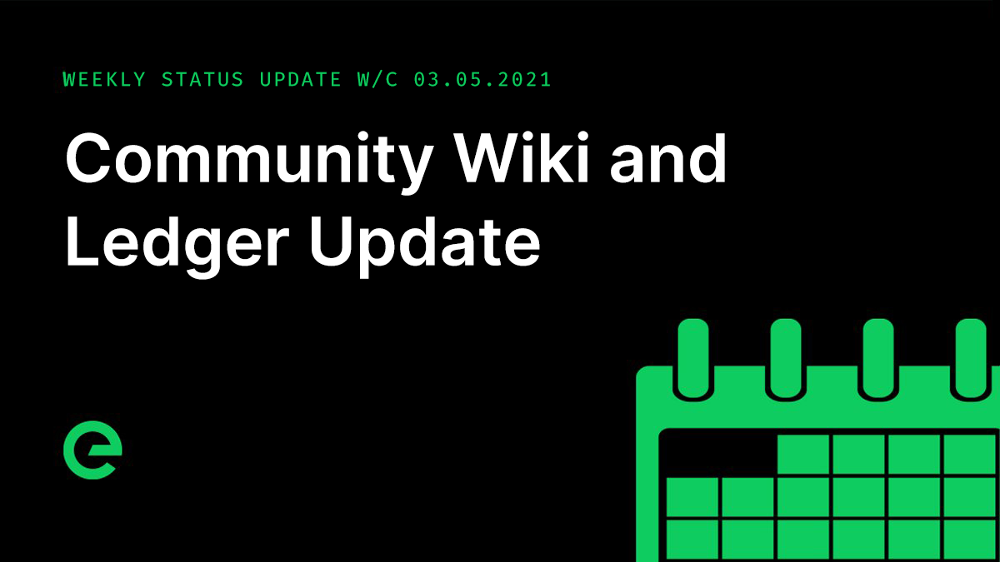

# Core Team Updates

As part of Edge's ongoing commitment to transparency and development in the open, the core team write weekly updates to the Edge community.

There have been 109 of these so far.



## Latest Update

Hi everyone 👋

Monday was a bank holiday here in the UK, so this week's update will be a little shorter than usual.

The Edge Community Wiki was released. Designed as the go-to resource for the Edge project, it covers a wide variety of topics, including the vision for the network, the project’s history, community governance, token distribution and node contributions.

You can see it here: [https://wiki.edge.network](https://wiki.edge.network)

It also includes a full break out of the core teams weekly updates, of which there have now been 109!

Here’s a link to the full archive: [https://wiki.edge.network/getting-started/core-team-updates/weekly-updates](https://wiki.edge.network/getting-started/core-team-updates/weekly-updates)

The source for the Wiki is available in the project Github here: [https://github.com/edge/wiki](https://github.com/edge/wiki)

Community contributions to the wiki are welcome and encouraged.

The $XE client side wallet is approaching completion and looking very polished. It will eventually house staking and governance too, moving these functions out of Console. This will also remove the requirement for the email/password based account concept, with everything running off of your private keys.

Here’s another screenshot as a teaser ahead of release:

The iOS and Android mobile wallet remains in heavy development. The timelines for this are further out, and we’ll keep you up to date we go.

Testing on the network ledger continued. An invalid state issue was raised in relation to the P2P service. This has now been resolved.

Several updates for the API for the ledger were made, including the addition of batch transaction processing to support Earnings/Payouts and configurable batch transaction limits.

An issue with the API where large POST requests were being rejected was resolved.

A series of additional metrics were added, providing new data points for performance monitoring & debugging.

And a ledger pruning feature was introduced, removing old wallet data and keeping only the relevant wallet data for a number of blocks.

A major refactor to the configuration process for dApps was deployed this week. The refactor included a fix to the way request cancellations are propagated within the network, and a refining to the method that syncs dApp subscription config status information between Host and Gateway.

Debug logging was greatly improved, creating far more transparency to the Host app deployment process and to the Gateway worker pool prioritisation engine, or LBQ \(Load Balanced Queue\) as it is more commonly known.

Chris and I started to flesh out plans for an investment programme for third party and community projects built using Edge technology. It’s a little early to go into any real detail yet, but if you have an idea that needs funding, start thinking about how you might pitch it. We’ll be sharing a lot of information on this front in the coming months.

Will wrote an article about the carbon impact of the cloud and the net benefit that Edge brings to the industry.

You can read that here: [https://ed.ge/knowledge/cleaning-up-the-cloud](https://ed.ge/knowledge/cleaning-up-the-cloud)

And last but not least, issue 3 of the Edge Digest was sent out. If you’re not subscribed, you should be! You can do so here:

[https://edge.press](https://edge.press)

And you can read the latest issue here:

[https://ed.ge/digest/issue-3](https://ed.ge/digest/issue-3)

And that’s it for this week.

For the very latest from Edge, join our Discord server: [https://ed.ge/discord](https://ed.ge/discord)

Enjoy your weekends.

_Posted by: Joseph Denne_

