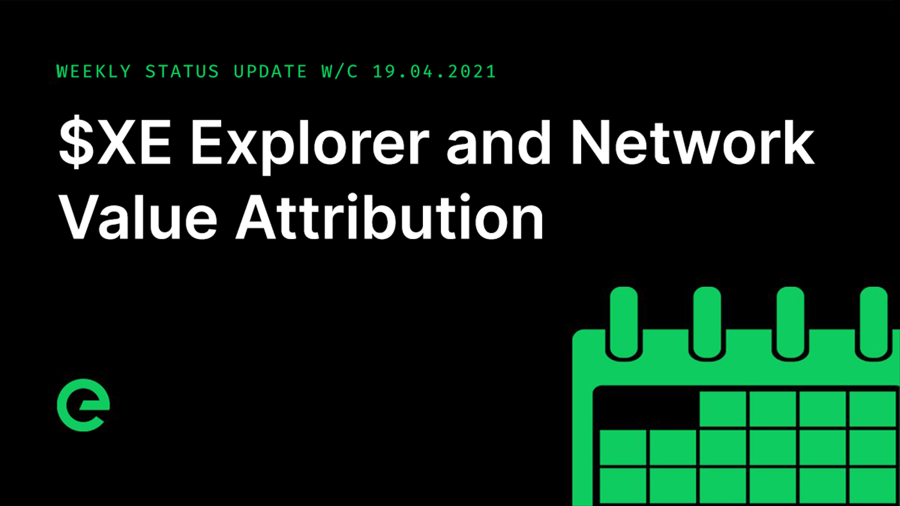

# Core Team Updates

As part of Edge's ongoing commitment to transparency and development in the open, the core team write weekly updates to the Edge community.

There have been 108 of these so far.



## Latest Update

Hi everyone 👋

Chris and I have spent the week discussing the tokenomics for XE with a number of third parties in the crypto industry. These conversations have been designed to challenge the work that the team has done, giving us different perspectives and ultimately validating and strengthening the offering. We’ve spoken to other projects and to investors.

We had planned on sharing the community wiki this week, but are going to hold it back until next week. Chris and I will be sharing the tokenomics of $XE ahead of the release of the wiki next week. We’ll both also be available for a community AMA.

The team remains broadly on track for the end of April/early May release and distribution of $XE.

This week the team refactored the way in which the storage module in the ledger network clones itself. It’s used when preparing new blocks and we had observed a rare event causing service interruption as a result of database chunks changing.

They also pushed forward the explorer. Rather than releasing a separate explorer for the ledger alongside the existing network explorer, we will be providing an integrated experience that will replace the current explorer, allowing both blockchain & network interrogation.

As part of this, and to aid ongoing testing & debugging, the team completed work on a real time network telemetry server which gathers data from the blockchain nodes in Stargate. The explorer frontend connects into the server, which enables real time data to be pushed to clients \(for example latest blocks, status, and transaction pools\).

In time this will be extended to allow a live explorer screen, in the vein of ethstats \(along with the static exploration pages\).

Here’s a screenshot of the unstyled work in progress explorer:

The team have also progressed testing, focusing on at scale transactions and applying fixes where required.

A block transaction limit has been added to the miner and mempool. We’re currently testing with 100 transactions a block.

Support for burning $XE has been successfully tested.

Testing is ongoing, specifically focused on pushing performance, testing high volumes from multiple sources, and pushing high volumes of transactions to multiple disparate connected nodes.

A minor issue with Host&lt;&gt;Gateway connections after a Gateway update early in the week was resolved and is currently under testing. A goroutine leak in Gateway was tracked down, patched and released. A bug caused by prematurely removing a channel that was still being written to was also resolved.

A bug with the order in which an update hook method was called was resolved and released for edge/atomicstore. This problem was occasionally causing a deadlock when the update hook tried to make changes to locked data.

Next week we move on to end to end user testing including the bridge and the client-side wallet.

The mobile wallet for $XE for iOS and Android moved forward. It will have support for $ETH and $EDGE built in, alongside $XE.

I want to take a moment to elaborate on the yield system for network nodes. We’re moving to attribution on the basis of a score that is calculated as a moving window of completed jobs. Device activity is recorded in real time and is made available alongside $XE payouts.

The earnings process is designed to handle a cohort of Hosts per Gateway and per block of time. It also handles Gateway and Stargate cohorts. With jobs distributed on the basis of audience need, every node in the network is in effect in competition with its immediate peers to resolve jobs.

For example:

If we take network activity for an arbitrary period, we are able to rank each device against the others in its tier, providing a score for its relative work among the cohort.

For example:

These values are then used to determine the attribution of network yield within a given period. So if a host has a stake of 2,500 $XE and a yield of 10%, it would return 0.000011415525114 \* stake per hour if it resolved 100% of the jobs available.

Summarised:

`amount = stake * yield * share`

Where:

`stake = 2,500 yield = 0.000011415525114 // one hour at 10% per year (0.1 / 365 / 24) share = relative share from cohort, as seen above, say, 0.042`

More information about this approach has been written up in the wiki and we’ll be publishing an article with a deeper dive soon.

We kicked off an engagement with a major broadband provider \(who have millions of customers here in the UK\). They are using our technology in the form of Edit and Edge services. Expect to see more on this in the coming months.

And finally, the second issue of the Edge Digest was sent out to subscribers.

You can see it here: [https://ed.ge/digest/issue-2](https://ed.ge/digest/issue-2)

For the very latest from Edge, join our Discord server: [https://ed.ge/discord](https://ed.ge/discord)

And that’s it for this week.

Enjoy your weekends.

_Posted by: Joseph Denne_

