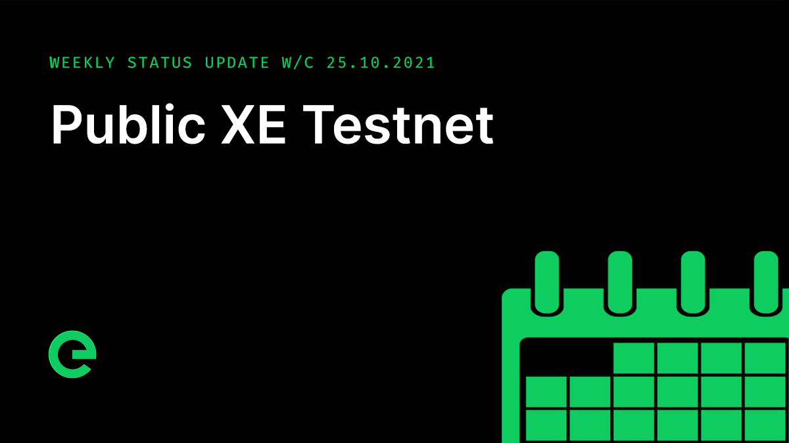

# Core Team Updates

As part of Edge's ongoing commitment to transparency and development in the open, the core team write weekly updates to the Edge community.

There have been 139 of these so far.


[weekly-updates.md](weekly-updates.md)


## Latest Update

Good evening everyone 👋

I’m here with Adam again this evening.

_Adam_:

Good evening folks. It’s been a busy week here!

_Joseph_:

So, first up... we have just opened up the Edge (XE) Blockchain testnet to the public 

_Adam_:

The blockchain testnet mirrors the mainnet, with a fully functional web wallet ([https://wallet.test.network](https://wallet.test.network)), explorer ([https://test.network](https://test.network)), bridge (which is integrated with the Rinkeby Ethereum testnet), and index ([https://index.test.network](https://index.test.network)).

The blockchain nodes are [https://xe1.test.network/](https://xe1.test.network), [https://xe2.test.network/](https://xe2.test.network), and [https://xe3.test.network/](https://xe3.test.network) and either of these can be used for submitting transactions to the blockchain.

We also released **Explorer v1.8.0** and **Wallet v1.8.0** in support of the public testnet.

The team is currently working on a faucet which will be accessible via the testnet explorer ([https://test.network/](https://test.network)) that will allow you to acquire some testnet $XE on demand. Whether you want to try out the web wallet, see how the staking works, or use the testnet to develop your own XE-based applications, the core team will be here to help and support you.

_Joseph_:

The testnet also receives updates ahead of mainnet, so you may see new features from time-to-time before they’re released.

_Adam_:

Work has progressed on the new CLI (command line interface), with staking now integrated. We’re looking to release this next week for testnet. The first version of the new CLI will support wallet operations along with stake management, with device onboarding functionality due to follow shortly after.

_Joseph_:

We’ll write more about that next week.

Build of the front end interfaces for Edge VPS kicks off next week. The API layers are complete, and the beta programme has been performing well, with test and production usage showing great performance. The interfaces will be released as a beta in the first instance.

The mobile wallet app continues towards public beta status, and we’re excited to be able to share that with you in the next few weeks.

_Adam_:

And plans for the desktop wallets (which will also include device management) are underway as we explore ways to make onboarding of devices easier.

Work on v2 has also progressed well, with focus on internal connectivity and protocol.

We’ll write more about how you can get involved with v2 once the public v2 testnet becomes available.

_Joseph_:

The latest episode of our podcast just dropped:



We’ve taken on board community feedback and are working to evolve the format. A bunch of exciting things to share on this in the coming months.

Delivery as part of the partnerships I’ve mentioned in previous updates progressed apace. There’s a huge amount underway and some really exciting developments that we can’t wait to be able to tell you about.

The latest issue of our now weekly newsletter was sent yesterday. You can see it online here:



If you’re not signed up, do so now and join the 100,000+ individuals already subscribed:



We're still on the hunt for new core team members, with positions available for accomplished full stack developers. You can read about how we work and find a job specification here:


[careers](../../supporting-the-network/careers/)


And if you missed last weeks update, you can find it along with a full archive of our weekly updates here:


[weekly-updates.md](weekly-updates.md)


For the very latest from Edge, join our Discord server: [ed.ge/discord](https://ed.ge/discord)

And that’s it for now – have a great weekend.

_Adam_:

Thank you and good night 

_Posted by: Joseph Denne & Adam K Dean_
