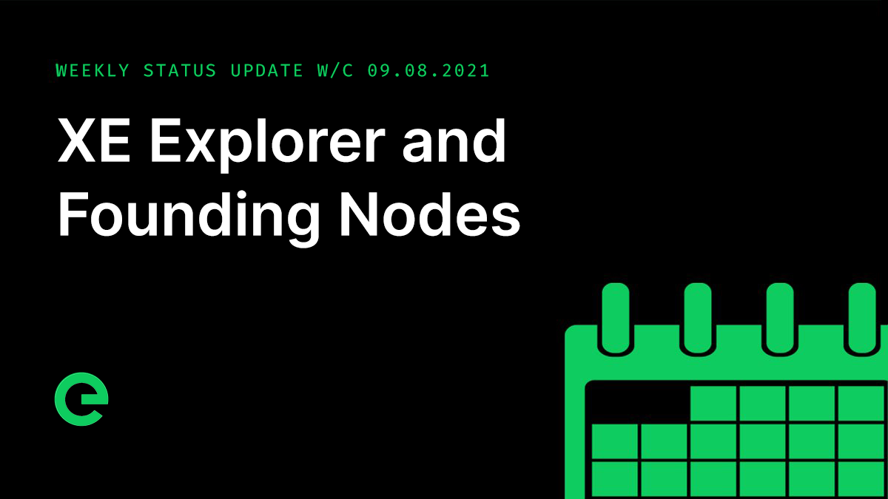

# Core Team Updates

As part of Edge's ongoing commitment to transparency and development in the open, the core team write weekly updates to the Edge community.

There have been 123 of these so far.



## Latest Update

Hi everyone 👋 Happy Friday 😀

A shorter update this week. It’s been full on on a number of fronts.

Adam will be taking over update duties from me next week as I’m going to be away and offline for a couple of weeks. That will mark the first break in my 124 update run! \(That has to be some sort of record, right?\)

First up, a reminder that you have until the 04th of September to claim your distribution of $XE.



Founding Nodes are going to be retired at a point in the not too distant future. This is because they no longer provide enough power to the network. While there is no specific time for this yet, we expect it to happen at some point in the next six months.

A thank you to those of you who have run them for the past few years will be sent directly to your XE wallets when the time comes.

Of course the case itself can continue to be used, and you will be able to replace the original Pi with a replacement should you want to. Details on how to do this will be provided nearer the time as well.

Work on the blockchain explorer continued, with data from the index service and the blockchain API being incorporated this week.

Two new endpoints were introduced to the index service in support of this, further allowing the exploration of blockchain data: `/block/:hash` and `/block/:height`.

Additionally, the explorer has been undergoing a few design revisions during build, further improving the look and feel as well as the user experience.

I'm really happy with how it's coming together and can't wait to share it with you.

Implementation of on-chain configuration moved forward and testing is now being undertaken on blockchain synchronisation with dynamic staking. This will allow required stake values to reflect the value of the coin, with the amount of XE required to create a stake being updated as frequently as every hour.

The bridge remains on track for opening at the end of the month.

A reminder that we are hiring. Specifically we are looking for multiple talented frontend and backend developers to work with HTML/CSS/JS and JavaScript/Golang for backend. Attention to detail and a self-starting attitude is critical. The roles are 100% remote and can be based anywhere. They will be working on both Edge and customer deliverables. Hit up careers@edge.network if you’re interested.

For those of you who may know the right sort of candidate, please note that we will pay 50,000 XE for a successful referral.

And finally this week, the latest episode of Conversations on the Edge has just been released: You can listen to it here:



And that’s it for this week!

This weekend, why not help spread the word? The more the existing community helps to promote and drive the project forward, the stronger we will become.

For the very latest from Edge, join our Discord server: [ed.ge/discord](https://ed.ge/discord)

Enjoy your weekends.

_Posted by: Joseph Denne_

