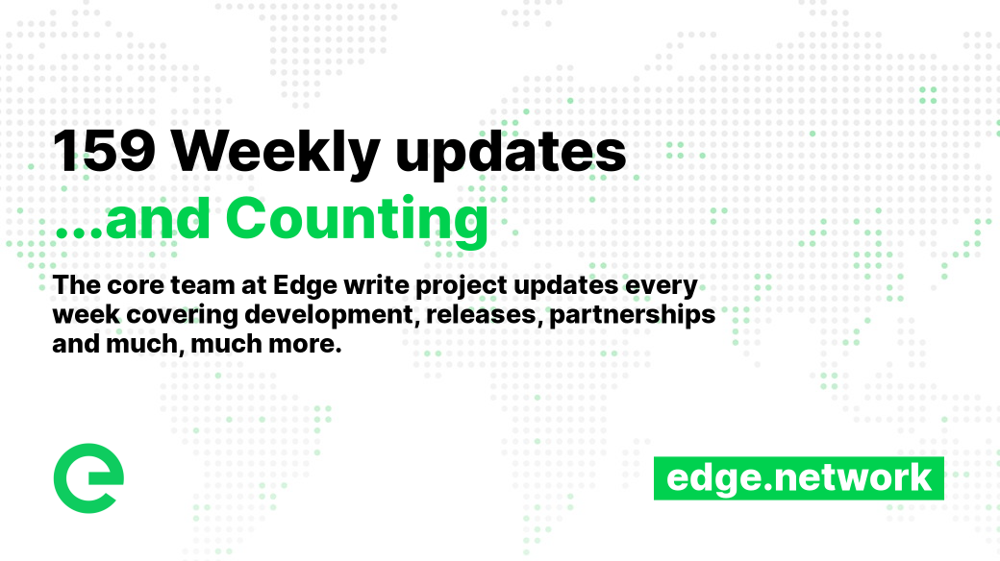
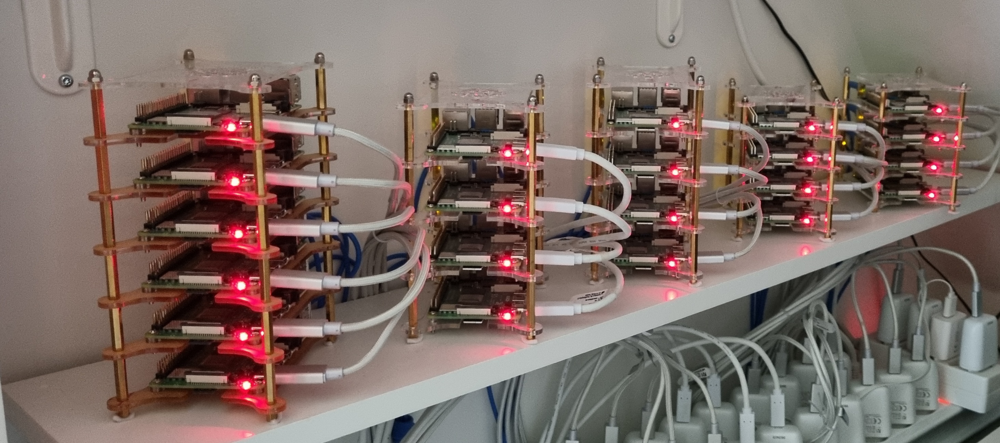

# 📰 Core Team Updates

As part of Edge's ongoing commitment to transparency and development in the open, the core team write weekly updates to the Edge community.

There have been 159 of these so far.


[weekly-updates.md](weekly-updates.md)


## Latest Update

Happy Friday everyone 

It was another short week here as Monday was a bank holiday. Nevertheless we have made some great progress.

Seven - 7! - releases this week:

First up, **Earnings Oracle v0.7.1** was released – a key update that improves scalability in anticipation of network growth. It also adds metrics collection over time, so we are able to determine how much work was performed by which devices during exactly which time periods.

**Index v1.22.2** adds a new API for hourly and daily statistics for each node on the network, plus an API to access raw earnings snapshot data.

**Explorer v1.19.1** uses the new statistics API on Index to visualise performance on the node overview.

This means that you can view any node's availability and work done - hourly over 24 hours, or daily over 7 or 30 days.

.png>)

As noted in conversation in Discord, you'll note a low level of jobs in the network at the moment. This is because most network traffic is currently in network v1. We're transitioning to v2 over a period of time to allow for performance testing as we go.

**Wallet v1.16.0** adds a 'receive' button which displays your wallet address and a QR code, which can be scanned to facilitate receiving funds.

.png>)

Very smart.

**Bridge v2.7.2** provides minor improvements to logging.

**Stargate v2.9.1-187** provides minor improvements to logging.

**Gateway v2.9.0-136** improves the accuracy of data measurements by requiring origin servers to provide Content-Length for processable assets. It also provides minor improvements to logging.

In other news our partnership with Mudas (mudas.com) focused on the provision of a referral programme ahead of their genesis period. This is being built on Edge and should be released in the next few weeks.

And another site moved to the Edge network (Edge servers beta; CDN; and DNS). We'll share this one in the next week or two.

Mad props to community member _The Elk_, who now has 22 Hosts online 

And that’s it for this week  Enjoy your weekends.

_Posted by: Σxult_
