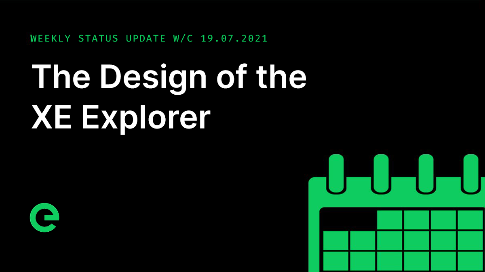
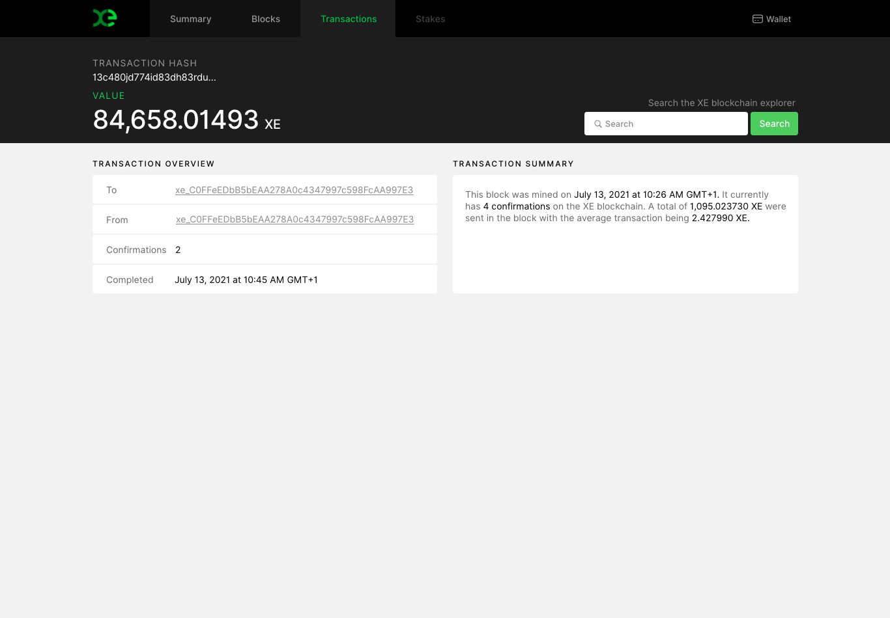
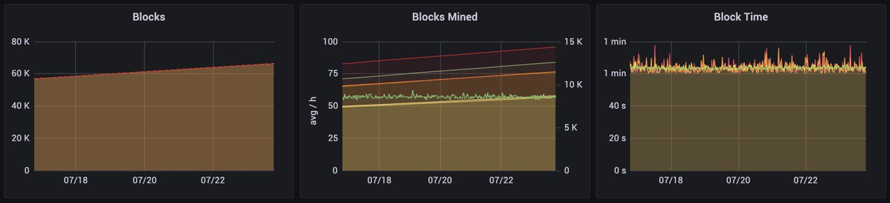

# Core Team Updates

As part of Edge's ongoing commitment to transparency and development in the open, the core team write weekly updates to the Edge community.

There have been 120 of these so far.



## Latest Update

Hi everyone 👋 Happy Friday 😀

The designs for the XE Explorer are complete and are now being applied to the platform.

Here are some screenshots to wet the appetite:

We are expecting to be releasing the explorer within the next 3-4 weeks.

There was a major release to Stargate this week, bringing in upgraded dependencies for atomicstore, logger, utils, protobuf, prometheus, viper, x/net. The update also brings updates to API sync for  improved maintainability and a new 'Registry pattern' providing stronger typing and clearer code structure.

Config update batching which we’ve discussed in previous updates was also part of this release. This reduces backend traffic and brings increased performance to the core.

This also introduced streaming log files from Stargate, which show job scoring for connected network devices. This is pretty cool to see running live.

The new Load Balanced Queue now gives us more detailed insight into the real-time performance of each device.

This milestone allows us to move forward with prioritising the best performing devices in a fairer and more reactive way, by making sure priority is based both historic and current performance, and that an amber warning on a devices ability to resolve requests will see if demoted immediately rather than retaining a performance grade.

We’ve successfully upgraded the load balancer and worker queue to handle disconnections more gracefully, and introduced a mechanism to all failing health checks and disconnected RPC’s \(Remote Procedure Calls\) to share the same disconnection process. This unified approach makes it far simpler to detect where the problem occurred and to resolve it quickly with a quicker reconnection.

Adam is with me to provide an update on the XE blockchain:

Work on integrated blockchain staking continues, with functionality for unlocking and releasing stakes now implemented. A new layer of on-chain configuration is in the process of being integrated in order to support dynamic stake values. More on this at a later date.

We are currently working toward August for on-chain staking to open up.

The blockchain remained stable over the last week. Eventually these statistics will be visible in real time in the explorer.

XE distribution continues to process seamlessly. Distribution for staked devices that were swapped to TNC will be processed next week.

Thank you Adam!

The latest episode of Conversations on the Edge, featuring an interview with @adamkdean and me, can be listened to here:



And that’s it for this week!

This weekend, why not help spread the word? The more the existing community helps to promote and drive the project forward, the stronger we will become.

For the very latest from Edge, join our Discord server: [ed.ge/discord](https://ed.ge/discord)

Enjoy your weekends.

_Posted by: Joseph Denne_

