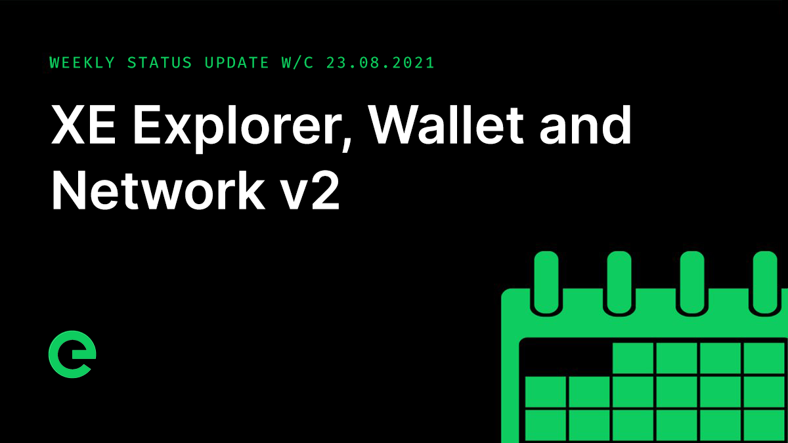

# Core Team Updates

As part of Edge's ongoing commitment to transparency and development in the open, the core team write weekly updates to the Edge community.

There have been 125 of these so far.



## Latest Update

Good evening everyone 👋

I’m providing the core team update again this week as Joseph is away.

This is the final reminder ahead of the closing of the distribution period for $XE. It ends on the 4th of September.



Final bridge testing ahead of opening has been completed. We are also writing up a how to guide, which will be added to the Community Wiki.

The opening of the bridge is looking likely to be on the 1st of September – mid next week.

We’re continuing to move our development channels away from Slack to Discord. This started a little over a week ago and has been going well. It’s making the team more present with the community and this is opening the potential for a positive feedback loop. Last week for example the colours of the new explorer were updated to provide a better contrast ratio on the back of community input. There were a whole bunch of other updates delivered to the new explorer too.

We have always planned to be developing in the open, and this supports that.

Since the release of the blockchain explorer this time last week, 9,597 blocks have been processed, with a steady average blocktime of 64 seconds, or roughly 56 blocks per hour.

If you’ve not checked it out yet, you can see it here: [https://xe.network](https://xe.network/)

Today we released version 1.2.0 of the web wallet \([https://wallet.xe.network](https://wallet.xe.network/)\), which introduces a whole bunch of improvements ahead of the Bridge opening next week. Transactions are now paginated, there have been numerous user interfaces fixes and tweaks for both mobile and desktop, and transactions now link directly through to the explorer.

Work on the mobile wallet app continued from the designs we showed you last week, with the screens now being designed in line with the look and feel of the web wallet and explorer.

Next up I’d like to talk a little bit about the evolution of our roadmaps. There’s been a blockchain-like storage solution within the network for some time, which among other things was used to store device contribution & earnings data. The original plan for this was to evolve the dag-based solution, maintaining it centrally to the network.

When we assessed the future needs of the system though, it became clear that we need functionality beyond what that approach would have been able to achieve, particularly on-chain programmable events and the ability to make micro-transactions. In order to deliver the functionality required without interruption of currently live services, the XE Blockchain was developed adjacent to the core network.

Looking to the future we’re going to be working to develop a version 2 of the network core, architected around the blockchain. This will be an evolution of the existing core network, with a far greater level of integration with the blockchain.

For example, with on-chain staking, stakes can exist in one of four states: active but not assigned to a device, active and assigned to a device, inactive but locked for a period of time pending release of funds, and inactive and released, where the funds have been returned to the wallet. From this, we have all the information we need to determine whether a device is authorised to connect to the network and contribute spare capacity. Stargates, Gateways, and Hosts will make use of an authentication layer built on top of this information for real time device authentication tied directly to stakes.

Stargates, Gateways, and Hosts will all make use of the asymmetric cryptography \(public/private keypairs\) that form wallets, with each device having its own unique keypair. The wallet address \(public key in XE format\) will become the device’s identifier, and will be assigned to a stake by the edge command line interface to begin with. In time, there will be other ways to manage your stakes: through the web & mobile wallets, and through the desktop wallet later too. All of this brings us closer to the anonymous space, allowing you to create an XE wallet, fund it, stake devices, and contribute to the network.

It is important to note that there will be no interruption to live service delivery as we push ahead with deeper chain integration.

And as a part of this we will be refreshing our roadmaps.

The latest episode of our little podcast, Conversations on the Edge, has just been released:



And that’s it for now – have a great weekend, and see you next week.

This weekend, why not help spread the word? The more the existing community helps to promote and drive the project forward, the stronger we will become.

For the very latest from Edge, join our Discord server: [ed.ge/discord](https://ed.ge/discord)

Enjoy your weekends.

_Posted by: Adam K Dean_

