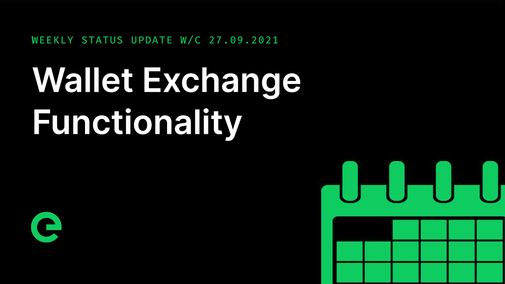

# Core Team Updates

As part of Edge's ongoing commitment to transparency and development in the open, the core team write weekly updates to the Edge community.

There have been 131 of these so far.


[weekly-updates.md](weekly-updates.md)


## Latest Update

Good evening everyone 👋

It’s been another busy week, hence this update landing a little later than usual.

The team kicked off two exciting partnerships this week, both blockchain and both mutually beneficial. Details will be shared in due course.

I have Adam with me to provide you with a development update:

_Adam_:

Evening all!

Another late update, and this week we have another release for you.

We have just released **Index v1.7.3** and **Explorer v1.6.4**. This introduces a wallets index for the first time, allowing the browsing of active wallets in the XE Blockchain. The heavy lifting for this is in Index, which monitors blocks and queries the blockchain for balances. The hooks have also been put in place to allow us to add a balance field to transactions in the explorer in future.

Take a look: [https://xe.network/wallets](https://xe.network/wallets)

This week saw **Bridge v2.2.0** released, which implemented Ethereum EIP-1559 transactions. So far we’ve seen a big improvement in transaction processing speed.

The new Edge CLI has been in the works this week, with the first CLI transaction being sent on the testnet earlier today. The new version of the command line interface tool will allow full wallet management, along with onboarding and stake management, later this year.

While we’re talking about testnet, just a reminder that we’ll be making testnet public later this year. You’ll be able to create a wallet, get some XE from a faucet, and even onboard testnet devices, if you wish to. Super exciting.

The design for the mobile wallet app is looking great, and has started to be implemented into the beta. We’ll have a preview of the design for you next week, and let me tell you, it’s looking amazing.

This week we released one of our open source libraries, `@edge/log`. Logging, along with monitoring and alerting, are key to both development and operations, and this library, though small, is essential to achieving that. If you’re interested in learning more about how it works, take as look at the repository:



_Joseph_:

Thanks Adam!

As I hope is obvious, the core team is working flat out to push the project forward. We have fantastic tech and an extremely strong roadmap. Plus there is some magical development work happening around the roadmap – future stuff that I’m hopeful will make it into the core of the platform in the fullness of time.

Marketing is underway and as a result we’ve seen steady growth in our core community channels and have opened up a series of fantastic opportunities. The team will be sharing what they can as we go. There’s a lot on the horizon to excite you.

We firmly believe that Edge is only as strong as its community. The project set out to take control of web services away from centralised corporations, enabling everyone to participate in the value creation that flows from the Internet. To this end we really need you to get involved. Tweet about the project, mention it in your other communities and help us to spread the word.

If you didn’t know, Edge has a bug bounty. We pay out for the identification of verified bugs. To date this year the bounty has rewarded $4,500, with the highest single reward being $1,000. If you find a bug or a security vulnerability, email bounty@edge.network with details as to how we can recreate it.

Episode 22 of our podcast, Conversations on the Edge, has just been released:



If you’ve missed the podcast to date, you can catch up with all of the episodes from season one right here in the Community Wiki:


[conversations-on-the-edge.md](../conversations-on-the-edge.md)


The latest of our now weekly newsletters was sent today. If you’re not signed up, there’s no time like the present! You can do so here:



We're still on the hunt for new core team members, with positions available for accomplished full stack developers. You can read about how we work and find a job specification here:


[careers](../../supporting-the-network/careers/)


And if you missed last weeks update, you can read it on our site here:



For the very latest from Edge, join our Discord server: [ed.ge/discord](https://ed.ge/discord)

And that’s it for now – have a great weekend.

_Posted by: Joseph Denne & Adam K Dean_
