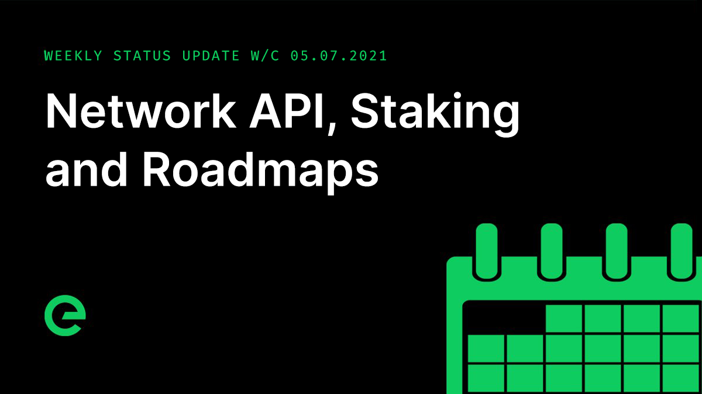

# Core Team Updates

As part of Edge's ongoing commitment to transparency and development in the open, the core team write weekly updates to the Edge community.

There have been 118 of these so far.



## Latest Update

Hi everyone 👋 Happy Friday 😀

Time is just flying at the moment. There's so much happening it's hard to keep track. These updates are a great marker though. As ever, the team are usually about if you have any questions.

We’ve moved closer to the release of the network bridge, with supporting marketing plans now in place and branding and links in key channels starting to drop into place. Testing is ongoing, with full live contract testing now scheduled for next week.

We're working on it!

Network API has been updated to accept device IDs in both legacy and a new format in preparation for a phased migration to the new datastore for device activity – one of many performance improvements to reach production over the coming weeks.

An issue with the health check package has been resolved, putting an end to an intermittent bug with devices that connect and disconnect from the network at a rate that exceeds the health check timeout.

Host is now using batch updates throughout, further reducing its memory usage when configurations are synced after update.

A new package for generating random image and text content has entered its first phase, with the anticipation of being production ready within the next few days. This will allow us to simulate higher traffic spikes without the need to pre-generate source files. The package will instead create a buffered queue of random files.

Another of Edge’s packages has been open sourced:

[https://github.com/edge/goarch-helper-action](https://github.com/edge/goarch-helper-action)

I have Adam with me today to update you on staking. Hi Adam 👋

_Adam K Dean_

Evening!

From my side the team has been focused on the integration of staking directly into the XE blockchain. We’ve looked at a number of different approaches and have settled on the integration of the staking mechanism directly into the transaction layer.

Creating a stake will work by submitting a self-addressed transaction with additional staking metadata, which will then be picked up and validated in the same way as regular transactions, except when the ledger is updated, a stake will be added to the wallet and the wallet balance will have the amount deducted.

Unlocking and releasing a stake will work in the same manner, submitting a self-addressed transaction with the relevant stake information and action in the transaction metadata. Unlocking a stake will change the status from active to a state of unlock pending, with a timestamp set for the unlock date. After this period, a further transaction can be sent requesting the release of those funds back to the wallet.

The creating, viewing, and management of stakes will be handled inside the XE Wallet, and will no longer occur in Console. This is the next step on the road to enabling truly anonymous staking & network contribution.

_Joseph Denne_

Thank you Adam!

A roadmap update is underway, which will be released in the coming weeks. This will add a lot more flesh to the bone for expected delivery through the rest of the year.

We now have 20 Edge Compute Units in production. Rollout is ongoing, with capacity expected to reach around 1,000 units over the rest of this month.

The Cookalong event with David Flatman and Hawksmore for Vodafone went off last weekend without a hitch. The event was hosted on site within the Edge Compute layer of the network.

You can see a replay here:

[https://cookalong.tv/david-flatman/the-hawksmoor-feasting-box/03-07-2021/17:00](https://cookalong.tv/david-flatman/the-hawksmoor-feasting-box/03-07-2021/17:00)

API development for Compute moved forward.

Our work with the business network provider here in the UK moved ahead. We are expecting to have a new site for them – built on Edit and running in Edge – live in August.

And finally the latest episode of Conversations on the Edge can be listened to here:



If you missed last weeks update, you can read it here: [https://ed.ge/update/2021/07/02](https://ed.ge/update/2021/07/02)

And that’s it for this week!

This weekend, why not help spread the word? The more the existing community helps to promote and drive the project forward, the stronger we will become.

For the very latest from Edge, join our Discord server: [ed.ge/discord](https://ed.ge/discord)

Enjoy your weekends. \(And wish us well for Sunday ⚽️\)

_Posted by: Joseph Denne_

