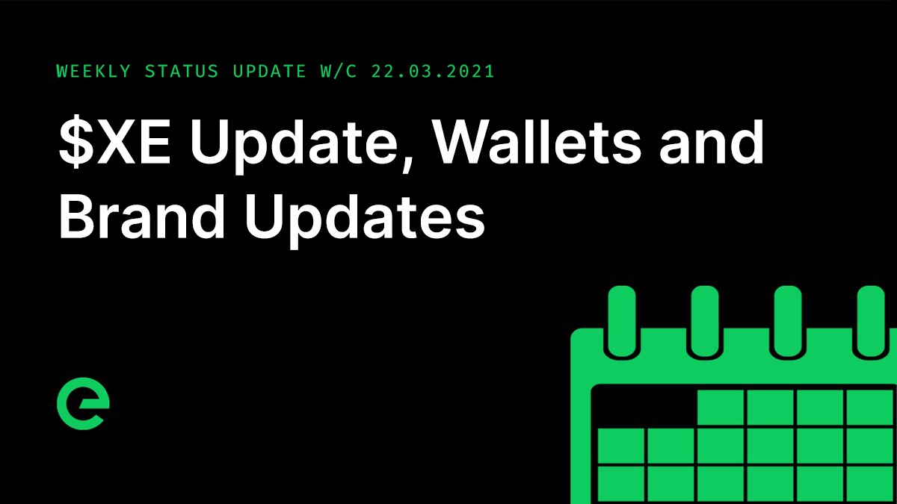
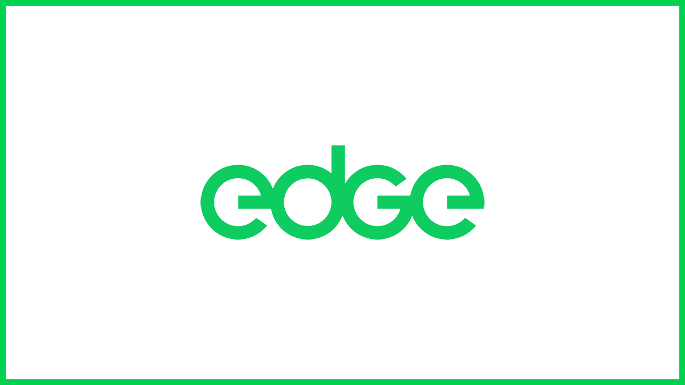
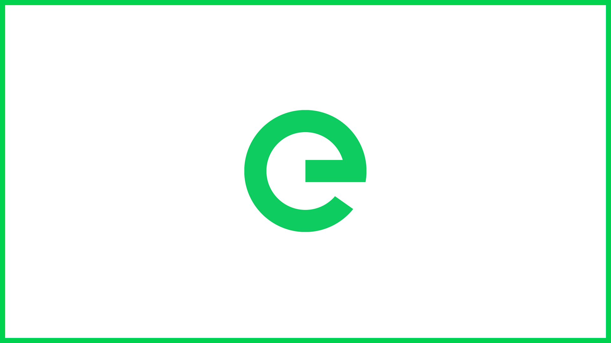
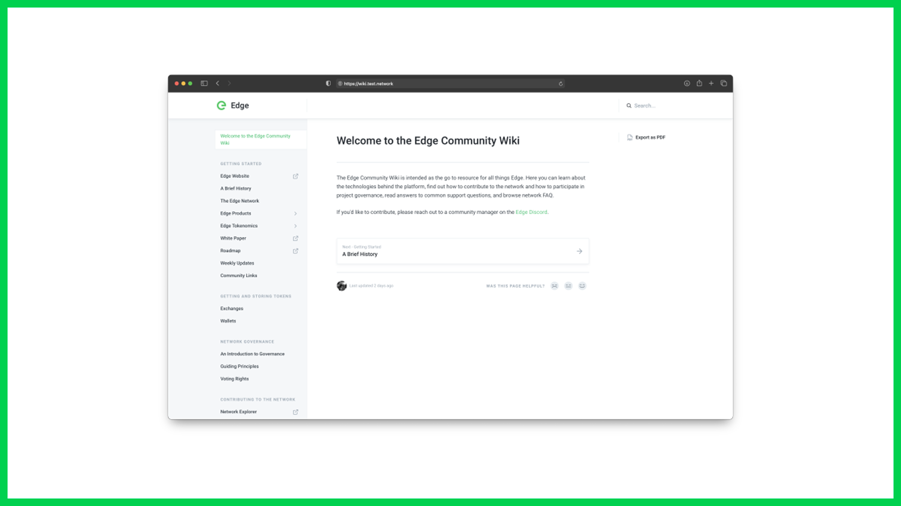

# Core Team Updates

As part of Edge's ongoing commitment to transparency and development in the open, the core team write weekly updates to the Edge community.

There have been 101 of these so far.



## Latest Update

Hi everyone 👋

It’s been another jam packed week here, as we push towards the release of $XE 🏗️

$EDGE itself is ready \(contracts + the bridge\). Distribution will be in $XE, which will be available to claim and which can be bridged out to $EDGE at the end of April/early May \(TBC depending on development pace on remaining items\).

The network team changed the way Gateway handles device scoring to ignore responses that include error codes. Typically a response from CDN with an error return faster because there is no asset manipulation, therefore scoring based on a quick but failing response gives far too much priority to a device that has configuration issues.

The way applications are launched in the network is getting a large refactor, including the introduction of the Edge Finite State Machine package in order to avoid conflicting states and duplicate containers. This is expected to be delivered at the very start of April.

The test.network build of the $XE chain has been updated with a series of P2P Synchronisation fixes & enhancements.

It’s also been under continuous load testing, and has shown itself to be stable. We’ve pushed it hard, with 5 second block times and heavy usage. Adam will share some more data on this front next week all being well.

A metrics dashboard for the chain has been deployed giving us a bunch of insight and trend data.

$XE wallet generation and restoration is now complete in the client-side JS wallet.

A wallet utilities module and support API have also been completed. This will be made publicly available, allowing third parties to interact with it directly.

This includes crypto functions such as wallet generation, public key to checksum address, checksum address verification, private key to private key phrase generator, private key phrase to private key recovery, private key to public key, private key to address and world list generation.

As we move towards the issuance of $XE we’ve taken the opportunity to make some small changes to the Edge logo.

> “After living and working with the word mark and the ‘e’ icon over the past 18 months, we felt it wasn’t quite as well balanced as it should be and needed a little refinement.
>
> “The original logo was intended to convey balance, uniformity and simplicity. The 4 circles being the starting point of the letter forms. There was a slight angle applied to the endings of the cross section on the ‘e’ and ’g’. This little detail has now been simplified and removed in favour of a straight edge.
>
> “Although this is a small detail, the straight edge adheres to the ideas of simplicity and clarity and makes for a more balanced, less fussy shape.”
>
> _– Ravi Chandwani, Edge Desgin Director_

Here’s the updated logo:

And here’s the icon:

The brand pages on the site will be updated next week.

We have also been putting together a community wiki for the project. This is near completion and does a great job communicating the scale of the project and how much has been achieved so far.

We’ll be making this public in mid April, along with a whole lot of additional information relating to $XE, $EDGE and the network bridge.

The definitions around project governance have been moved forward, with guiding principles defined along with guidelines for the use of governance for the core team.

This will be laid out in detail in the wiki.

Cookalong are hosting an evening with William Sitwell – a charity event in support of Muscular Dystrophy UK. I’ll share the link as soon as it’s available.

The updates to the Ecohustler site mentioned in earlier updates is set to go live on Monday, with eCom functionality following the week after.

And finally, we have had a couple of business meetings this week, including with a leading motorsport. Chris is leading on partnerships and special projects, and has been doing a great job getting the network and its tech in front of some really exciting organisations.

And that’s it for this week.

Enjoy your weekends.

_Posted by: Joseph Denne_

