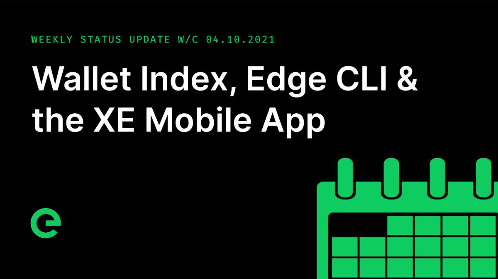
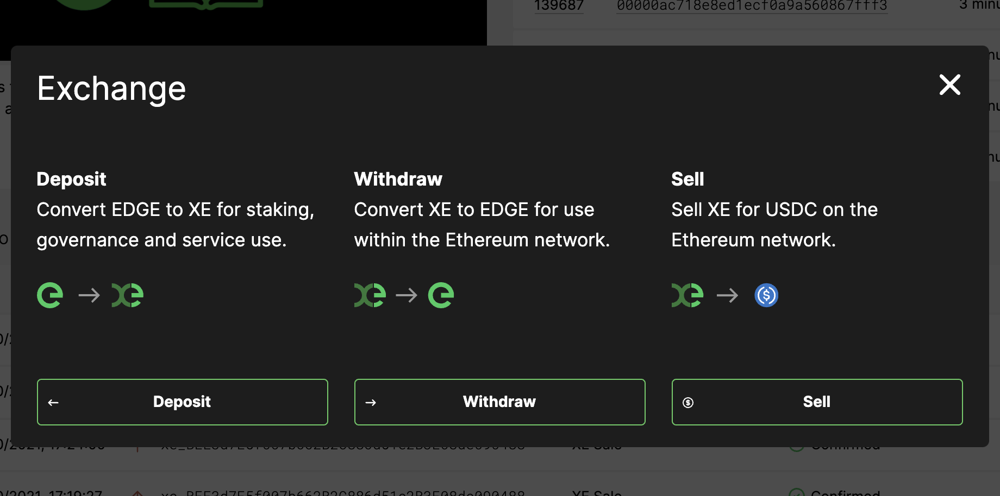
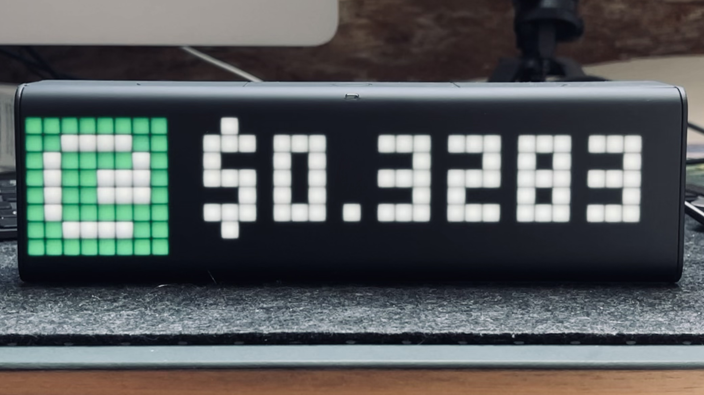

# Core Team Updates

As part of Edge's ongoing commitment to transparency and development in the open, the core team write weekly updates to the Edge community.

There have been 131 of these so far.


[weekly-updates.md](weekly-updates.md)


## Latest Update

Good evening everyone 👋

For those of you that are new to the community, we post weekly core team updates to our main channels, including to the wiki. These are on a Friday, at some point in the evening, depending on how busy we've been.

There have been 129 of these so far. You can see a full history here:


[weekly-updates.md](weekly-updates.md)


On to this week’s update… #130!

Nothing says we’ve been working hard like the weekly project update being at 22:59. I’m covering for Joseph this evening as he’s been called away. It’s been a packed week here and we have a big release to tell you about as well.

(Thanks for your patience everyone in waiting for this update!)

The move to Discord pushed further with most of the team now working here instead of in Slack. You can see this in the core team members, and it means that we’re generally more available. This is part of a wider move towards community governance and the ultimate goals of the project.

The extended distribution period for $XE closed yesterday. Console has now been mothballed, and the site updated with links to the explorer and the wallet. For those of you who haven’t been here for previous updates, the public roadmaps can be found here:


[project-roadmaps.md](../project-roadmaps.md)


Today marks the start of Q4 and wow, what a Q3 we had, releasing the explorer, opening the bridge, listing on Uniswap, and in-between those, dozens of smaller releases here and there and a lot of work on v2 behind the scenes. We have a lot planned for Q4, including on-chain staking, a new CLI, a public v2 testnet, v2 mainnet device onboarding, the mobile wallet apps, VPS public beta, and to kick off the quarter, the wallet sell feature, **which is now live!**

Accessible via the web wallet, you can now sell your XE directly for USDC. The process is similar to withdrawals, except instead of receiving EDGE you’ll receive USDC. The exchange rate will update in real time, and tracks the value of the EDGE token.

Once you submit your transaction, it will go through to the bridge, which will process them on a first come, first serve basis. As with withdrawals, there is a minimum 10 confirmation wait before processing. Purchasing of XE by Edge is subject to availability and will fluctuate over time.

**Supporting this saw releases of blockchain (v1.3), index (v1.6), bridge (v2.3) and wallet (v1.6)!**

ork on the mobile wallet app progressed, with the latest version of the wireframes now being turned into a more polished design while the functionality of the app continues to be built. The mobile wallet app will be available for iOS and Android devices later this year.

DefiGainer in the Telegram community posted a photo of an Edge ticker on a Lametric device. We loved this and spent a few hours making an official app for the device showing the ticker name, current CMC price and the movement over the last hour.

If you have a Lametic, you can download the app from their app store:



We’ve also picked up a few of the devices to give away to the community! We’ll be sharing the mechanic for this in the next week or two.

The latest of our now weekly newsletters was sent today. If you’re not signed up, there’s no time like the present! You can do so here:



The latest episode of our podcast, Conversations on the Edge, has just been released:



If you’ve missed the podcast to date, you can catch up with all 21 episodes from season #1 here:


[conversations-on-the-edge.md](../conversations-on-the-edge.md)


We're still on the hunt for new core team members, with positions available for accomplished full stack developers. You can read about how we work and find a job specification here:


[careers](../../supporting-the-network/careers/)


This weekend, why not help spread the word? The more the existing community helps to promote and drive the project forward, the stronger we will become.

For the very latest from Edge, join our Discord server: [ed.ge/discord](https://ed.ge/discord)

Enjoy your weekends.

_Posted by: Adam K Dean_
