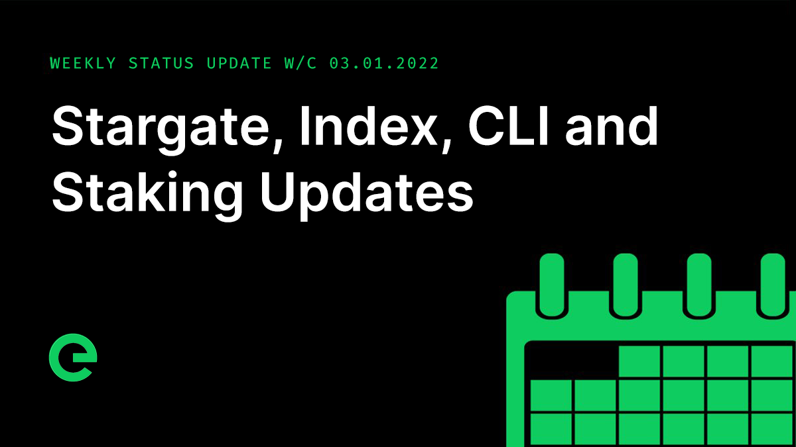
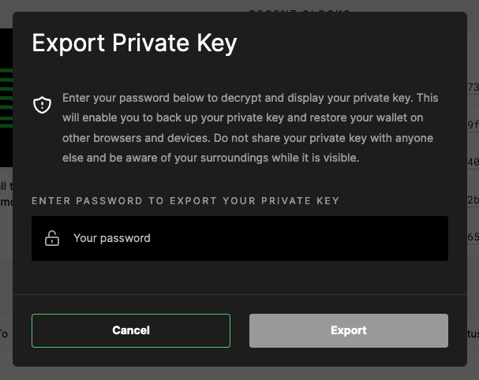

# Core Team Updates

As part of Edge's ongoing commitment to transparency and development in the open, the core team write weekly updates to the Edge community.

There have been 147 of these so far.


[weekly-updates.md](weekly-updates.md)


## Latest Update

Good evening everyone 

First up, the XE mobile app. As you know we originally planned for a beta release at the end of last year, but pushed this back to give us time to enhance the application and to ensure that it stands up to the quality expected from the project. We’re around two weeks out from the first public release for iOS and it’s looking great.

The focus of the app is all about lowering the barriers to use of the network. It helps to achieve this by allowing access to XE across a greater set of devices. And of course in time a network node will be bundled into the application as well, unlocking the \~60% spare capacity that exists in the average mobile phone.

Here are a few screens to whet your appetite:

The mobile app’s source code will be released in full alongside the beta.

As we continue to move towards full open source development, we’re continuously refining the way that we manage our projects and repositories. You may have noticed the addition of contributor guidelines to some of our public repositories. We’re rolling out a simple set of guidelines to help you more easily work on the projects, so if you’re interested in writing code but unsure of what to do, that’s a great place to start.

In the same vein, we’re also planning to open source the explorer in the coming weeks, and look forward to sharing that with you all.

We’ve seen some great work in the community with contributions to the Wallet repository and even full extensions, such as:



We’re really thrilled to see this level of input – exactly what the project needs to help accelerate development.

Next up: we originally required a minimum uptime of 20% for contributed Hosts, however with improvements to the network in v2 relating to session management, this requirement is no longer needed.

If nodes are offline, they won’t earn, but for those devices that may have intermittent connectivity or whose contributions may be linked to machine inactivity, being able to connect and disconnect from the network is essential, so we will be supporting this.

The team held a series of meetings with potential partners, ranging from Enterprises to other crypto projects. There’s a lot bubbling on this front. As soon as we can name names, we will!

This week we saw a number of releases across the board:

**Blockchain v1.5.1** was deployed to mainnet. This patch fixed a slight issue where transactions to release already released stakes were being accepted by the mempool, only to be discarded by nodes when mining the next block. This patch also included regular security patches.

**Bridge v2.4.3** was deployed to mainnet. This update contained changes to logging drivers, and included regular security patches, as well as a change to build and deployment notifications so that they now appear in the Discord builds & releases channels.

**Index v1.13.1** was deployed to mainnet. This update (which also included v1.12.0 and v1.13.0) simplified balance indexing, and also included changes to build and deployment notifications too, along with regular security patches. You'll now find the Wallets page is positively snappy!

[https://xe.network/wallets](https://xe.network/wallets)

**Wallet v1.11.0** was deployed to mainnet. This update added the ability to export your private key, plus numerous bug fixes and enhancements — including new visual feedback when copying text to the clipboard.

**Explorer** has also been receiving some updates this week (as you can see on testnet) and you can expect them to hit mainnet early next week. These include stake-related features such as listing stakes on wallet pages and showing total staked amounts for wallets. Groundwork has also begun for device pages, including explorable device statuses and the old favourite — the Edge world map.

Have an idea of something you’d like to see in the Explorer? Let us know in the #suggestions channel on Discord.

We also welcomed Will G to the core team this week, and he didn’t waste any time in getting stuck right into the explorer and wallet, the results of which you’ll see shortly. Please say hello if you see him around and welcome him to the community.

For those of you who are still waiting on your stake migrations, please be sure to check and double check your inboxes and spam boxes and junk boxes and any other boxes. If you still can’t find the email from us, please reach out to a community lead.


[community-leads.md](../../supporting-the-network/community-leads.md)


Once your legacy stake has been migrated into your wallet, you have a few options: you can either leave it there, stake a device with it, or unlock it. Unlocking takes 90 days after which you can release the funds back to your balance.

If you still need to make a request, please ensure that you make it with your Console account email to make it easier for us to process. Also for Founding Node requests, please include your original staking transaction or your device name if you can find it.

Don’t forget to check your inbox and spam messages for emails from us to confirm your request. If anything is unclear, you can always ask in Discord.

The latest issue of our weekly newsletter just dropped. You can read it here:



And if you’re not signed up, sign up now:



If you missed last weeks update, you can read it on site now:



The latest episode of our podcast dropped. Listen below!



And finally, Will wrote about object storage:



And that’s it for this week  Enjoy your weekends.

_Posted by: Σxult_
