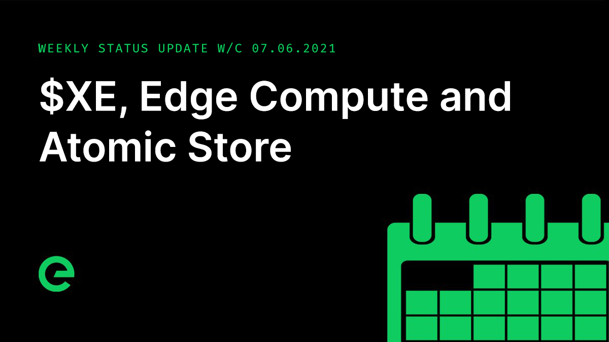

# Core Team Updates

As part of Edge's ongoing commitment to transparency and development in the open, the core team write weekly updates to the Edge community.

There have been 114 of these so far.



## Latest Update

Hi everyone 👋

$XE distribution is working well and progressing as planned. Requests are collated over a 24 hour period, consolidated and sent for processing. So you can expect to receive your $XE roughly a day after you submit your XE wallet to Console.

Those of you who either had stakes that were returned in TNC or who are still staking will also be distributed $XE. Note that this is being done to a separate schedule, and that we expect it to complete within the next four to six weeks.

Also, as a reminder, distribution is only available to those who went through the swap of the original Edge. I mention this as there have been a few requests outside of this process.

Version v1.0.6 of the XE Wallet was released. This contains a number of interface updates to further streamline the user experience.

Final preparations are being made for the launch of the Network Bridge, with the project now moving into an as-live testing phase.

Work to support withdrawal transaction metadata was completed on the blockchain.

Improvements have also been made to the XE Index, which should be released next week, allowing transactions to be sorted by type \(sent, received\) as well as filter above a block height. The XE Wallet received an update during the week, fixing a number of small user interface issues.

A new version of the Edge Atomic Store was released, which includes the ability to batch all storage operations and run a single callback. Stargate, Gateway and Host are now using the new batch store which has reduced the number of messages between the services by an order of magnitude. These changes will be released during the next major release cycle.

Edge Compute moved further forward, with testing on an API for the control of individual instances \(start, stop, reboot. resize\). This is the control system that will eventually be mapped into the services dashboard to allow for on demand setup. Production use of the layer will be ramped up towards the end of the month, with key services moved in to the stack.

Chris and I have pitched three businesses this week.

And finally episode five of Conversations on the Edge has just been released:



And that’s it for this week.

This weekend, why not help spread the word? The more the existing community helps to promote and drive the project forward, the stronger we will become.

For the very latest from Edge, join our Discord server: [ed.ge/discord](https://ed.ge/discord)

Enjoy your weekends.

_Posted by: Joseph Denne_

