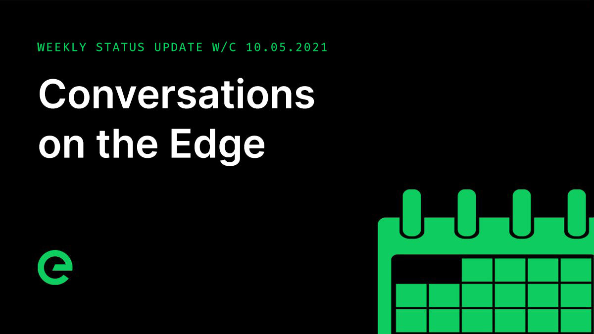

# Core Team Updates

As part of Edge's ongoing commitment to transparency and development in the open, the core team write weekly updates to the Edge community.

There have been 110 of these so far.



## Latest Update

Hi everyone 👋

First up, a reminder that the swap closes on the 27th of this month \(Thursday, 27th May 2021\). **If you don’t swap before this date, you won’t be able to claim TNC and will lose the ability to claim $XE**.

We remain in a good place for the distribution of $XE. Specific dates for this will be agreed by the core team early-mid next week, and we’ll publish them to the community. We’re close.

We’ve just released the first episode of Conversations on the Edge. This is the first in a new series of audio shorts discussing Edge Network and how it is poised to help change the Internet.



The latest build of the Edge Ledger moved into staging today, ready for further testing through this weekend. Among the optimisations and fixes introduced are additional metrics for ledger & storage performance, failsafes to protect against rare, momentary underlying storage failures during heavy IO, and the introduction of cryptographic signing of all P2P traffic, which is powered by the $XE wallets belonging to each $XE node.

In addition to these changes, work has progressed on the API, which is built directly into $XE nodes, allowing inspection of blocks, transactions, and the ledger. Plans for the opening up of the API and how we handle rate limiting were completed. We’ll share more about that soon.

There has been continued testing of the blockchain under super heavy load, with positive results. While we don’t expect to be processing 2,000+ transactions/second, we have tested to this level and have demonstrated stability at scale.

The team have removed the private key phrase concept from wallets, and introduced encryption to wallet keys, allowing you to specify a passphrase to unlock your wallet. Work on the wallet is progressing, and it is looking fantastic.

The front end build is due for completion on Tuesday. We can’t wait to show you.

Stargate API requests are now monitored and graphed as part of an increase in transparency of the network services and their activity. Gateway is also monitoring the Device priority leaderboard and we expect to be making this information public later on this summer.

A new Gateway health check has been deployed to test.network. This refactor unifies the health of the RPC connection and the quality of the RPC stream to create a more reliable health status across slower connections.

To reduce the race hazard issue with RPC metadata syncing, Host now uses a buffered channel to force each update to stream in the order they were enqueued.

Chris and I pushed forward discussions about embedding Edge technology into a series of smart devices destined for deployment in London and other cities. This is looking likely to go ahead, with the first deployments expected toward the back end of this year. As soon as we can provide more detail on this front, we will.

There are multiple active customer engagements ongoing. This includes the broadband partner discussed in an earlier update. The team is flat out in delivery. We’ll have loads more to share on this front as we progress.

TNC payouts for stake withdrawals will be being processed soon. They will be done on a node by node basis over the next few months. There will no longer be any vesting on the withdrawals.

Earnings for 2020 continue to be processed. If you’ve not had your yet, sit tight.

Finally, we’d like to understand a little more about your appetite for custom Edge devices.

We’ve been pushing hard in this space, and are considering releasing one or more devices as ready-to-go nodes which could be purchased using $EDGE/$XE or other crypto currencies.

To help guide the future of this side of things, please take a moment to complete this anonymous survey:

[ed.ge/device-survey](https://ed.ge/device-survey)

And that’s it for this week.

For the very latest from Edge, join our Discord server: [ed.ge/discord](https://ed.ge/discord)

Enjoy your weekends.

_Posted by: Joseph Denne_

