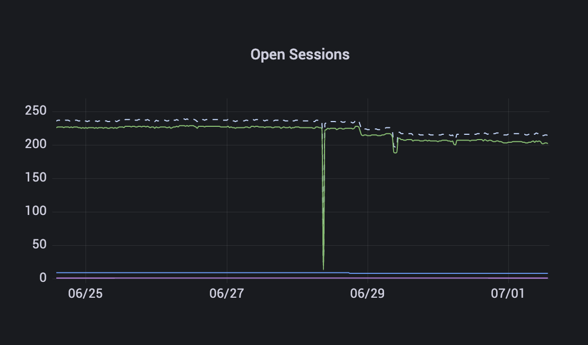
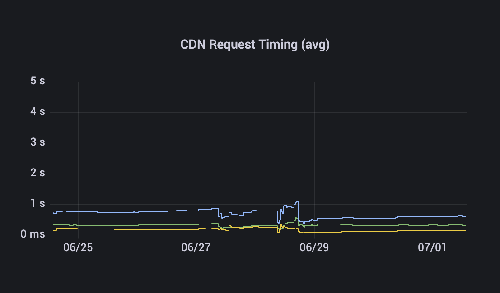

# 📰 Core Team Updates

As part of Edge's ongoing commitment to transparency and development in the open, the core team write weekly updates to the Edge community.

There have been 169 of these so far.


[weekly-updates.md](weekly-updates.md)


## Latest Update

Good evening everyone 

This week Stargate saw an update, with **v2.10.6-230** being deployed to mainnet. This update introduced improvements to the area of Stargate that monitors connected nodes for changes in their stakes (such as them being reassigned or unstaked). This process is now more efficient and more robust. Build 230 also improved the way in which Gateway sessions are handled, allowing a grace period for Gateways to reconnect before treating them as offline, which allows for easier recovery on network blips.

The team have also been heads-down, busy at work, putting the finishing touches on the account system. There are a lot of moving parts, but things are looking good. The user interface is getting a final review and polish, while the behind-the-scenes services are being prepared for mainnet. We’re working towards this being available next week (exciting!) so keep an eye on the 📢 announcements channel in Discord 

The network remains stable. The number of online nodes has been a little bit lower towards the latter half of this week, when we switched off the original London Gateway node. It seems some devices haven’t switched over to their local Gateway yet so if you notice your earnings are lower than usual, try restarting your nodes. This can help with DNS issues your nodes may be experiencing.

(That one drop was the Stargate deployment, v2.10.6-230)

Everything is performing well. Host RTT latency is on average, across all Hosts and Gateways, 178 ms. This means 178 ms on average from Stargate -> Gateway -> Host and back, so 4 hops, average of 44 ms per hop. This will improve with time as we add more and more Gateway nodes.

CDN performs well, with uncached images being processed in under a second on average. Downloading origin images takes on average 300 ms, processing takes on average 150 ms, and other overheads (transport, packing, unpacking etc) takes on average 150 ms, giving uncached CDN requests an average duration of 600 ms. This isn’t bad at all, considering some of the origin assets are high resolution images, 10-20 MB or greater in size.

Of course, most assets the network serves are cached, and are delivered directly by Gateways. The average this week for cached hits was 90%, though this fluctuates. That means 9 out of 10 requests were handled by Gateways, with 1 out of 10 requiring processing by a Host.

Finally, a couple of weeks ago we proposed to create a community advocate role. If you haven’t read about that, check out last week's update. If you’d like to discuss the idea, please take a look at the proposal thread 001-community-advocates in Discord.

And that’s it for this week  Enjoy your weekends.

_Posted by: Adam K Dean_
