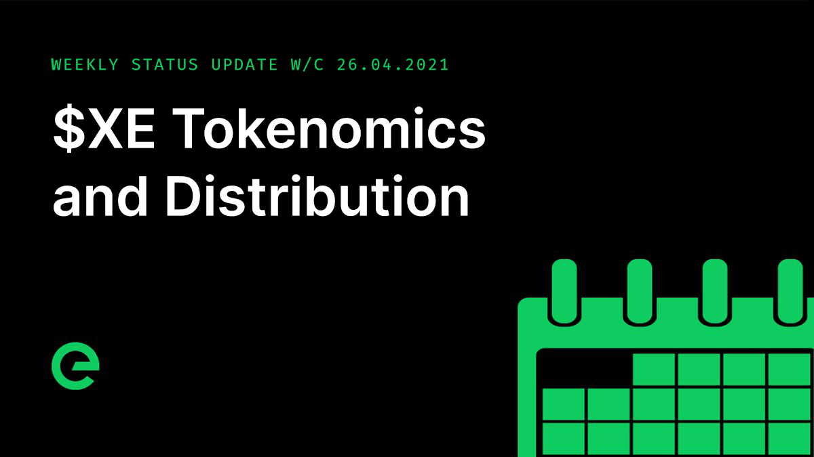

# Core Team Updates

As part of Edge's ongoing commitment to transparency and development in the open, the core team write weekly updates to the Edge community.

There have been 108 of these so far.



## Latest Update

Hi everyone 👋

It’s been a big week for updates, with tokenomics and plans for the distribution of $XE released.

Chris Mair wrote about the tokenomics of the network, breaking out the mechanics within each layer and explaining how they work both to aid network security, and to incentivise network growth.

You can read this here: [https://ed.ge/knowledge/tokenomics-overview](https://ed.ge/knowledge/tokenomics-overview)

We also wrote about the distribution of $XE.

You can read this here: [https://ed.ge/knowledge/xe-distribution](https://ed.ge/knowledge/xe-distribution)

Chris and I also held an AMA on Thursday evening, focused on the coming release of XE. It was a meaty session, with great contributions from the community.

You can access a fullt transcript here: 

One of the things I love so much about this project is just how distributed the community is. There are members in 203 countries, with new members joining every day.

Here’s a great visualisation of where we all are:

The team made some changes to the Edge Logger to enhance the readability and depth of information available for debugging.

An investigation into the performance of the update process when a configuration change is made has led to the roadmapping of a staggered propagation for updates. This will be coupled with a per-device performance grade freeze to avoid unnecessarily downgrading a devices performance during an update window.

And investigation into a rare issue with slow reconnections after a Gateway deployment continued, and is expected to conclude early next week.

Heavy load and security testing on the Edge Ledger continued, with a series of performance improvements brought to bear as a result of the data tracked.

Some big improvements were made to ledger storage, vastly improving performance during the mining cycle. This was done after a bottleneck was identified during testing.

A transaction Generator service was built and deployed to feed transactions into the network. This is now being used on testnet to scale out testing.

Arthur Mingard wrote an article on network security.

You can read this here: [https://ed.ge/knowledge/hidden-in-plain-sight](https://ed.ge/knowledge/hidden-in-plain-sight)

And I wrote an article on TCO of network services.

You can read this here: [https://ed.ge/knowledge/the-network-that-works-for-you](https://ed.ge/knowledge/the-network-that-works-for-you)

The Edge Community Wiki will be released on the 04th of May.

And finally, TNC released the interest for the month of staking to holders wallets. You should be able to see this in your wallets. It’s fully unlocked and usable right away.

Note that next week is a short week as we have the May bank holiday on Monday. With luck it will be sunny☀️

And that’s it for this week.

For the very latest from Edge, join our Discord server: [https://ed.ge/discord](https://ed.ge/discord)

Enjoy your weekends.

_Posted by: Joseph Denne_

