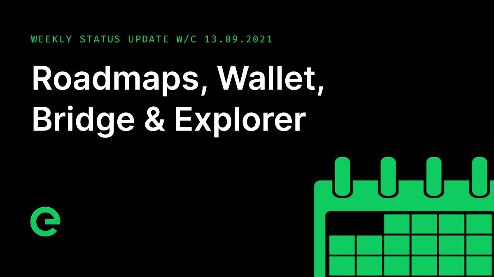

# Core Team Updates

As part of Edge's ongoing commitment to transparency and development in the open, the core team write weekly updates to the Edge community.

There have been 129 of these so far.



## Latest Update

Good evening everyone 👋

For those of you that are new to the community, we post weekly core team updates to our main channels, including to the wiki. These are on a Friday, at some point in the evening, depending on how busy we've been.

There have been 128 of these so far. You can see a full history here:



On to this week’s update… \#129!

First up, marketing. I have Chris with me to provide a summary of what’s been going on and where our focus is.

_Chris:_

Marketing for the project breaks into two halves – growing and strengthening the network itself, which is all about awareness, the token economy, taking and governance; and growing the use of Edge services such as CDN.

In the short term we’ve been working with [@Cryptonator1337](https://twitter.com/@Cryptonator1337) to develop a marketing plan focused on awareness. This looks at other projects in the space to identify opportunities for Edge; targets marketing spend; and identifies influencers that are likely to be aligned with the outlook of the project. We’re executing on this at the moment, which should be visible in our ongoing content, outreach and growth.

We expect numbers to start to pick up over the coming weeks as direct spend increases.

Longer term my focus is on partnerships and collaborations. Deeper integration within the crypto space through alignment with other communities and through providing Edge Services to other crypto projects that we recognise, admire and share values with.

This is a really strong marketing angle for us and one that is bearing some serious fruit. I can tell you that it doesn’t happen overnight, but that things are moving at a pace.

I’m also looking at some of our more consumer focused product offerings. For example, Edit.com is a killer domain and brand, but it’s underutilised right now.

Imagine a future where it’s retooled, developed in the open around a DAO structure to provide an anonymous site builder for the creation of blogs, content sites and eCommerce… all fully decentralised through Edge.

You can see the potential. And this is just the beginning.

_Joseph:_

Thank you Chris!

I also have Max with me to chat about the token economy.

_Max:_

Good evening everyone!

Since the relaunch of the token, we have seen great performance of the token.

As was expected we have seen some sell pressure from existing holders, however that has come to an end. Which can be seen in the upswing today.

There are around 191 holders of $EDGE in the Ethereum network. Not a huge number, but it’s growing and you have to remember that most of the value of the network is actually locked inside of the network in $XE, where there are a further 800+ active wallets.

Nonetheless, a key focus for us in driving that holder number. We need to see active use of the token – new entrants holding it to participate in the network. This is where we’ll see most growth and upside potential for early supporters. I speak with the other members of the team regularilly to drive this point, ensuring that the objective is central to what we’re doing on the marketing front.

I’m really bullish on Edge. Hard to overstate that fact. We’re so early. The technology and the scale of the markets in which were operating are really exciting. Thank you for helping to spread the word. The more that you talk about what we’re doing, the stronger the project will become.

The network bridge has now generated over 200k $XE in fees. This is a great start that demonstrates real value creation through blockchain use. Now imagine a future where we’re providing bridges between multiple chains...

Some more great news:

$EDGE is now listed on Coin Market Cap and CoinGecko!





There are more listing sites to come.

The Sell option within Wallet will be live in the next fortnight. This is a direct OTC option for smaller amounts of $XE, designed to make life easier for holders who don’t want to deal with Uniswap fees. It will also help the overall token economy by keeping smaller trades within the network.

_Joseph:_

Thank you Max!

The extended claim window for $XE closes at the end of this month. It won’t be extended again, and Console is being mothballed. So if you haven’t put in your claim yet, do so now.

The team delivered **Bridge v2.0.0**. The major version update \(from 1.3.4\) reflects that the codebase has been migrated to TypeScript.

This provides significant improvements to maintainability and presents future refactoring opportunities also. Also included in this release:

* Preparatory work for wallet sell functionality
* Fee Tx is now stored alongside each withdrawal/deposit transaction to enable correlation
* Patch to Uniswap sync to ensure correct ETH values in the frontend
* Behavioural change for very small transactions incurring a handling fee: if the fee is larger than/equal to the actual amount sent, the transaction will fail, rather than taking the entire sum as a fee
* Other maintenance incl. removing test code

**Explorer v1.5.0** was also released to mainnet:



The release added the ability to view the Fee Tx for any transaction that incurs a fee - namely, a withdrawal/deposit through the Bridge. This makes it easier to correlate 'primary' transactions and their corresponding fees through the Explorer.

Look for 'Fee Tx' in the transaction overview.

_Note: withdrawals/deposits prior to the latest Bridge release \(v2.0.0\) may not display Fee Tx, but all future such transactions should_

Adam wrote about the latest roadmap updates, bringing some additional detail to the individual deliverables. The schedule is pretty stacked for the coming months, so it’s definitely worth taking the time to familiarise yourself with what’s ahead:



You can access the project roadmapsright here in the Community Wiki:



The latest episode of our podcast, Conversations on the Edge, has just been released:



If you’ve missed the podcast to date, you can catch up with all 20 episodes from season \#1 here:



We're still on the hunt for new core team members, with positions available for accomplished full stack developers. You can read about how we work and find a job specification here:



This weekend, why not help spread the word? The more the existing community helps to promote and drive the project forward, the stronger we will become.

For the very latest from Edge, join our Discord server: [ed.ge/discord](https://ed.ge/discord)

Enjoy your weekends.

_Posted by: Joseph Denne, Chris Mair & Max Lyrical_

