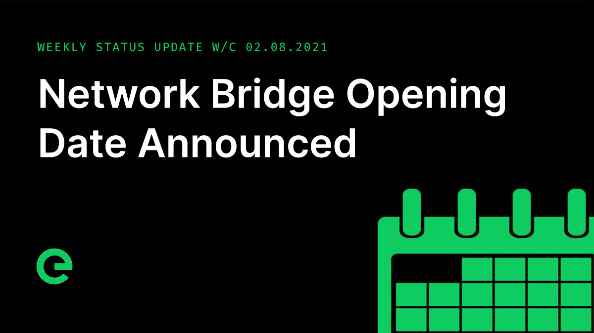

# Core Team Updates

As part of Edge's ongoing commitment to transparency and development in the open, the core team write weekly updates to the Edge community.

There have been 122 of these so far.



## Latest Update



Hi everyone 👋 Happy Friday 😀

I have quite a long update for this week. As ever, there’s a lot happening at Edge HQ.

First up, the network bridge. The Web is 30 years old this month, the perfect milestone for the release of $EDGE and the opening of the network bridge. What the Web did for access to information, Edge is doing for wealth distribution from providing network services.

Our mission is to uphold the founding principles of the Web by democratising computational power. We want to give the ownership of the network to everyone that is connected to it, and to make them the beneficiaries of the revenue that comes from its use.

To this end, the opening of the network bridge will take place towards the end of this month \(August, 2021\).

This week the team has undertaken some refactoring work touching all of our apps so that a single interface handles all config, further streamlining this system.

Until now all network apps have included 'second-order' configurations, which means that we have some values hard-coded into our application binaries that are toggled based on a single config flag. There has also been some legacy reliance on "magic" configuration that isn't properly integrated with our configuration model. For example, EDGE\_NETWORK=test will make apps connect to test.network services by setting 5-6 secondary values, while another will enable secure connections, even though it doesn't exist in our code. This is a result of Consul legacy code.

Sorting this out brings benefits including complete visibility of all config in a single location; 'flattened' config structure to remove indirection; the ability to read an envfile consistently; deprecating reliance on those 'magic' inputs; and removing unused values. The net effect is to improve engineering confidence around the network apps, as we now have complete clarity on all inputs, simpler workflows for local development and simpler build-deploy processes with clearer ownership of configuration \(i.e. builders and runners must provide those values, with no assumptions made by the app code\).

Long term, this is also a step towards being able to detach apps and services from specific networks and to be able to run a completely offline network, which will make it considerably easier to write/run tests and engineer experimental features.

Other updates include changes to Gateway to ensure that it now fails fast without a delayed panic when it can’t find a Stargate. Previously a missing Stargate would cause Gateway to attempt to recover, cycling over and over until it ran out of memory. Whilst we don’t expect this to have happened in production, mitigating against it is one less concern when identifying the cause of a CPU spike.

Gateway is also now able to exit before the Finite State Machine package is initialized. The package itself guarantees that operations run under one state will not continue after the state is changed. If the Gateway launch process itself has issues and FSM has yet to be started, there is a chance that a failing process that requests a change to the Error state will be ignored, causing a slower exit process.

Host has been updated to close all connections with Gateway when an unknown error occurs with the CDN launch process, rather than attempting the same process ad nauseam. This in turn reduces the number of connections and disconnections from Gateway.

The development of the blockchain explorer pushed ahead. It is expected to go live just ahead of the opening of the network bridge. To begin with you’ll be able to use it to explore blocks, transactions, and wallets. In time you’ll also be able to view devices & stakes with it, and then later on governance too.

Development of staking is coming along, with the focus now on finishing up the integration of a global configuration state, which to begin with will be used to store values such as the amount of XE required to create stakes, the period they’re locked for before you can release the funds, and the fee you’ll pay if you want an immediate release of the funds within stakes.

Want some deep tech info on staking? Okay! Here you go...

Here’s a wallet on chain before we start:

```text
{
  "address": "xe_00009f6354aa0449eACA1Af54FCf7171cAc85cB7",
  "balance": 60000000000000,
  "nonce": 0
}
```

Here’s a transaction for creating a stake:

```text
{
  "timestamp": 1628261257207,
  "sender": "xe_00009f6354aa0449eACA1Af54FCf7171cAc85cB7",
  "recipient": "xe_00009f6354aa0449eACA1Af54FCf7171cAc85cB7",
  "amount": 2500000000,
  "data": {
    "memo": "Create Host stake",
    "action": "create_stake"
  },
  "nonce": 0,
  "signature": "cde075846c13d7d3d0adfd29d95136321175fa6c6a192a270a6c8db41a10221d136a43beccebde9f5ae25c4c45608949a1afe9908ab4e60582447dce054e2dfa01",
  "hash": "8c45cf87d4f48763f91e2cb3e59365d3e9a2d91cc134e33d152f74d33aff5b93"
}
```

Our wallet now has a stake:

```text
{
  "address": "xe_00009f6354aa0449eACA1Af54FCf7171cAc85cB7",
  "balance": 59997500000000,
  "nonce": 1,
  "stakes": {
    "572c8fb0c17a688d476560706abe86182327d72077a46c8a1ee7696251bd6000": {
      "id": "4f41c077717e83c994eb57416e381b05caf111139147a0a8f90ebf69f580ac1f",
      "type": "host",
      "created": 1628261257207,
      "amount": 2500000000,
      "transaction": "8c45cf87d4f48763f91e2cb3e59365d3e9a2d91cc134e33d152f74d33aff5b93",
      "unlockPeriod": 7776000000,
      "hash": "572c8fb0c17a688d476560706abe86182327d72077a46c8a1ee7696251bd6000"
    }
  }
}
```

Next, we request to unlock the stake. Here is the transaction:

```text
{
  "timestamp": 1628261321749,
  "sender": "xe_00009f6354aa0449eACA1Af54FCf7171cAc85cB7",
  "recipient": "xe_00009f6354aa0449eACA1Af54FCf7171cAc85cB7",
  "amount": 0,
  "data": {
    "memo": "Unlock stake",
    "action": "unlock_stake",
    "stake": "572c8fb0c17a688d476560706abe86182327d72077a46c8a1ee7696251bd6000"
  },
  "nonce": 1,
  "signature": "d87a0a14fab13d792a33615ca94e1d66082f25f203fce5b4a75b30e0601493db3950fc67a16b4663e449def6e4ef9e6666394bc3b52be3799808ce39812b0fbe01",
  "hash": "940b932e6f474910abb4571c0833fc61f419778ea22dfaf2efd3729fda7027f7"
}
```

The stake then enters a period of unlocking:

```text
{
  "address": "xe_00009f6354aa0449eACA1Af54FCf7171cAc85cB7",
  "balance": 59997500000000,
  "nonce": 2,
  "stakes": {
    "3579e9df46e07a7a24894b96bf6c81c520da15d8e5cfb7238a6e92e031a9fda8": {
      "id": "4f41c077717e83c994eb57416e381b05caf111139147a0a8f90ebf69f580ac1f",
      "type": "host",
      "created": 1628261257207,
      "amount": 2500000000,
      "transaction": "8c45cf87d4f48763f91e2cb3e59365d3e9a2d91cc134e33d152f74d33aff5b93",
      "unlockPeriod": 7776000000,
      "unlockRequested": 1628261321749,
      "unlockTransation": "940b932e6f474910abb4571c0833fc61f419778ea22dfaf2efd3729fda7027f7",
      "hash": "3579e9df46e07a7a24894b96bf6c81c520da15d8e5cfb7238a6e92e031a9fda8"
    }
  }
}
```

We then attempt to release the stake:

```text
{
  results: [
    {
      success: false,
      status: 422,
      reason: 'stake not unlocked yet',
      data: [Object],
      transaction: [Object]
    }
  ],
  metadata: { rejected: 1 }
}
```

It can't be released as it hasn't unlocked yet.

So instead, we release it by using the express flag, agreeing to give up a percentage of the stake in return for an immediate release:

```text
{
  "timestamp": 1628261891953,
  "sender": "xe_00009f6354aa0449eACA1Af54FCf7171cAc85cB7",
  "recipient": "xe_00009f6354aa0449eACA1Af54FCf7171cAc85cB7",
  "amount": 0,
  "data": {
    "memo": "Release stake",
    "action": "release_stake",
    "express": true,
    "stake": "3579e9df46e07a7a24894b96bf6c81c520da15d8e5cfb7238a6e92e031a9fda8"
  },
  "nonce": 2,
  "signature": "edc94b4f53aaa0942f2808d45774a6a58979f93d162ad938a30f9a3adebfadf43ed346578832d216a7c55f40511b024e14cf0dc8ccb513830767e749c2365b9b00",
  "hash": "43a322bdd3a5ee6f2f9968600b029a9c456698beafea9652b67a24ee551e400a"
}
```

Our wallet now shows our stake as having been released:

```text
{
  "address": "xe_00009f6354aa0449eACA1Af54FCf7171cAc85cB7",
  "balance": 59999375000000,
  "nonce": 3,
  "stakes": {
    "1e377135bd0d13c3ac367193f01061182b2454405d5effcc864f6401ccf07cca": {
      "id": "4f41c077717e83c994eb57416e381b05caf111139147a0a8f90ebf69f580ac1f",
      "type": "host",
      "created": 1628261257207,
      "amount": 2500000000,
      "transaction": "8c45cf87d4f48763f91e2cb3e59365d3e9a2d91cc134e33d152f74d33aff5b93",
      "unlockPeriod": 7776000000,
      "unlockRequested": 1628261321749,
      "unlockTransation": "940b932e6f474910abb4571c0833fc61f419778ea22dfaf2efd3729fda7027f7",
      "released": 1628261891953,
      "releaseTransation": "43a322bdd3a5ee6f2f9968600b029a9c456698beafea9652b67a24ee551e400a",
      "hash": "1e377135bd0d13c3ac367193f01061182b2454405d5effcc864f6401ccf07cca"
    }
  }
}
```

Notice how the wallet balance is now less than it was when it started.

Following on from this work, we’ll be working on opening up device onboarding again, using the new blockchain staking technology, and are currently working towards integrating this with the network and migrating over existing stakes and devices.

We’re super excited for staking, earnings and governance all residing on the native Edge blockchain. This is the path to full decentralisation.

It’s also how we enable scale in the network, with per minute value attribution on the back of service purchase and use.

There's a lot still to do, but we're running at full pelt!

Staking opening up again is expected to follow on from the opening of the bridge.

We have a first customer in the pipeline for the use of the Edge Blockchain as a service. They will be using the chain as an inter-wallet value transfer mechanism in the first instance, and later as a bridging mechanism for value exchange. More as this evolves.

On which...

Imagine a world where you can deploy a custom blockchain with native coin and multi-bridge functionality, and instantly scale it to any number of nodes. This is the direction of travel for the Edge Blockchain. Edge becomes a network of chains through the provision of blockchain as a service.

The first delivery for the broadband provider here in the UK that we have been working with is due live over the course of the next month. We’ll share more on this just as soon as it is public.

This week's top performing node is `polite-bethe` with an average of 44.23 ms response time. Nice one.

If you’re the operator of the node, make sure you add an XE wallet to your Console account in the next few days, and we’ll drop you a spot prize.

A reminder that we are hiring. Specifically we are looking for talented frontend developers to work with HTML/CSS/JS for frontend, and JavaScript for backend \(specifically Vue.js and Node.js\). Attention to detail and a self-starting attitude is critical. The roles are 100% remote and can be based anywhere. They will be working on both Edge and customer deliverables. Hit up careers@edge.network if you’re interested.

For those of you who may know the right sort of candidate, please note that we will pay 50,000 XE for a successful referral.

And finally this week, the latest episode of Conversations on the Edge has just been released, all about the network blockchain. You can listen to it here:



And that’s it for this week!

This weekend, why not help spread the word? The more the existing community helps to promote and drive the project forward, the stronger we will become.

For the very latest from Edge, join our Discord server: [ed.ge/discord](https://ed.ge/discord)

Enjoy your weekends.

_Posted by: Joseph Denne_

