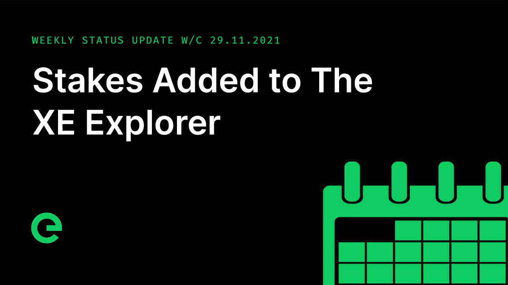

# Core Team Updates

As part of Edge's ongoing commitment to transparency and development in the open, the core team write weekly updates to the Edge community.

There have been 140 of these so far.


[weekly-updates.md](weekly-updates.md)


## Latest Update

Good evening everyone 👋

Friday! How has your week been?

This week saw a whole bunch of deployments to both testnet and mainnet.

First up, **Faucet v1.0.7** deployed which introduced a slight change to the format of transaction memos. The faucet has been running well since it was introduced to test.network, and has even played a key role in the Edge scavenger hunt.

The team also released **Wallet v1.8.2**, which fixed a small issue with deposit fees sometimes displaying incorrectly. This update also removed some debugging information that got left in the deposit panel by accident. (Oops!)

Next up came **Blockchain v1.5.0**, which introduced blockchain protocol functionality. This allows for changes to the blockchain & cryptographic ledger protocol without breaking historical blocks or transactions. This functionality was then used to introduce a change to the ledger under the protocol version 1, so that new and modified stakes are indexed by their IDs too (previously it was just their hashes).

**Index v1.9.0** was also deployed, making use of the updates to the blockchain and bringing with it stake indexing. Stakes, and their transaction history, are now explorable through the index API.

The Index API is free to use, and powers the explorer. If you’re interested in using it, do reach out to us.

Following the Index update, **Explorer v1.10.0** was then deployed (which also included the testnet only Explorer v1.9.0 faucet update). This update brought with it additional statistics to the overview page, as well as new stake pages (both for listing stakes and viewing individual stakes). Take a look!

**CLI v1.2.0** is now available on test.network, which has stake and onboarding functionality. Onboarding on testnet isn't fully functional at the moment but feel free to update your edgetest binaries and have a poke around.

As a reminder, you can get the testnet CLI binary from https://files.edge.network/cli/testnet/ or simply run `edgetest update` if you already have it.

**CLI v1.0.4** is available on mainnet which already allows staking (we’ve already had one Host stake created) so you can use that to generate stakes now, and in the near future you’ll be able to onboard devices to the new Edge network (v2) using these stakes.

If you want to try the CLI out first on testnet, onboarding for devices will be live by the end of next week there, so check out the latest version of the testnet CLI. If you need help using it, feel free to ask in one of our channels.

For those of you who have legacy stakes, the transfer of these will get underway next week, just in time for device onboarding opening up. Please keep an eye out for an email asking you to confirm the XE wallet address that you want to be used for staking.

Mainnet device onboarding will follow on from this.

We spoke to a sports technology startup about the use of XE for their blockchain project. And we spoke to a car group about the potential for launching an asset backed token on the network. Both early conversations about interesting and compelling projects that would make great use of Edge technology.

The anonymous account and authentication methods for Edge Servers neared completion. API integration for the Edge Server Management layer into the account interfaces is ongoing and progressing well.

The latest episode of Conversations on the Edge, the Edge Network Podcast, just dropped:



Another crypto project launched on Edge :muscle:



If you want to bring your project to the Edge Network, hit us up. We’re offering free decentralised hosting to crypto projects.

And the latest issue of our now weekly newsletter was just sent. If you’re not signed up, do so now!



You check out the latest digest here:



We’ve had some great applications for the open positions on the core team. If youve not heard back from us yet, hang tight. And if you want to help to drive the project forward, why not send in an application. We’re all remote and looking or full and part time contributors. More information can be found here:


[careers](../../supporting-the-network/careers/)


Finally, if you missed last weeks update, scroll up :point\_up\_2: ...or you can read it on our site here:



And that’s it for this week. Have a great weekend.

_Posted by: Joseph Denne_
