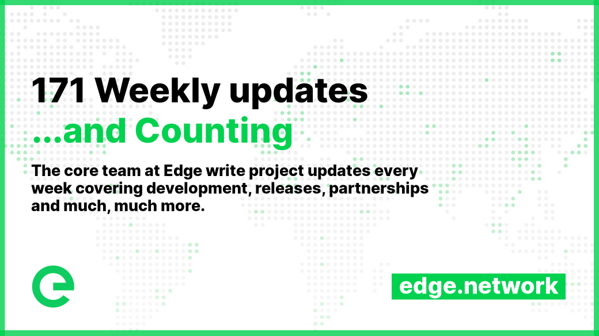

# 📰 Core Team Updates

As part of Edge's ongoing commitment to transparency and development in the open, the core team write weekly updates to the Edge community.

There have been 171 of these so far.


[weekly-updates.md](weekly-updates.md)


## Latest Update

Good evening everyone 

We started the week ready to open up the new account system, allowing you to spin up Edge Servers in a matter of minutes, using XE for payment. Everything was set. But as often happens with the best laid plans, we suffered a little setback: some hardware at one of our partners that was powering the London zone of the Edge Network failed. For those of you who aren’t aware, we are experiencing a particularly intense heatwave here in the UK, and those increased temperatures led to multiple power supply units to fail. Over the course of a few days we monitored the situation and identified the hardware causing the issue, which was removed from the setup.

As you can see, this led to some outages on the network as well, but the good news is that the network is built to recover from faults like this, and as soon as connectivity to the Stargate was restored, the network recovered automatically.

Recently, we expanded the Gateway layer, and we’ll continue to expand both this layer along with the Stargate layer, adding more redundancy and making the network even more resilient to faults.

.png>)

On the back of the outage we have decided to advance our trusted partner programme, and will be adding a new region to Edge Servers. This will be completed next week. Our original plan was to make available the remaining capacity in the current Edge Servers region, based 20 miles outside of London. The additional trusted partner being bought online is located at a facility in London’s Docklands, which as some of you might know, is the most connected location in Europe.

The new account system is fully ready to open up, and as soon as we have the new capacity in place, we’ll do so.

I know some of you are excited to see it so here’s a sneak preview of what it looks like:

.png>)

.png>)

Meanwhile, the team is already hard at work implementing FIAT payment options. There will be both one-off and automatic top ups available using this method, with FIAT exchanged for XE at time of purchase, which will then be used for daily billing. Following delivery of the FIAT features, we’ll be integrating Edge DNS and Edge CDN into the account system. We’re pumped for what’s coming!

If you haven’t already seen it, Pod in the Edge community raised some great questions in a recent marketing thread, so definitely give that a read and add to the discussion if you like. You can find it here:



As you may know, some of the team are involved in the Mudas NFT project, and wow, some of the artwork that we saw this week was amazing. We can’t wait to be able to show you what we’ve been working on, but it’s almost as as the UK right now. Certainly some of the most complex and beautiful digital art that we’ve seen.

Speaking of which, next week, owing to the forecasted high temperatures here in the UK, we’re having a slightly shorter week, with most of the team enjoying Monday & Tuesday away from their computers (and likely sitting in baths filled with ice cubes). We will still be around though, in the event of any issues, or in case anyone wants to chat about how awesome edge networking is 

And that's about it for this week!

Enjoy your weekends (and wear sunscreen!) 

_Posted by: Adam K Dean_
