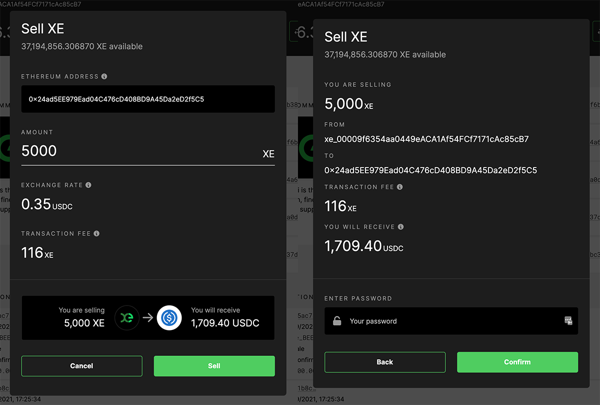
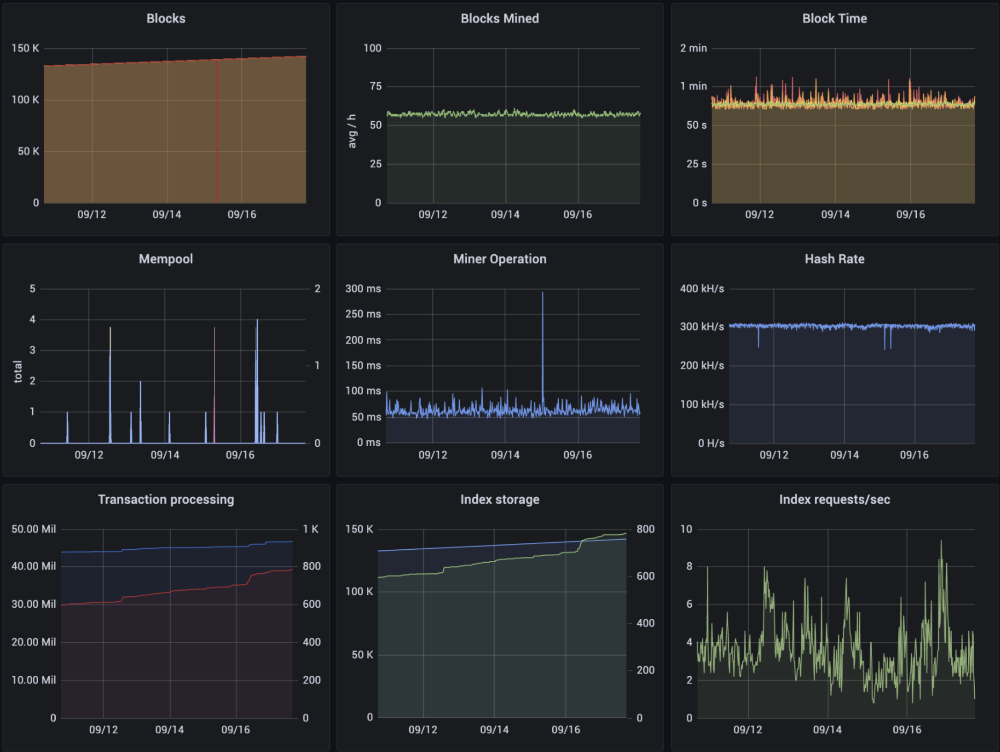

# Core Team Updates

As part of Edge's ongoing commitment to transparency and development in the open, the core team write weekly updates to the Edge community.

There have been 128 of these so far.



## Latest Update

Good evening everyone 👋

For those of you that are new to the community, we post weekly core team updates to our main channels, including to the wiki. These are on a Friday, at some point in the evening, depending on how busy we've been.

There have been 127 of these so far. You can see a full history here:



On to this week’s update… \#128!

I’d like to introduce Max, who has joined the core team with a focus on the tokenomics of the Network. Having him onboard provides a talented go-to resource for this side of the ecosystem. He has been involved in the project on an informal basis for some time now and is well versed in the platform. Max is deeply involved in the wider crypto community, bringing fantastic contacts and experience to the team.

It’s his Birthday celebration today, so he can’t join us this evening, but he sent me this to share with you:

> “I’m very happy with the launch of the token on Uniswap and how it has performed so far. It’s very early days of course, but to see liquidity building and knowing that $EDGE has held its own through the initial bridge opening and sell-side pressure is fantastic.
>
> “The network bridge has generated a little over 150k $XE in fees so far \($51,929 at the time of writing\). These will be distributed between liquidity providers, the growth fund and the dev fund towards the end of the month.”

We’ve also started working with @Cryptonator1337 \([https://twitter.com/cryptonator1337](https://twitter.com/cryptonator1337)\). He’s joined the team as a marketing consultant and will be working with Chris to help drive adoption.

Thank you to those of you who have been pitching in to help to promote Edge. We’ve been flat out with marketing efforts this side of the fence and have a lot of great things brewing.

By way of example of the scale of the effort at the moment, our marketing plan pushes out to December, and has over 120 touch points in it already.

Some of these will be visible to you soon, some will take longer to develop. The experience and connections across the team is incredible. We’ve been involved in marketing at a high level for decades \(Chris was the Marketing Director at Diesel\), and can honestly say that this is the most exciting and dynamic team we’ve worked with. There are amazing things ahead.

Now over to Adam for this week’s development update:

_Adam:_

Good evening everyone 👋

Moments ago we released Explorer v1.3.0 which introduces the ability to view a wallet directly, including the wallet balance, some technical information like the nonce, and a list of all incoming and outgoing transactions. The update also contained a number of tweaks and fixes. Future updates are planned to bring a wallet listing page, as well as to integrate pending transactions into the individual wallet page, among other things.

You can see the bridge hot wallet here:



Earlier this week Wallet v1.5.4 was released, which fixed an issue with withdrawal fees being rejected by the blockchain for certain withdrawal amounts, which led to people having to be quite creative in their withdrawals. \(For those interested in the technical detail, this was due to non-integer division in the fee calculation in the Wallet, where all blockchain transaction values are integers and work on the basis of microXE or mxe, to which there are a million per XE!\)

Since then withdrawals have been running smoothly, as has the Bridge which saw v1.3.3 released earlier in the week too. This fixed an issue with certain withdrawal fee transactions not processing properly. The v1.3.3 update also improved the efficiency at which withdrawal transactions were processed.

Work has continued on adding the OTC Sell option to the Wallet, which involves adding multi-token support to the Bridge. This is a natural evolution as we move towards multi-chain support later down the line.

Here’s a little preview of the Sell XE interface in the Wallet \(currently running on testnet\):

Now onto the Blockchain, which has seen a lot of activity since the Bridge opened. We monitor vital stats every second using Prometheus, and use Grafana to display these. The following shows the blockchain network over the last week. As you can see, everything remains nominal.

Behind the scenes, the team have been working away on the new Command Line Interface, adding support for staking and device registration. For those who may have missed previous updates, for v2 we’re moving to a wallet-based approach. Every device will have its own wallet \(which is essentially an asymmetric key pair\) and this will be used to authenticate with the network. This is just one of the many ways in which the blockchain is at the heart of the Edge network. If this all sounds a bit complex, don’t worry! The new `edge` CLI will handle all of this for you, which will allow you to easily stake and onboard devices all from the comfort of your own terminal.

_Joseph:_

Thank you Adam!

Our roadmaps have been updated and moved to the Community Wiki. The big focus for the team over the coming months is the move to Mainnet V2, which represents a significant overhaul of the core network, building on our learnings from the last three years and focused on a far deeper integration of the Network Blockchain.

You can access the project roadmaps here:



These will be updated as we go and should be considered living documents.

The broadband provider we’ve been working with here in the UK has gone live on our platform and are showing big performance increases \(30.37%+\). I can’t talk much about it yet, but I’m looking forward to being able to tell you more in the coming months.

We have reopened the claim period for $XE until the end of September. This is on the back of being made aware of a number of community members that missed the original distribution window. The closing date for the extended period is the 30th of September. This is a hard deadline as Console will be taken offline at this point as we move to get on-chain staking live.

The latest episode of our podcast, Conversations on the Edge, has just been released:



We're still on the hunt for new core team members, with positions available for accomplished full stack developers. You can read about how we work and find a job specification here:



This weekend, why not help spread the word? The more the existing community helps to promote and drive the project forward, the stronger we will become.

For the very latest from Edge, join our Discord server: [ed.ge/discord](https://ed.ge/discord)

Enjoy your weekends.

_Posted by: Joseph Denne & Adam K Dean_

