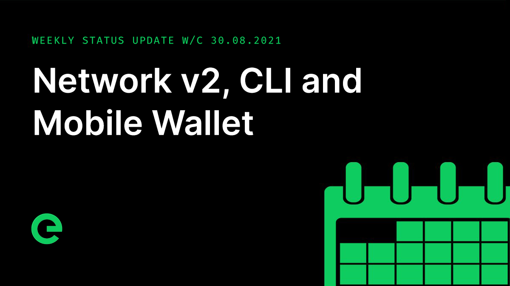
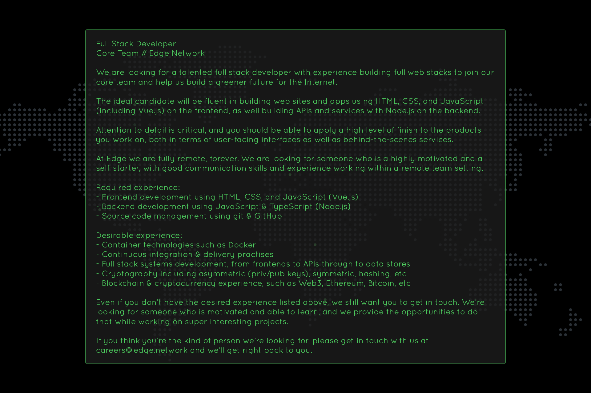

# Core Team Updates

As part of Edge's ongoing commitment to transparency and development in the open, the core team write weekly updates to the Edge community.

There have been 126 of these so far.



## Latest Update

Good evening everyone 👋

The $XE distribution claim window closes at the end of tomorrow. If you haven’t claimed yet, there’s still time, but you have to do so now.



We delayed the opening of the bridge from the 1st to allow a little more time to align support for the listing of the new EDGE token on Uniswap.

The bridge is 100% complete, as are the updates for the wallet and the explorer. In fact, support for bridge transactions in explorer is already live \(v1.1.2\), as is the functionality that powers this in the index \(v1.4.1\). All that is left is for us to open up the functionality, which we expect to be doing next week, and will confirm timings in the next day or two.

We’re moving forward with delivery against our plans for v2 of the network core, which will be tightly integrated with the network blockchain. I spoke about this in detail last week, so if you missed it, scroll up.

What I didn’t mention last week is that we’re planning to open up test.network, so that you can get involved and help with testing. We’ll be making a publicly available web wallet, along with a faucet to claim test.network XE, and you’ll be able to use this to create test.network stakes and onboard devices onto test.network. It’ll also give you a chance to try out new features or changes before they go live on the mainnet. I’m super excited about this.

This week the team have been working fervently on the new edge command line interface. This new CLI tool will allow you to manage your wallet from the command line, sending and receiving XE transactions, creating and managing stakes, and onboarding devices onto the network. And let me just tell you that it’s looking great!

As you may have noticed, we’ve been working in Discord for the majority of the last few weeks and it’s been going great. The team has been engaging with the community more and this has been fantastic: it’s allowed us to answer questions quicker, whether they’re technical in nature or requests for help, it’s let us share our \(at times questionable\) music taste with you in the radio channel, and altogether helped the team to feel part of the community too.

In time the dev channels that are currently private will be opened up, the intention being to much more tightly integrate the team with community governance. In addition to this, as some of you have noticed, last month we transitioned to a flatter hierarchy, consisting of a single core team. Arthur is now focusing on customer integrations, while I’m leading the core team in the development of the blockchain, v2 of the network core, and supporting web projects.

And we're still looking to grow the core team. The priority right now is for a full stack developer to join us. We're looking for someone experienced in the full web stack, from creating polished web interfaces through to the backing services that power them. We’re looking for someone who can hit the ground running, and we’ve got some fantastic projects in store.

Now, I may be a little bit biased, but working at Edge is the best job I’ve ever had. _Sometimes it doesn’t really feel like a job._ We work asynchronously, at our own pace with collaboration and agreement being handled by asynchronous mechanisms. There’s no 9 to 5, we work when our creativity is strongest and find this helps us get more work done. There are minimal meetings, we work where we want, there’s no commute, and we get paid for giving a shit.

So if you or someone you know likes a challenge, is great at what they do, and likes the sound of the way we work, let me know or email your \(or have your friend email us their\) curriculum vitae/resume, along with any additional resources such as a GitHub profile to `careers@edge.network`.\[19:50\]We’ve previously published roadmaps. We’re refining these as we go and will share a version of these soon. So far this year we’ve developed and released our own layer 2 blockchain, web wallet, and explorer. Very soon the Bridge will be live too. After that on-chain staking, moving onto governance, meanwhile the opening up of the v2 testnet. We’ve got a great roadmap lined up for the next year and I can’t wait to share it with you soon.\[19:50\]  
  
In other news...

Work on the mobile wallet app design continues, and we look forward to this being integrated into the wallet app beta once complete.

The platform for the broadband provider we have been working with goes live next week. Once it’s bedded down we’ll share it with you.

The latest episode of our little podcast, Conversations on the Edge, has just been released:



And that’s it for now – have a great weekend, and see you next week.

This weekend, why not help spread the word? The more the existing community helps to promote and drive the project forward, the stronger we will become.

For the very latest from Edge, join our Discord server: [ed.ge/discord](https://ed.ge/discord)

Enjoy your weekends.

_Posted by: Adam K Dean_

