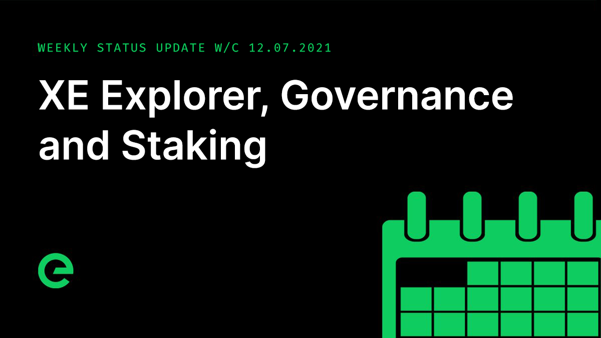
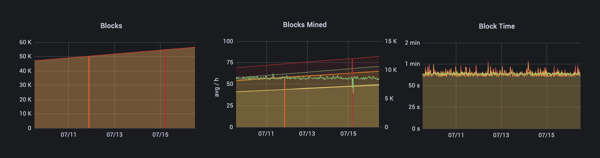

# Core Team Updates

As part of Edge's ongoing commitment to transparency and development in the open, the core team write weekly updates to the Edge community.

There have been 119 of these so far.



## Latest Update

Hi everyone 👋 Happy Friday 😀

The XE Mainnet remains stable. It has processed c.1,400 blocks this week, with an average blocktime of 1.1 minutes, roughly averaging 57 blocks per hour.

Design and UX for the XE Explorer is nearing completion. We expect to be able to share this with you next week. V1 will exist apart from the wallet. V2 will bring them together as a single app under the domain: [xe.network](https://xe.network)

After the delivery of the explorer focus for UX will shift to completing v1 of the mobile wallet for iOS and Android. The wallet exists as an internal beta – a native build without a considered UX layer.

Staking has now been integrated into the transaction layer, meaning that the creation, unlocking, and release of stakes will be conducted through every day transactions, just like transferring XE.

Transactions have the ability to contain metadata, including the memo you see in the wallet, but also metadata for bridge transactions and soon staking and governance metadata too.

Stakes will be stored in the ledger, alongside the wallet’s balance and other associated metadata, which is constructed deterministically from the blocks contained in the chain. Every transaction within a block mutates the ledger from one state to another. Every block then contains a cryptographic digest, or hash, of the ledger after that block’s transactions have been applied. In a sense, the data for wallet balances and stakes are stored on the blockchain, but are reconstructed in their current state in the form of the ledger.

Voting for Network Governance will use this same model, sending transactions containing metadata. This is a brilliantly simple approach which brings core functionality on chain while reducing complexity, key to achieving robustness.

The next steps for staking are to implement the unlock and release of individual stakes, and then integrate this into the web wallet’s interface.

The default unlock period will be 90 days. You will be able to pay to speed this up, with the fee going to the growth fund. The API for Edge Compute pushed forward.

A push to improve the health check package replaced a latency-causing bug with buffered channels becoming deadlocked with a more elegant Wait Group approach, where each successful renewal of a health check creates a timed block on the closing of the healthcheck, protected by goroutines rather than the previous channel blocking mechanism. This has been running well for 24 hours on test.network, meaning it’s ready to be deployed to mainnet early next week.

The team also spent a block of the week planning a refreshed technical approach to the way that network services are roadmapped, which we’ve started road testing and will formalise later this month.

And finally for this week, the latest episode of Conversations on the Edge can be listened to here:



And that’s it for this week!

This weekend, why not help spread the word? The more the existing community helps to promote and drive the project forward, the stronger we will become.

For the very latest from Edge, join our Discord server: [ed.ge/discord](https://ed.ge/discord)

Enjoy your weekends.

_Posted by: Joseph Denne_

