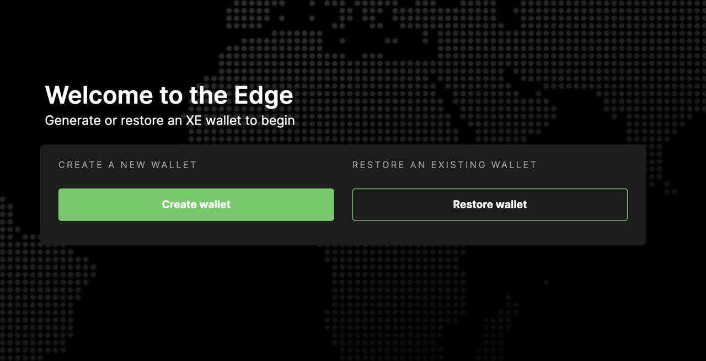

# Core Team Updates

As part of Edge's ongoing commitment to transparency and development in the open, the core team write weekly updates to the Edge community.

There have been 111 of these so far.



## Latest Update

Hi everyone 👋

First up, timelines for $XE.

**The** **$XE** **mainnet goes live on Monday**. The wallet will be made available for address generation and claiming distribution a week today. Distribution will run from early June. The bridge will open and trading will start the week of the 14th of June \(possibly a week later - final security testing dependent\).

We’ve been in high-load testing all week. The platform is looking very stable and our confidence in the dates above is high. We’ll let the community know right away if anything changes on this front.

The team integrated a new logging module improving the resolution of platform logs.

Security improvements were introduced to the P2P connection procedure, which solved some issues with disconnections and subsequent reconnections.

A P2P connection issue was found which in certain circumstances was leading to chain desynchronisation. This has been resolved. A keep-alive procedure was implemented as part of the P2P system alongside this work.

Memo content validation was added to transactions within the ledger.

Work progressed on an indexing Oracle, which will sit on top of the blockchain and provide a searchable index of blocks & transactions. This will be utilised by the wallet as well as the blockchain explorer.

The team also patched an issue with CDN whereby a 404 wasn’t being returned in the event of a missing fallback image. This work also unearthed an issue where a slow request to CDN was blocking all other requests at Host level until the timeout threshold was hit. As part of the resolution context was added to CDN requests enabling them to be cancelled by Host directly.

The CDN MIME type selector was refactored to improve lookup performance.

And additional logging was added to CDN to provide a deeper level of data relating to processing times.

Gateway was updated to prevent a scenario whereby Host remains out of sync when a container crashes.

And work started on a consolidated ‘sync’ key, which acts as an etag for configurations. This is the first step towards a single unified key for the operational state of Host.

The team ran a survey asking about dedicated Edge devices. This has returned some great results so far. There have been a little over 300 responses, With 75.5% of respondents indicating that they would be interested in purchasing a dedicated Edge device.

If you haven’t pitched in yet, now’s the time to do so:



We also received some great suggestions through the open comments. These included finding dual applications for nodes \(i.e. embedding it in other items like a bedside clock or a lamp\), making them wall mountable and ensuring payment options that cover a broad array of crypto currencies.

Thank you to those of you who took the time to participate. Any further ideas in this area please do feel free to share.

Chris and I have attended a series of new business meetings and are continuing to push hard on this front. There’s a lot going on and there are many irons in the fire.

A final reminder that the swap closes on the 27th of this month \(Thursday, 27th May 2021\). **If you don’t swap before this date, you won’t be able to claim TNC and will lose the ability to claim** **$XE**.

Earnings for 2020 continue to be processed. If you’ve not had yours yet, sit tight. The network holds complete records and all earnings will be distributed.

And finally, the episode two of Conversations on the Edge was just released:



And that’s it for this week.

For the very latest from Edge, join our Discord server: [ed.ge/discord](https://ed.ge/discord)

Enjoy your weekends.

_Posted by: Joseph Denne_

