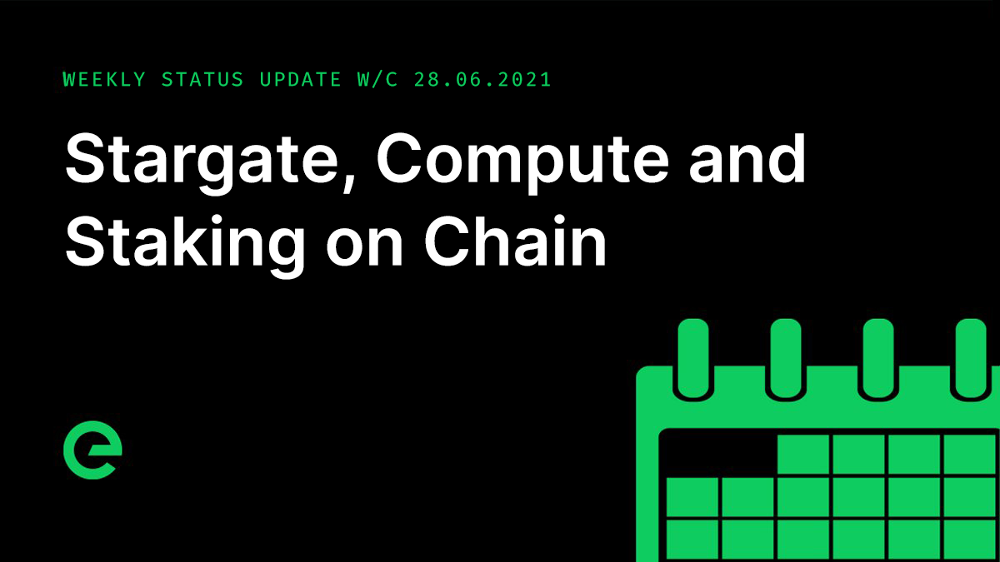

# Core Team Updates

As part of Edge's ongoing commitment to transparency and development in the open, the core team write weekly updates to the Edge community.

There have been 117 of these so far.



## Latest Update

Hi everyone 👋 Happy Friday 😀

It’s July! It’s been a full-on week for the core team, with deliveries for a series of customers the primary focus.

The process of introducing batch updates to all configuration stores that I discussed last week has been completed and deployed, with dramatic results in performance. This is down to a reduction in short-lived connections between Stargate and Gateway, as well as Gateway and Host.

There's also a CPU advantage here due to the nature of the update process and the overhead of running multiple updates to the CDN container, which is now done in a single push.

Another major fix to the new healthcheck mechanism to remove an edge-case load balancer failure as a result of a blocking channel caused by rapid re-connections from a single device was made and deployed to test.network. If the fix is validated on test.network over the next 7 days, it will be deployed to mainnet.

Work has begun on the integration of staking into the XE blockchain. Stakes will be held on the blockchain and associated with the wallets that create them. These can then be assigned to devices through the web wallet, allowing the onboarding of new devices to the network.

This means that staking will move away from Console, which in turn will remove the need for a named account. You will be able to generate a wallet, fund it, commit a stake and put a network node online entirely anonymously. Another big step on the road to full decentralisation.

We now have 16 Compute Units online of various sizes. We’ve been rolling through existing deployments and migrating them where possible to the set up.

The API for Edge Compute was moved forward, with create, destroy, start, stop, restart, reinstall and resize all added and shown to be working. The next steps for this will be the addition of ACL. From there we will be able to begin integration with the Edge site and our payment gateway.

Timings for the opening bridge remain in discussion, dependent on further testing, amends and the alignment of marketing plans. The core team is meeting next week to discuss dates, and I’ll update on this front in next week's update.

Issue 7 of Edge Digest was delivered to subscriber inboxes yesterday. You can access this online here: [https://ed.ge/digest/issue-7](https://ed.ge/digest/issue-7)

If you’re not signed up yet, come join our 120k+ subscribers: [https://edge.press](https://edge.press)

Will, Arthur and I had a very interesting series of discussions with a leading security company who provide at-scale DDoS and other security testing tools for the financial industry. We are going to be moving into testing with them in the coming weeks, specifically looking at how Edge can support their platform requirements.

$XE distribution continued. Anyone that went through the swap process from $EDGE &gt; $TNC is eligible for a distribution of $XE. Instructions can be found in the Wiki:



Distribution takes a maximum of 24 hours and will remain open until the 04th of September 2021.

The latest episode of Conversations on the Edge will drop tomorrow. I’ll share it when it’s ready.

And finally, Cookalong have an event for Vodafone with David Flatman tomorrow afternoon. It’s raised thousands for the Downs Syndrome Association. More information here: [https://cookalong.tv/david-flatman/the-hawksmoor-feasting-box/03-07-2021/17:00](https://cookalong.tv/david-flatman/the-hawksmoor-feasting-box/03-07-2021/17:00)

The latest episode of Conversations on the Edge has just been released. Listen up!



And that’s it for this week!

This weekend, why not help spread the word? The more the existing community helps to promote and drive the project forward, the stronger we will become.

For the very latest from Edge, join our Discord server: [ed.ge/discord](https://ed.ge/discord)

Enjoy your weekends.

_Posted by: Joseph Denne_

