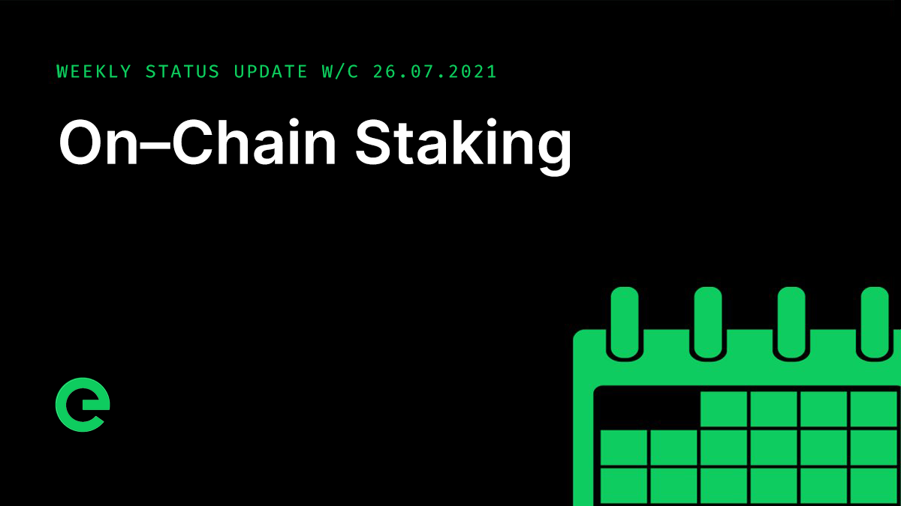

# Core Team Updates

As part of Edge's ongoing commitment to transparency and development in the open, the core team write weekly updates to the Edge community.

There have been 121 of these so far.



## Latest Update

Hi everyone 👋 Happy Friday 😀

I picked up a bug last weekend and have been out for the majority of this week. But we still had a jam packed week!

First up, with regard to the opening of the bridge, as noted in previous updates, there is a plan in place to support the token, with funds set aside. Marketing spend for the project is variable, allocated monthly, fairly significant and ongoing.

Plans for the opening of the bridge are ongoing. We expect it to happen sooner rather than later, but want to ensure the best possible start, hence taking our time to make sure that everything is just so.

Development of on-chain staking continued, with focus this week being on on-chain configuration and the early releasing of stakes through an express method. This allows stakes to be returned instantly in return for a portion of the stake going to a designated fund. The size of the portion taken and the location it is sent to are both values that will be determined using the on-chain configuration, which will be fully explorable.

Think of the on-chain configuration as a set of global values for the blockchain. For any given block in the blockchain, there exists a state: a ledger constructed of the sequential application of transactions from block 0 all the way to the current block. This ledger contains the final state of wallets as of the current block. With the staking update, wallets will also contain stakes, and in the same way that this final state of wallets is constructed from sequentially applying transactions to a state, so too will the global configuration be constructed.

Transactions from a specified wallet will allow these global values to be changed on a block by block basis, with the history of the changes being persisted in the blockchain. This is essential to the functioning of the blockchain which must keep a history of every change within itself.

We expect to complete on-chain staking next week.

After the success of the new priority queue and session refactor we have tweaked the performance of the queue worker pool to allow devices to complete more asynchronous jobs, having a notable impact on response times under heavy load.

Gateway is now using a single health check per device to control all GRPC services. This means that a single failing health check will immediately remove the device from the workers priority queue, stopping the device from dequeuing requests and reducing the delay between handing a job to a device with more capacity.

Gateway CPU usage has now dropped by 80% and maintains a stable performance under heavy load.

We're now also able to monitor each device's performance grade. This means that we can also see which device is the most performant over a given timeframe. For the last week the top performer has been 'reserved-tombaugh', with an average job processing time of 52ms.

Anyone for an Edge league table? Prizes for the top performing devices + major bragging rights await...

We are hiring. Specifically we are looking for talented front end developers to work with HTML/CSS/JS for frontend, and JavaScript for backend \(specifically vue.js and node.js\). Attention to detail and a self-starting attitude is critical. The roles are 100% remote and can be based anywhere. Hit up [careers@edge.network](mailto:careers@edge.network) if you’re interested.

The latest episode of Conversations on the Edge, featuring an interview with @adamkdean and me, can be listened to here:



And that’s it for this week!

This weekend, why not help spread the word? The more the existing community helps to promote and drive the project forward, the stronger we will become.

For the very latest from Edge, join our Discord server: [ed.ge/discord](https://ed.ge/discord)

Enjoy your weekends.

_Posted by: Joseph Denne_

