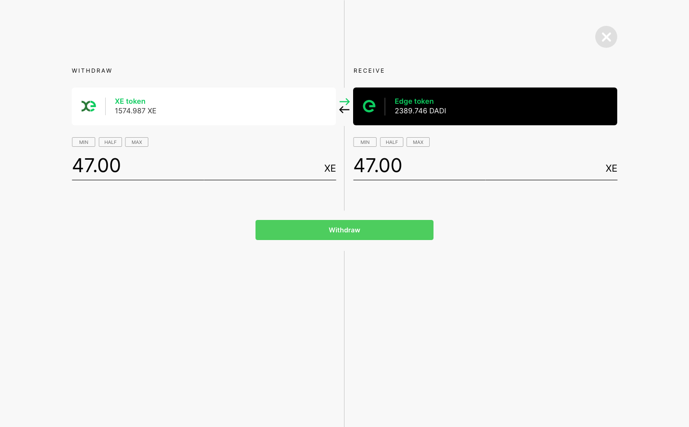

# Core Team Updates

As part of Edge's ongoing commitment to transparency and development in the open, the core team write weekly updates to the Edge community.

There have been 106 of these so far.



## Latest Update

Hi everyone 👋

The sun is shining here in London and we’re slowly emerging from lockdown ☀️

We’re now feature complete for the $XE Ledger. Transactions, wallets, balances and APIs are all fully implemented.

We moved into security testing and have been continuing with high load testing.

There have been a wide array of improvements implemented already on the back of testing. For example the ledger node now reports a hashrate, which is useful for benchmarking.

A sync issue with transactions has been identified under an extremely high load scenario. The team is working to understand what’s triggering this.

The tokenomics for the network are in final review with a handful of third parties.

We remain broadly on track, pending the outcome of testing and the revisions that it triggers.

I expect the community Wiki to go live next week. This breaks out everything about the Edge platform, and is designed in support of Edge’s growing community.

The team also released a new build of Stargate, Gateway and Host to mainnet, significantly improving configuration time and fixing an issue with poorly configured Devices contributing to the network.

The update has now been live for a little over 24 hours and is showing increased stability.

Since we introduced the priority queue, where requests are assigned to Hosts, we were seeing some issues with Hosts that weren’t configured trying to resolve the job.

An update to CDN was released that refactors the create and update paths, merging them into a unified upsert method which makes it harder for a restarted container from being mistaken as configured by Host. This removes the potential for 504 error responses for the service.

Arthur wrote an article on the future of the cloud. You can read this here:



The eCommerce addition to the Ecohustler site being worked on by Edit is in final testing and content is being populated. It will be live at some point in the next fortnight.

Maxmar asked:

> “Will there be rewards for liquidity providers on decentralized exchanges such as Uniswap and/or other DeFi integrations of the edge token? Or for example enabling node stakes using uniswap edge/eth LP tokens or automatically staking these in collateralized loan platforms such as AAVE ? I think it is important to realize that two of the main issues of the previous iteration of the token was low liquidity as well as too low APY from hosting revenue alone compared to DeFi protocols, so it would be important to address these”

Agreed completely on the liquidity issue with the first iteration of the token. There are plans in place to address this, which includes rewards for liquidity providers. There is also an allocation of funds set aside for the provision of liquidity. Node staking using LP tokens might be possible, but will need looking at in detail. \(It's in the backlog.\) We've not explored auto staking at this stage. APY for staked nodes is also being addressed – we'll be providing information on this along with a breakdown of the tokenomics.

Dwqps asked:

> “Why is the new token named XE?“

The X is from the ISO standard for currencies that are not specific to a certain country. We've used it because we see Edge as the standard unit of account for edge computing. X-Edge, hence XE.

-

The branding for XE is near complete.

Here it is:

This from Ravi, Edge’s UX & Design lead:

> “The XE token bears a close relationship to the Edge token. The intention was to ensure that it was a recognisable part of the Edge brand family.
>
> “The brand stands for balance, equality, simplicity and clarity. The starting point for the logo has always been the perfect circle. This provides the template for the ‘e’ letter mark as well as the edge logotype itself. Therefore it made sense for the XE symbol to derive from the same shape and structure.
>
> “An extra half circle is combined with the ‘e’ to create an ‘x’. In order to aid legibility to ensure the two letters are distinct, a break was introduced through the centre or the ‘e’. A colour change for the ‘x’ shape further helps to differentiate the letterforms.
>
> “Aesthetically both token symbols are clearly related, given they stem from the ‘e’, however there is enough variation to ensure that the two symbols are not confused with one another.
>
> ”And finally the ‘x’ shape is designed to be bridge like in structure, reflecting the key functionality of the technology.”

The frontend for the client-side $XE wallet is also complete. This is a standalone JavaScript app that runs through CDN in the network and that runs entirely in your browser. It allows you to create wallets, transfer and bridge in and out of the network as you see fit.

For complete clarity, there’s no manual confirmation of transfers and no limits to your usage...

In time we expect $XE keys to replace the account concept in Console entirely. That’s a way out, but it’s on the team's roadmap.

Here’s a preview of the wallet:

A mobile wallet for iOS and Android is also in production. Timelines for this are further out, however it is in beta testing and on a few of our devices. It includes $XE, $EDGE and $ETH wallet functionality, along with the ability to bridge directly in the app.

Later versions will include the ability to stake directly from the app. And the intention is to get to the point where a network node runs within the app, providing storage capacity back to the network.

And finally, don’t forget to sign up for the Edge digest, our regular mail out. The next drop is coming soon!



And that’s it for this week! Exciting times ahead.

As a reminder, we’re now posting these updates to Discord first. Discord offers a much more structured environment for supporting community growth, and things like governance will be linked directly into the platform. So if you’ve joined the server yet, now is the time!



Enjoy your weekends.

_Posted by: Joseph Denne_

