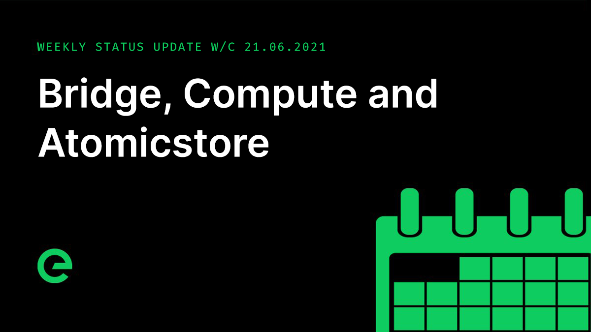

# Core Team Updates

As part of Edge's ongoing commitment to transparency and development in the open, the core team write weekly updates to the Edge community.

There have been 116 of these so far.



## Latest Update

Hi everyone 👋 Happy Friday 😀

The first Edge Compute Units in production are proving performant and stable. They are aligned to the London Stargate within a secure and controlled environment. We’re seeing good performance gains vs. the previous VPS used for those production environments that have been migrated.

You can see one in action here: [https://ecohustler.com](https://ecohustler.com/)

We’re a way off from general availability. We will have an extended production period for testing, followed by a second Stargate-aligned rollout in another network area. Alongside this a control API is being developed which will allow for the provisioning and control of Edge Compute Units. And finally a front end interface will be provided, added into the services area of the Edge site.

With production data on hand we are also able to firm up pricing. This is being developed at the moment, and will be released in the coming weeks.

Edge Compute Units are virtual private servers that can be used to run applications of any type. They are exclusively Linux based, and currently support CentOS. We are working on support for additional Linux varieties including Ubuntu and Debian.

Storage of network data is now entirely within the network’s own storage mechanisms. This is also the data layer that will serve the Edge DB solution in the future.

Config deployments have been sped up significantly, with batch atomicstore \(a Go storage system within the network\) released to test.network.

At the moment Stargates sequentially send app config updates to Gateways, and Gateways send these on to Hosts. There is no diff solution in place for this, meaning that whenever a minor change is made, every record is updated. As a result tens of updates are sent for every Host in the network. The update for atomicstore allows for a batch insert which runs on update, delete and insert, delivering a single batched payload. This reduces data transport by 89.9%, hugely reducing traffic and open connections in the network.

This is a major win.

$XE distribution continued. As a reminder, anyone that went through the swap process from $EDGE &gt; $TNC is eligible for a distribution of $XE. Follow the instructions here:

[https://wiki.edge.network/support/claiming-xe](https://wiki.edge.network/support/claiming-xe)

Distribution takes a maximum of 24 hours and will remain open until the 04th of September 2021.

Testing of the network bridge continued. It’s working well.

Here’s a preview of the user experience:

Timings for the opening bridge are in discussion, and are dependent on testing, amends and the alignment of marketing plans.

Work on the integration of staking with the XE Wallet will begin next week. Once that is complete and staking is reenabled, focus will switch to the inclusion of community governance mechanisms within the wallet.

Aeonwise on Discord brought up the potential of no-code data implementation on Edge. This is absolutely possible, with API designed for this purpose. There’s currently no interface for data design. We’re going to be discussing this as a core team soon, and will explore how and when this could be fitted into the roadmap.

The latest episode of Conversations on the Edge has just been released. Listen up!



And that’s it for this week!

This weekend, why not help spread the word? The more the existing community helps to promote and drive the project forward, the stronger we will become.

For the very latest from Edge, join our Discord server: [ed.ge/discord](https://ed.ge/discord)

Enjoy your weekends.

_Posted by: Joseph Denne_

