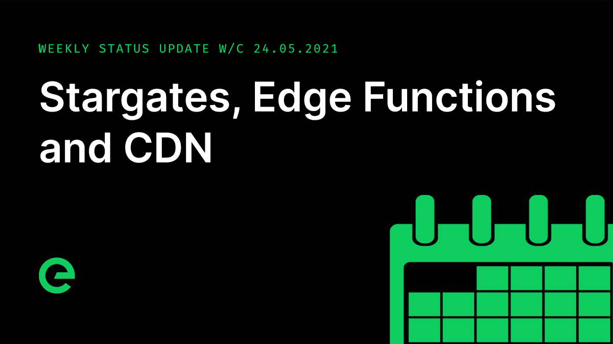

# Core Team Updates

As part of Edge's ongoing commitment to transparency and development in the open, the core team write weekly updates to the Edge community.

There have been 112 of these so far.



## Latest Update

Hi everyone 👋

First up, timelines for $XE. Adam was taken sick earlier this week, which has pushed back preparation for the release of the XE wallet, which was originally planned for today. As Adam is the Blockchain Lead in the core team, we collectively decided to press pause until he is back up to speed.

We think this pushes the opening of the wallet back by around a week, allowing for his recovery and some backfilling.

The good news is that the wallet itself is complete and ready for use.

The team also made some final improvements to the ledger as part of the mainnet release, including improvements to P2P connection recovery, as well as a fix for an issue discovered during the operation of the index service.

The API has received numerous improvements, brought about by integration with the wallet & index service.

The Index service received some fixes for issues identified during integration with the wallet early in the week.

This service will be open to public consumption, allowing you to browse blocks and transactions. Though the API endpoints will be limited at first, more will be introduced over time to help you inspect the chain.

An XE address field was added to Console. This is for use in distribution. The team took the opportunity to improve the performance of Console in a few places as well.

And the CDN refactoring undertaken last week was pushed to mainnet and deployed early this week. Arthur and I installed hardware for a new Stargate, a second for London.

We’re expecting to have 14 Stargate's live this year. The Stargates are being placed at the most connected hubs on Earth and will be located in Sao Paulo, LA, Miami, Ashburn, London, Amsterdam, Frankfurt, Prague, Vienna, Bucharest and Madrid.

The overall architecture of services in the network will be changing over the coming months, with Edge Functions taking centre stage. Functions provides a discreet deployment and execution environment for single purpose code blocks. Aligned with Storage, they allow for Edge–native applications to be built and run entirely at the edge of the network.

To give you an indication of what’s possible with Edge Functions, CDN will itself move to the functions layer in time.

We signed an agreement in principle with a new transport partner, which will provide terabit interconnectivity for the Stargate layer in the network, bringing faster resolution times and increased performance to network services.

It was a busy week on the new business front as well, with several new engagements kicked off. While 2020 was an incredibly difficult year for all of us, 2021 is looking much brighter, with businesses getting back up to speed and digital spend increasing.

And finally, episode three of Conversations on the Edge has just been released:



And that’s it for this week. It’s a long weekend here, so expect the core team to be back at the coalface on Tuesday.

For the very latest from Edge, join our Discord server: [ed.ge/discord](https://ed.ge/discord)

Enjoy your weekends.

_Posted by: Joseph Denne_

