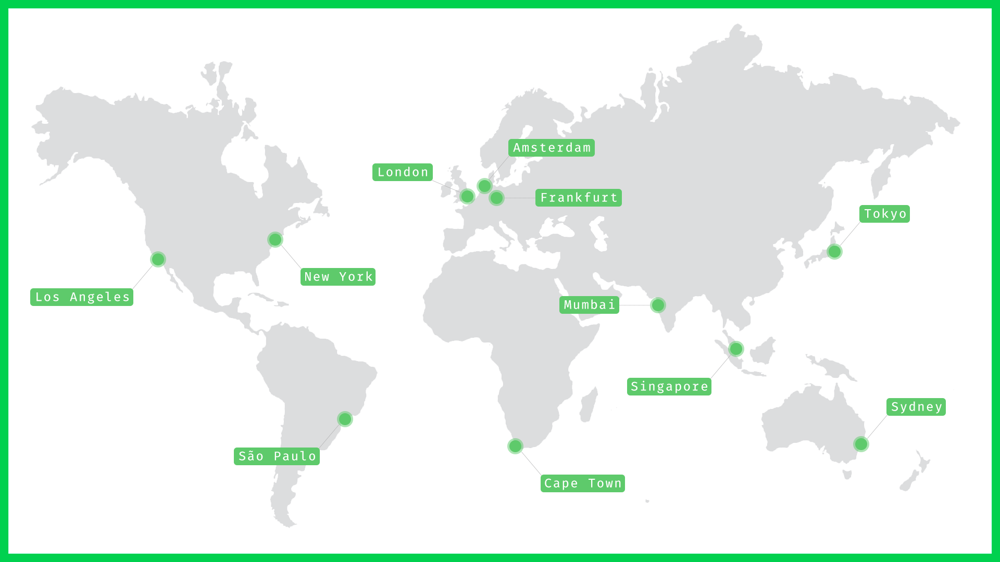

# DNS


**Available now**


Powered by a worldwide anycast network built in to the core of Edge platform and operational in 26+ countries, Edge DNS operates at lightning speeds ensuring incredibly fast resolution times and low latency for your apps.

<figure><figcaption></figcaption></figure>

## Features

### Advanced DNS Functionality

Edge DNS comes with an advanced feature set including geo-detection for global routing, DNS weighting and complete control of your TTL.

### Realtime Propagation

Traditional DNS update times: 24 hours. Edge DNS update times: 60 seconds.

### Redundancy and Optimization

DNS queries are serviced by every master node in the network, meaning that there is no single point of failure and a near infinite number of routes available.

### Built in Failover

Intelligent traffic management ensures seamless handoff and removes DNS bottlenecks and downtime.

### Platform-Wide DDoS Protection

DDoS mitigation technology is built in to the core of the network, providing a shield for your applications from malicious attacks.

### Industry Leading Uptime

Edge DNS has maintained an uptime of 100% over two years.

## Deploy a Domain to Edge DNS Now


