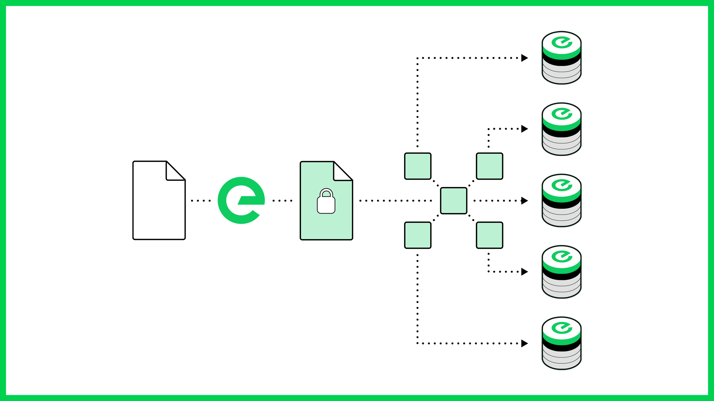

# Object Storage


**Edge Storage is currently in development**


Files in the Edge Network are encrypted and split into hundreds of pieces, and are then distributed across nodes in the network. This approach ensures the security of your data. Encryption keys are under your control, and no complete file is stored on a single device.

The availability of files and transfer performance in and out of the network is managed through replication and proximity to the point of use, making Edge the ideal solution for backup, file transfer and app level data storage.

## Features

### Secure

Files are encrypted and split into hundreds of pieces, which are then distributed across hundreds of nodes. This provides a level of security that is unmatched in market.

### Highly Performant

Edge object storage supports multi-threaded and concurrent downloads. And its use of in memory caches ensure the fastest possible access to your files.

### Reliable

Every fragment of every file is stored in multiple locations, building redundancy in to the heart of the solution. In addition, reed-Solomon erasure coding enables file rebuilding in the unlikely event of data loss.

### Cost Efficient

Because it’s decentralized and built using the spare capacity all around us, Edge storage is significantly cheaper to use than traditional cloud solutions.

### Integrated

Edge Object Storage is fulyl integrated within the Edge ecosystem, meaning that it can be used as the origin for Edge CDN, as a filestore for Edge Functions or as extended storage for implementations using the Edge Ledger.
