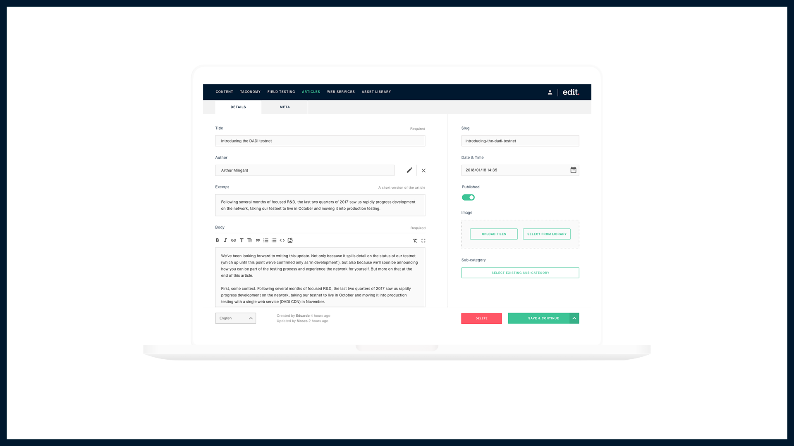

# Edit.com

[Edit.com](https://edit.com) is a content management solution, site builder and eCommerce solution built and run on the Edge Network.

Edit integrates with almost anything, giving you one clean interface to run everything from content management to customer emails. And it works on any device from mobile app to smart TV.

Best of all, everything made with Edit is decentralised by default.

## Features

### One-Stop Shop

Edit gives you control of all aspects of your digital product in one place.

### Optimal SEO

Products built with Edit are optimised for SEO out of the box.

### Enhanced eCommerce

Edit brings new flexibility and efficiency to online shopping and subscriptions.

### Beautiful Designs

Edit allows creative freedom for front-end templates and mobile applications.

### Multi-Tenancy

Power multiple brands/products from a single instance of Edit.

### Simplify Workflow

Flexible CMS interfaces that adapt to your editorial workflow.

### Easy Integrations

Edit is API-first and plays nicely with third-party applications.

### Asset Management

Thinking about print? Edit can store assets for any publication.

### Cost-Efficiency

Edit provides the optimal balance of performance and cost.


**Find out more about Edit on** [**Edit.com**](https://edit.com)\*\*\*\*


