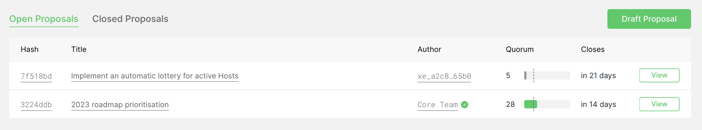

# 📰 Project Updates

As part of Edge's ongoing commitment to transparency and development in the open, the core team write weekly updates to the Edge community.

There have been 202 of these so far.


[weekly-updates.md](weekly-updates.md)


## Latest Update

<figure><figcaption></figcaption></figure>

Good evening everyone 

This week the team released some updates to the Governance portal. There were some bug fixes introduced in version 1.0.5 focused on text alignment issues, and in version 1.0.8 (there were a few test versions in-between) we added proposal guidelines to the draft proposal pages. This version also saw some further tweaks to proposal formatting.

And on that note, today is a very special day, for today we had the very first community proposal submitted to the governance system. A big thank you to @Pod & @Max for their contribution, and for the fantastic idea of an automatic lottery for active hosts!

<figure><figcaption></figcaption></figure>

You can read more about the proposal here:



...and discuss it either in the governance portal itself or in the governance discussion thread here:



The proposal will be open for 21 days as usual and the core team look forward with excitement to the community’s participation in this very important and meaningful initiative.

Behind the scenes, we’ve also been working on preparing the blockchain for the introduction of transaction fees. We’ve modelled a few potential ways in which this can work, but have generally settled on a very similar (though simpler) model to Ethereum. We’ll be submitting a proposal to the Governance system to ratify this approach soon.

This change is likely to come in a few phases: to begin with we’ll introduce the functionality for transaction fees to the blockchain and release this to mainnet; next we’ll upgrade all the tooling around the blockchain (the wallets, explorer, apis, libraries etc) to support transaction fees; and then finally with some notice, we’ll begin to enforce transaction fees on the network.

There are some questions around transaction fees vs fee-free transactions, but we’re leaning towards always enforcing transaction fees and these being burned by default. When this comes to node earnings payouts, we’ve always been of the opinion that we should support microtransactions — and we think we still can, by the mineable supply taking into account the transaction fees.

We think the model will work great, and will add to the monthly XE burns  by introducing daily XE burns by the very nature of how the earnings are paid out. We’re excited to write about this and get your opinions when the proposal hits the governance system.

The team have also been continuing their support of the security startup in integrating Edge & XE into their product offerings. We’re incredibly excited about this project and can’t wait to share more with you, when the time is right. 

In other news, the network continues to operate nominally, as does the blockchain. The amount of XE earned has now passed the 2,000,000 XE mark and next week we’ll be conducting the first big XE burn. So far there has been 6,385 XE burnt , but expect this to increase into the hundreds of thousands very soon. We’re excited for this!

Testing of Multi-Stargate continues apace, and data will be reviewed next week when members of the team return from their well deserved adventures. It’s a big task with lots of moving parts and so we’re taking our time to test and prepare so that the network can be upgraded with minimal (or hopefully zero) downtime. We’ll keep you posted on this front.

And that's all for this week. Enjoy your weekend 

_Posted by: Adam K Dean_
