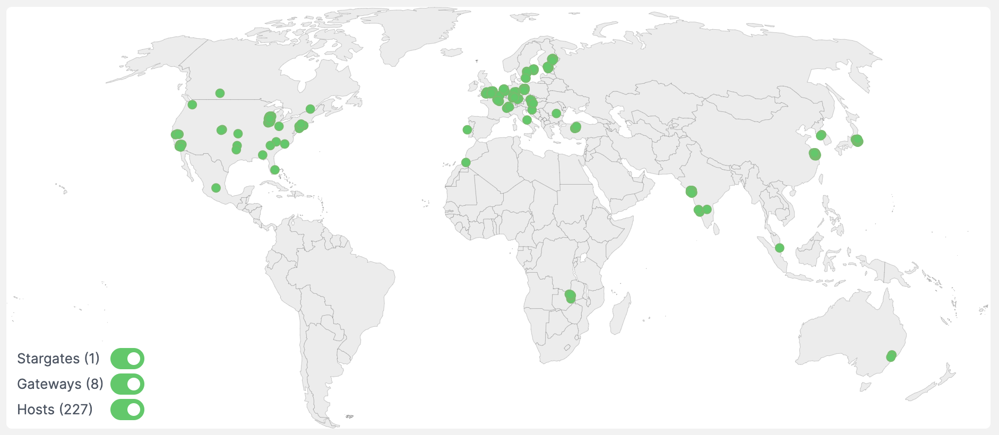

# 📰 Project Updates

As part of Edge's ongoing commitment to transparency and development in the open, the core team write weekly updates to the Edge community.

There have been 201 of these so far.


[weekly-updates.md](weekly-updates.md)


## Latest Update

<figure><figcaption></figcaption></figure>

Good evening everyone 

Some of the team are still away, and some have been unwell, so it’s been a relatively quiet week.

We’ve been working on the framework for marketplace integrations. It’s still early days but we’re looking at the ways in which third party projects can integrate with the XE blockchain and the Edge network itself. We’ll keep you updated as we continue to work on this.

Additional Edge Server capacity for the London region is expected to be online in the coming couple of days, and we’re working on introducing a second region as well.

Thoughts on where that region should be? Let us know where and why in the [suggestions channel on ](https://discord.com/channels/371989135172567051/814860932723245156)Discord.

<figure><figcaption></figcaption></figure>

Last week the second governance proposal passed with 32 votes, 100% in favour of the team burning the majority of XE received as fees for Edge services. With the proposal passed, we’re going to proceed with the first burn at the end of February!

This means that somewhere in the region of 250,000 $XE will be burned forever 

The next proposal from the core team will be posted soon. There are five proposals lined up that we have been putting the finishing touches to, and several more in plan for later in the year.

The team have also been working in support of a startup in the security space (mentioned in an earlier update), providing assistance with tooling and the use of the XE Blockchain. The company will be making heavy use of Edge services.

In stats, over 15k $XE has been earned by Network Contributors in the last week, with the total amount of $XE earned now standing at 1.98 million — very close to 2 million $XE earned. As a reminder, the mineable supply was 10m $XE, with 10% of the remaining supply being paid out by the network every year. In 2021 that was 1m $XE, in 2022 it was 900k $XE, and this year will see 810k $XE paid out.

You can follow along with the total amount paid out over on the explorer: [https://xe.network](https://xe.network/)

And that's all for this week. Enjoy your weekend 

_Posted by: Joseph Denne_
