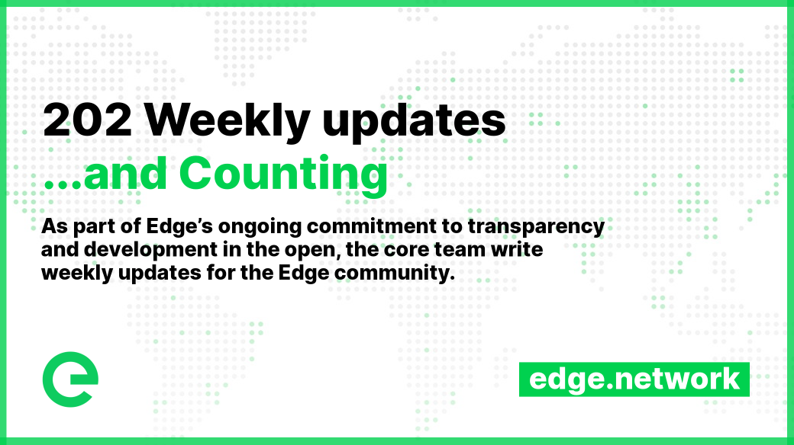

# 📰 Project Updates

As part of Edge's ongoing commitment to transparency and development in the open, the core team write weekly updates to the Edge community.

There have been 202 of these so far.


[weekly-updates.md](weekly-updates.md)


## Latest Update

<figure><figcaption></figcaption></figure>

Good evening everyone 

This week we want to talk about the future, and more specifically, our roadmap to it.

But before we do so, let’s take a quick look at the last couple of years...

In 2021 we made significant progress towards our goals, delivering a number of milestones, features and improvements. These included the migration of devices to the Mainnet, the introduction of Host V2, Gateway V2 and Stargate V2, as well as the launch of a Public Testnet for Network V2.

We also introduced on-chain staking, a command-line interface for staking, and processed payouts for the year. Other important updates included the opening of the Bridge and a Uniswap listing, the delivery of the XE blockchain explorer, and improvements to the explorer wallet view. The Console was mothballed, and the project launched a new Web Wallet.

In 2022 we continued to push forward, delivering even more milestones. The team delivered community open governance, and published the first governance proposal ratifying the system. We integrated the Node Explorer with XE Explorer, along with a whole list of other improvements.

Additionally, Edge Server and Edge DNS became generally available, along with the XE-based account system, with PAYG payments in FIAT and XE. We migrated DNS customers to Edge Network V2 and began migrating CDN and Server customers over to the new system.

The team also delivered Stargate/Gateway (v2) usage metrics (as part of the billing & earnings systems), automatic daily earnings, the Edge Server public beta, an XE iOS wallet, basic video streaming support in CDN, and Edge CDN (v2) general availability. Many other smaller updates were delivered across the year as well. For a full round up see the 2022 TLDR post here: [https://edge.network/en/updates/network/2022-tldr](https://edge.network/en/updates/network/2022-tldr)

At the close of 2022 we completed our first five year strategic roadmap. We’ve talked about this before, so if you missed it you can scroll up or check out the updates section on the website. We’ve also talked about the next five year strategic roadmap: the opening up of XE & Edge to community projects, the integration with XE into third party products, and an expansion of the core services in both refinement and functionality. We’re excited for the years ahead, and today we’ve released an update to the roadmap covering 2023.

You can find it here:


[project-roadmaps.md](../project-roadmaps.md)


The technical roadmap is a fluid document, meaning that it changes over time as priorities change. Looking at it now you can see what we hope to achieve over the next year or so. We’ve already delivered on multi-user account access, a feature that had been requested by a number of customers. Multi-Stargate support for network operations is under way, and we expect that to be completed by the end of this quarter. We’ve also been working on an improvement to the connectivity model between Stargates and Gateways (and naturally Hosts too.) While this sits in the background, it’s a refinement that will bring a greater level of stability and reliability to the network, and will work hand in glove with the Multi-Stargate support.

Moving forward, we also have a number of other features and products in the works, and one that we’re looking forward to talking more about soon is the Fungible and Non-Fungible Token support that will be coming to XE. Non-Fungible Tokens, or NFTs, will allow XE holders to mint, transfer, and use unique non-fungible tokens. Fungible Token support will allow XE holders to mint new tokens and transfer them from XE wallet to XE wallet.

As we mentioned last week, we’re working in support of a startup in the security space that is going to be making use of these new sub-XE tokens, along with a number of other Edge services. It’s early days but it’s exciting!

The technical roadmap also looks forward to a number of other features & services, from internal alphas for Storage, Shield, and more, to public betas and general availability. We have some R\&D tasks around recently discussed AI & GPU models for the network, and of course, the new customer facing website, which we hope to unveil soon.

It’s important to note that these tasks are prioritised, but that this prioritisation can (and sometimes does) change according to the needs of the project. We think the vision laid out for 2023 here prioritises the resources in the right place at the right time. As this is a technical roadmap, deliverables such as marketing & sales approaches have been omitted, and will be progressed separately.

Now it’s time for you to have your say on the roadmap. The latest governance proposal has now been published, so please take some time to read over the proposed roadmap & prioritisation, and cast your vote:



You can comment on the proposal either in the portal itself or in the following discussion:



Now, we know a few of you have been asking about CMC & CG, with regard to verification and caps. We’re working on getting these pages updated and reflecting the true state of the project, and will keep everyone updated on our progress. We have open channels to both services.

Thank you to everyone who has been active in the 💡│suggestions ons and 🏗│buidl l channels in Discord. It’s great to see, and we look forward to reading your messages, hearing your feedback and suggestions, and all the support you provide.

And that's all for this week. Enjoy your weekend 

_Posted by: Joseph Denne_
