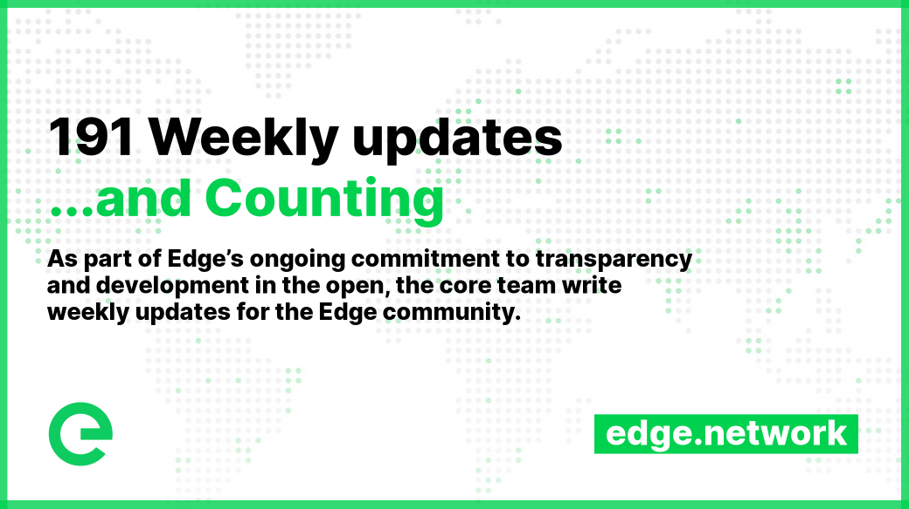

# 📰 Project Updates

As part of Edge's ongoing commitment to transparency and development in the open, the core team write weekly updates to the Edge community.

There have been 191 of these so far.


[weekly-updates.md](weekly-updates.md)


## Latest Update

<figure><figcaption></figcaption></figure>

Good evening everyone 

This is weekly update 191… and counting!

This week the team has been focused on completing the Governance UI, which is almost ready. The API has been integrated and the interface has been made mobile-ready. We're putting the final touches on it now.

The Governance API has made significant progress as well. We've integrated the blockchain governance API, which allows us to track votes, comments, and proposals, and synchronise them with the blockchain. We've also integrated the API with the UI.

On the blockchain side, we've made a major update to testnet. We've integrated governance functionality into the ledger and added governance-related API endpoints. This allows the blockchain to track proposals, votes, and comments.

`@edge/xe-utils v1.8.0` was published to npm, adding support for new on-chain data and APIs in anticipation of coming governance features. Exciting stuff.

In addition to the continued development of the Governance UI and API, I also want to take a moment to highlight the importance of community involvement in project governance.

Having a strong and engaged community is essential to the success of any project, and that's especially true for decentralised projects like ours. The community plays a crucial role in shaping the direction of the project, and your input is invaluable.

Here are a few reasons why the community's voice matters in project governance:

1. The community has a vested interest in the success of the project. You are the ones using the platform, and your feedback and suggestions can help guide development in a direction that benefits everyone;
2. The community can provide valuable perspectives and insights that the core team may not have considered. Having a diverse range of voices and perspectives can help identify potential challenges and opportunities;
3. Involving the community in governance helps foster a sense of ownership and responsibility for the project. This can help build a stronger, more engaged community, which is essential for the long-term success of the project.

Ultimately, involving the community in governance is good for the project. It helps ensure that decisions are made in the best interests of the entire community, and it helps build a strong and vibrant community that is committed to the success of the project.

We encourage everyone to get involved in project governance and make your voices heard. Your input is valuable and it matters!

Now alongside the continued hard work on governance, there are a number of exciting initiatives happening behind the scenes that we look forward to sharing with you in the future. One of these is the Mudas project which we’ve spoken about before. The artwork is fantastic, but the mission behind Mudas is even better. Events will begin unfolding soon with Mudas, and the sooner you’re involved, the more you’ll benefit, so be sure to join us here every Friday for these updates as this will be the first place you’ll hear about it.

And that's all for this week. Enjoy your weekends 

_Posted by: Joseph Denne & Adam K Dean_
