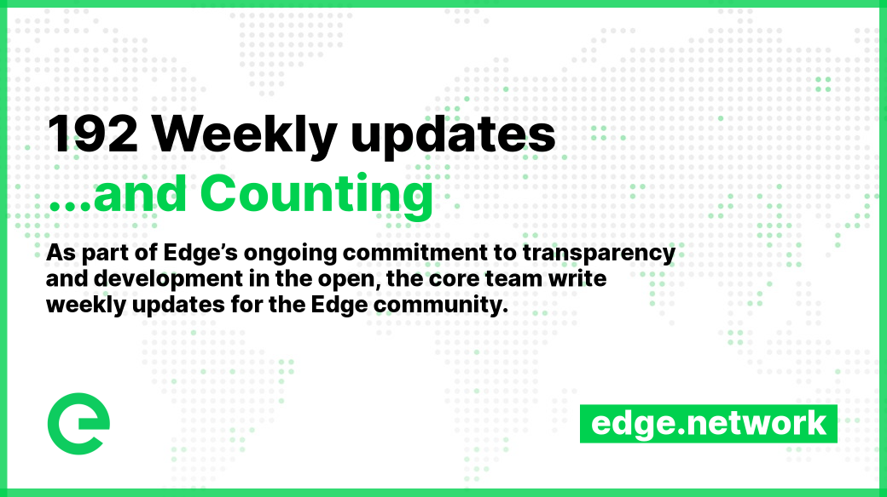

# 📰 Project Updates

As part of Edge's ongoing commitment to transparency and development in the open, the core team write weekly updates to the Edge community.

There have been 192 of these so far.


[weekly-updates.md](weekly-updates.md)


## Latest Update

<figure><figcaption></figcaption></figure>

Good evening everyone 

Work on Project Governance is nearing its end, and we’re confident of a release before the end of the year.

overnance API is almost ready: all tests are passing and we are now in the pre-launch phase. Thai means a focus on asserting fine details and continuing to end user test in preparation for launch.

Along with fixes and incremental additions to proposal data, this week we have developed the formatting specification for proposals, along with helper functions to validate and auto-format them. This should make it easy to write clean and consistent proposals – important as everything will be tracked on chain.

We are also adding metrics to the governance system (as we do with all services), which helps us monitor and maintain them. We’re looking to have mainnet deployed next week, with testing conducted, before opening it up.

You’ll notice that while the Governance portal looks familiar, it’ll also look fresher and lighter. This is part of a series of changes we’re making across the Edge family of products, and the new, refreshed look will then be implemented in Explorer and Wallet too.

We’re excited to begin this next chapter of community governance and the project together with you.

Also this week:

**Index v2.1.0** was deployed to mainnet, adding a new API summarising named wallets.

**Index v2.1.1** was deployed to mainnet. This update reduced the size of certain passive metrics, making infrastructure-related bandwidth usage less intensive.

**Account API v1.9.2** was also deployed to mainnet, also reducing the size of passive metrics to manage bandwidth usage by infrastructure.

The founders of the project have been focusing on the longer term roadmaps for the network and have mapped out a high level vision. This is a multiyear proposal for growing the network and usage which contains some extremely exciting developments. Look out for a post ahead of Christmas, and expect a governance proposal to follow.

And that's all for this week. Enjoy your weekends 

_Posted by: Joseph Denne_
