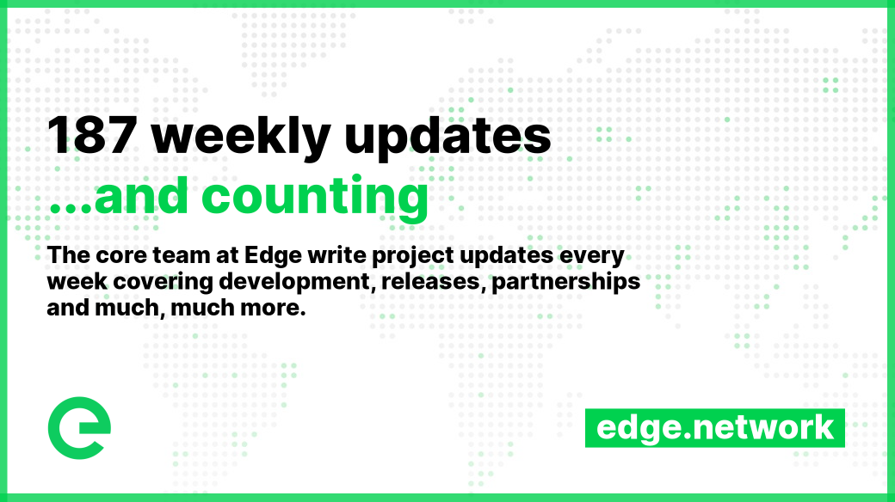

# 📰 Project Updates

As part of Edge's ongoing commitment to transparency and development in the open, the core team write weekly updates to the Edge community.

There have been 187 of these so far.


[weekly-updates.md](weekly-updates.md)


## Latest Update

<figure><figcaption></figcaption></figure>

Good evening everyone 

This week we introduced customer support to the account system 💥

Live chat is available to everyone, with an optional paid tier for priority support, which includes phone support, quicker response times, and optional account management. This means customers can now get help from the support team without leaving the page, and without having access to Discord.

Additional capacity for Edge Servers was brought online in the `UK #1 London region`. We’re continuing to work on expanding both the capacity of the current London region along with introducing new regions too. Expect more on that over the coming months.

**Account API v1.8.1** was deployed to mainnet earlier this week, introducing backend functionality for priority support subscriptions and server backup charges.

**Account v1.12.4** was then deployed to mainnet introducing the frontend functionality for live chat, priority support, subscription billing, and server backup charges.

**Account v1.12.5** then followed, which contained a small fix to ensure that live chat sessions are closed upon signing out of your account.

We have a number of releases coming next week, including in-browser interactive virtual consoles for Edge Servers, which will allow you to control your server directly from within the account interface.

We’ll also be releasing a new and improved, plus much more performant Index API. Thank you to those of you who have reported the slowness issues with the current Index API. We’re committed to providing transparency and access to data without limits, but would ask that consumers play nice in their consumption of APIs. Keeping the frequency of requests down means we won’t have to put into place any API key support or rate limiting.

As a reminder, in your Edge account interface you’ll find a unique referral link, which you can share with your friends, colleagues, and social channels. You will receive `10%` commission on the usage of anyone who signs up using your referral code `for the lifetime of their engagement`. This can easily add up to a highly significant amount.

We continue to migrate clients over to the new billing platform and to Edge Servers, CDN, and DNS, as well as managed accounts. This activity should increase even further as we continue to introduce clients to the new system.

We’re also working on a number of exciting opportunities, some of which have been introduced to us by community members. If you think you know someone that could benefit from working with Edge, or if you have a potential partnership in mind, reach out to us.

And that’s all for now!

Enjoy your weekends 

_Posted by: Adam K Dean_
