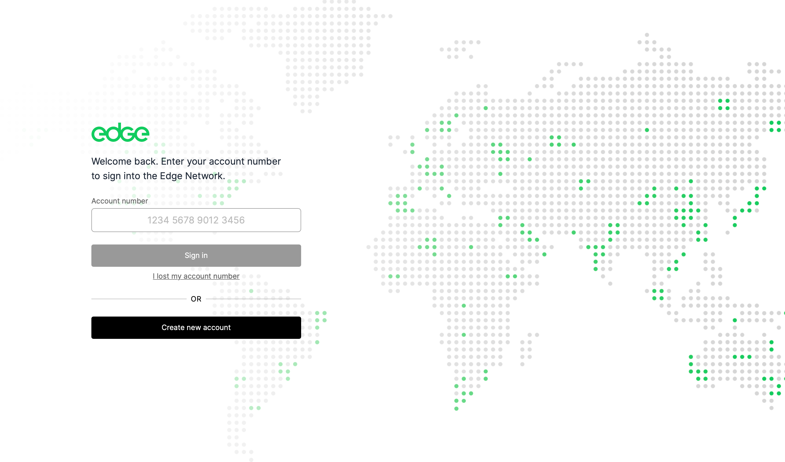
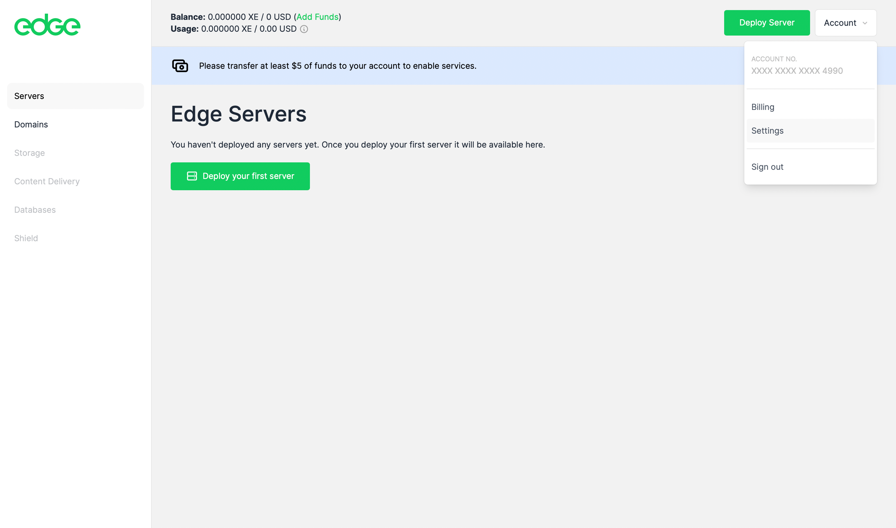
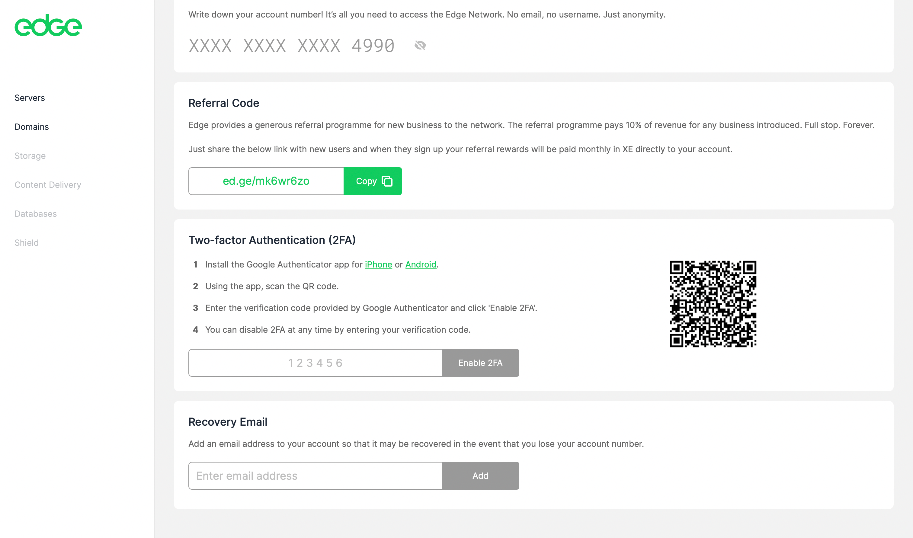
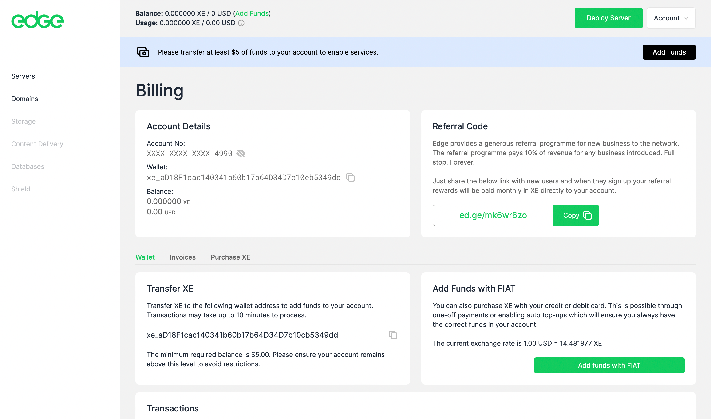

# Account System

## Setting up an Account

To set up an Edge account, head to:



The account landing page gives you the option to sign in or to create a new account.

<figure><figcaption></figcaption></figure>

To create a new account, click 'Create new account'.

<figure><figcaption></figcaption></figure>

The account system uses a single cryptographic key for access. Make sure that you make a note of your key or store it in a password manager such as [1Password](https://1password.com).

You can optionally enable two factor authentication and/or a recovery email address at this stage. This can also be done later in the settings section of your account.

<figure><figcaption></figcaption></figure>

To go straight to your account click 'Go directly to my account'. You are now signed in.

<figure><figcaption></figcaption></figure>

### Two Factor Authentication (2fa)

2fa can be added to your account at the point of account creation, or from within the settings section of your account.

<figure><figcaption></figcaption></figure>

<figure><figcaption></figcaption></figure>

To enable 2fa, scan the QR code presented with Google Authenticator.

Enter the verification code provided by Google Authenticator and click 'Enable 2FA'.

You can disable 2FA at any time by entering your verification code.

### Recovery Email

You can add a recovery email to your account to help you gain access in the event that you lose your account number. To do this, simple enter the email address that you want to use in the 'Recovery Email' field of the settings section of your account.

## Signing in to Your Account

To sign in to your account, simply enter your account number on the sign in page and click 'Sign in'.

## Billing

Documentation coming soon.

## Referral Code

Your referral code and link can be found in both the Billing and Settings sections of your account. It is a short URL starting with the domain ed.ge which is followed by your unique code. Use of this code when referring people to Edge will pay you 10% of their spend on network products for the lifetime of their use of the network.

<figure><figcaption></figcaption></figure>

You can find out more about the referral programme here:


[referral-programme.md](../supporting-the-network/referral-programme.md)

