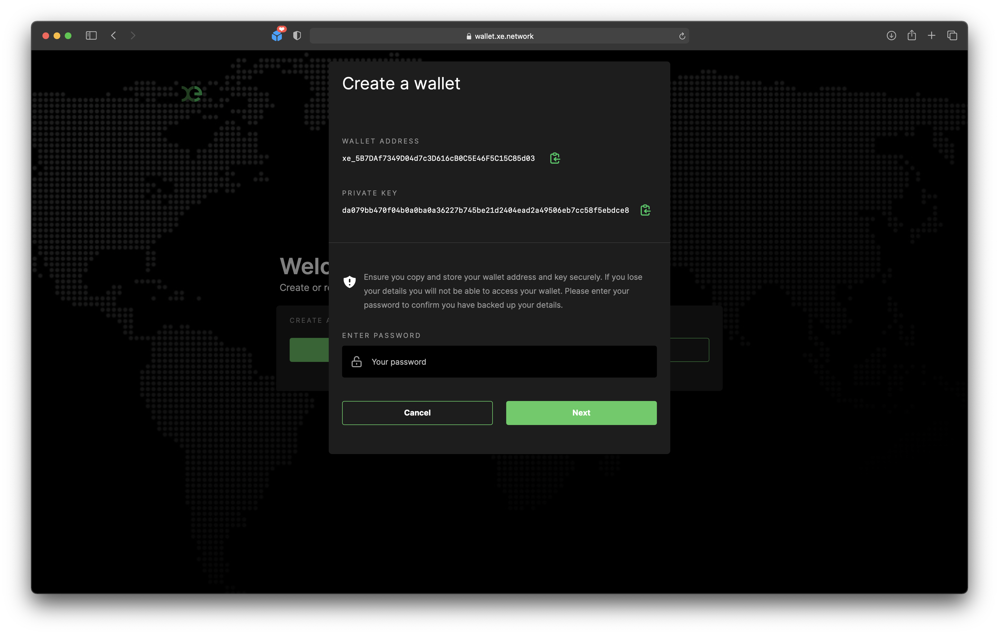
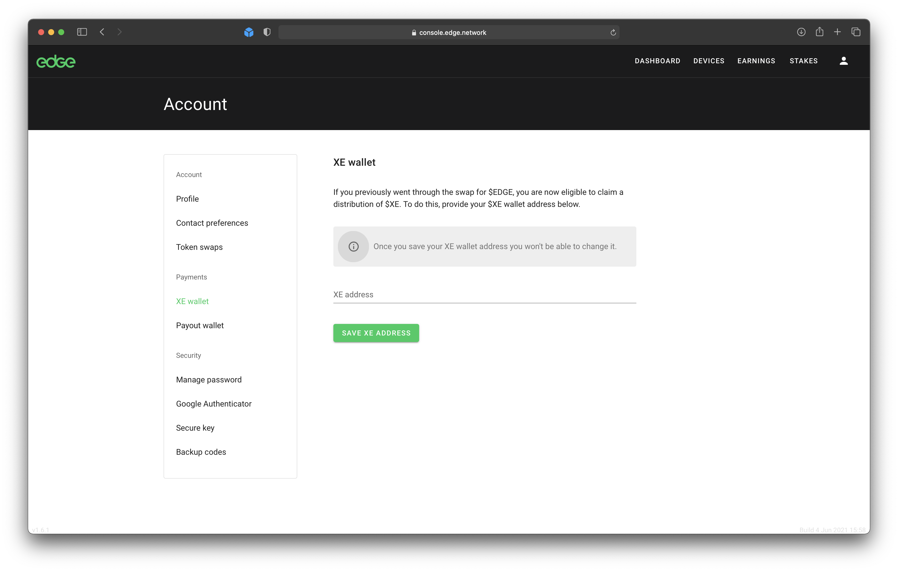
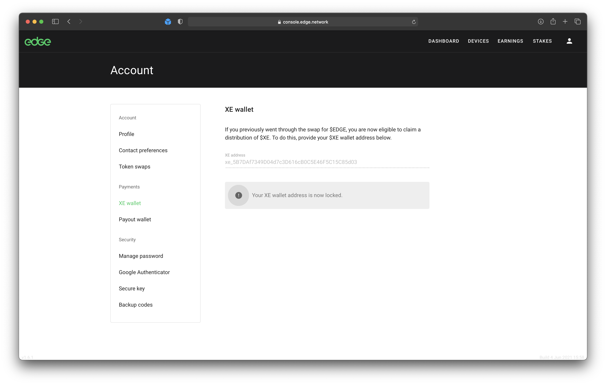

# Claiming $XE

A distribution of $XE is available to everyone that went through the $EDGE>$TNC swap process in Edge Console.

The swap period for the $EDGE token closed on Thursday, 27th May 2021. Note that unswapped $EDGE can still be used for the payment of network services.

$XE can be claimed by providing your $XE wallet address in Edge Console.


**Active $EDGE stakes will be automatically swapped for $XE**


## How to Claim $XE

### Step 1: Create an $XE Wallet

Head to [wallet.xe.network](https://wallet.xe.network) and select "Create wallet":

Add a password to the wallet to allow for quick future access and then select "Next":

Make sure you store a copy of your private key somewhere secure, like a password manager. Then enter your password and select "Next":

Congratulations! You now have an XE Wallet ready for use.

### Step 2: Provide the Address in Edge Console

Make a note of your XE Wallet address and head to Edge Console at: [console.edge.network](https://console.edge.network)

Once you have signed in, Select "Claim XE" in the XE promo panel:

Enter your XE Wallet address and select "Save XE Address". \(Note that once you have done this you will not be able to change the address\):

