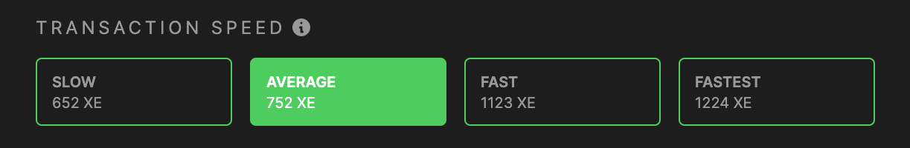
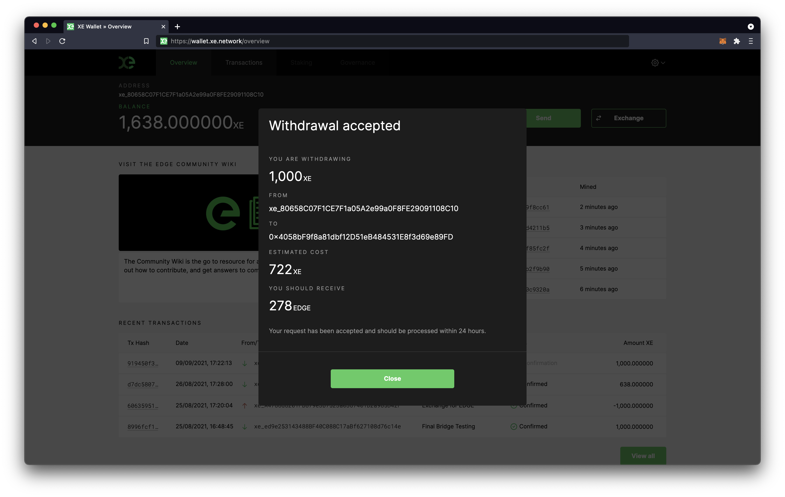
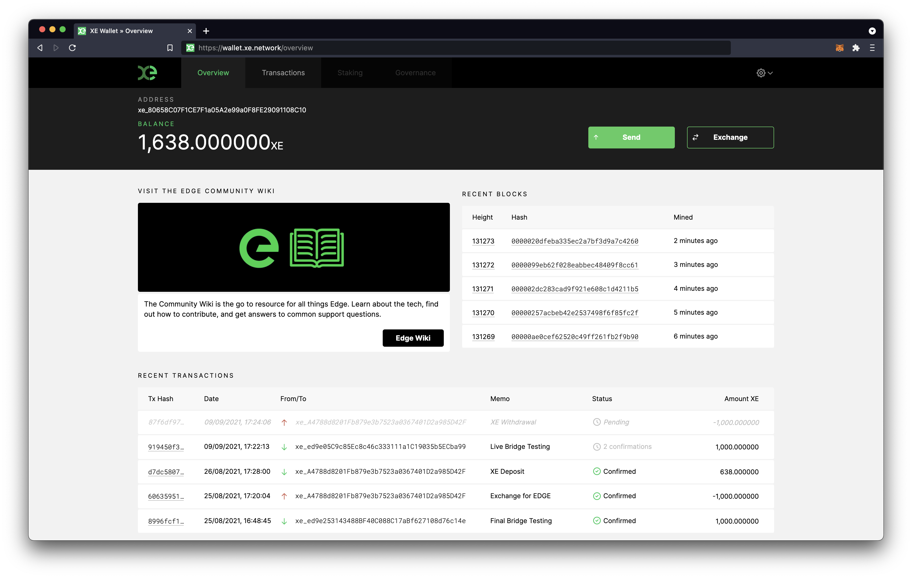

# Withdrawing $XE

## Step 1

To bridge out of the Edge Network, select Withdraw from the Exchange menu.

## Step 2

Enter the address of the Ethereum wallet that you want to withdraw to. Then select the amount of $XE that you want to withdraw.

## Step 3

Select the speed of the transaction. This is based on current ethereum gas price.

## Step 4

Select Withdraw and enter your Web Wallet password.

## Step 5

Your withdrawal has been accepted to the network. You'll see a confirmation screen within your Web Wallet.

You can now see your withdrawal in your transactions list in a pending state.

Withdrawals typically take 10 minutes, depending on the speed you've chosen for the transaction. 10 confirmations with the XE Blockchain are required before the withdrawal is processed.
